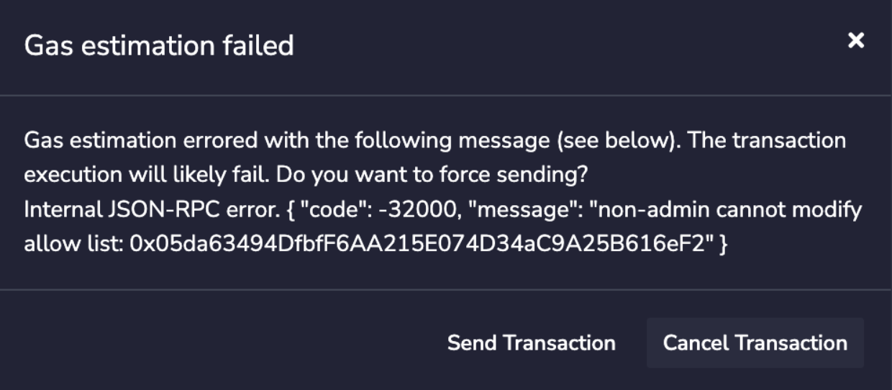
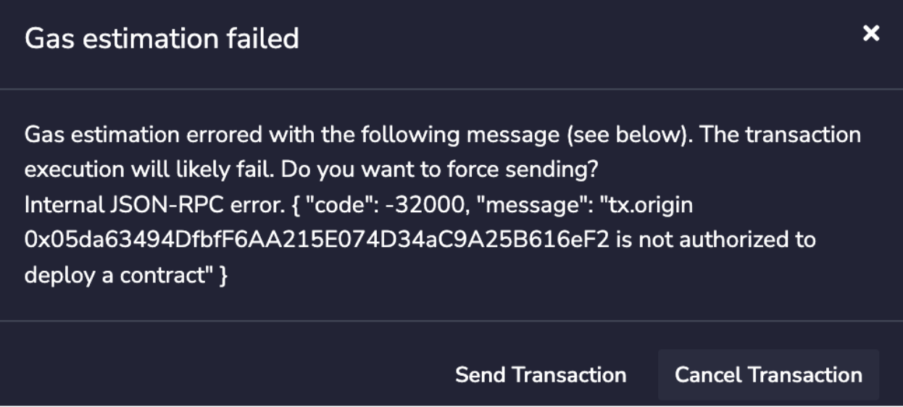
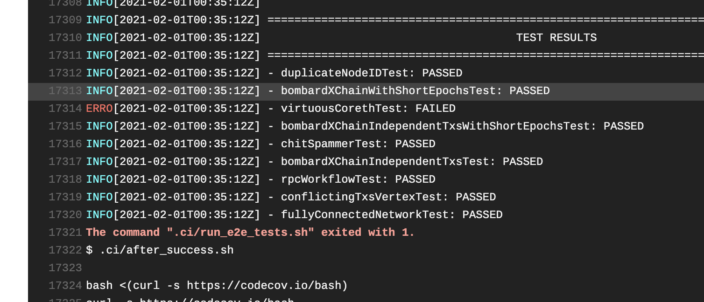
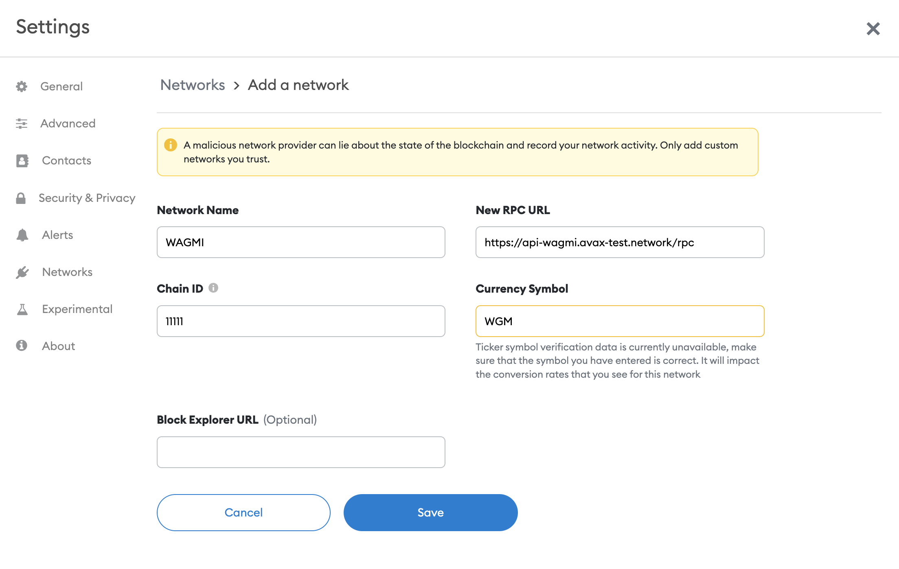

# Subnet EVM

[Avalanche](https://docs.avax.network/learn/platform-overview) is a network composed of multiple blockchains.
Each blockchain is an instance of a Virtual Machine (VM), much like an object in an object-oriented language is an instance of a class.
That is, the VM defines the behavior of the blockchain.

Subnet EVM is the [Virtual Machine (VM)](https://docs.avax.network/learn/platform-overview#virtual-machines) that defines the Subnet Contract Chains. Subnet EVM is a simplified version of [Coreth VM (C-Chain)](https://github.com/ava-labs/coreth).

This chain implements the Ethereum Virtual Machine and supports Solidity smart contracts as well as most other Ethereum client functionality.

## Building

The Subnet EVM runs in a separate process from the main AvalancheGo process and communicates with it over a local gRPC connection.

### AvalancheGo Compatibility
```
[v0.1.0] AvalancheGo@v1.7.0-v1.7.4
[v0.1.1-v0.1.2] AvalancheGo@v1.7.5-v1.7.6
```

## API

The Subnet EVM supports the following API namespaces:

- `eth`
- `personal`
- `txpool`
- `debug`

Only the `eth` namespace is enabled by default.
Full documentation for the C-Chain's API can be found [here.](https://docs.avax.network/build/avalanchego-apis/contract-chain-c-chain-api)

## Compatibility

The Subnet EVM is compatible with almost all Ethereum tooling, including [Remix,](https://docs.avax.network/build/tutorials/smart-contracts/deploy-a-smart-contract-on-avalanche-using-remix-and-metamask) [Metamask](https://docs.avax.network/build/tutorials/smart-contracts/deploy-a-smart-contract-on-avalanche-using-remix-and-metamask) and [Truffle.](https://docs.avax.network/build/tutorials/smart-contracts/using-truffle-with-the-avalanche-c-chain)

## Differences Between Subnet EVM and Coreth

- Added configurable fees and gas limits in genesis
- Merged Avalanche hardforks into the single "Subnet EVM" hardfork
- Removed Atomic Txs and Shared Memory
- Removed Multicoin Contract and State

## Setting a Custom Fee Recipient
By default, all fees are burned (sent to the blackhole address). However, it is
possible to enable block producers to set a fee recipient (get compensated for
blocks they produce).

To enable this feature, you'll need to add the following to your
genesis file (under the `"config"` key):
```json
{
  "config": {
    "allowFeeRecipients":true
  }
}
```

Next, you'll need to update your [chain config](https://docs.avax.network/build/references/command-line-interface/#chain-configs) with the following:
```json
{
  "feeRecipient":"<YOU 0x-ADDRESS>"
}
```

_Note: If you enable this feature but a validator doesn't specify
a "feeRecipient", the fees will be burned in blocks they produce._

## Restricting Smart Contract Deployers
If you'd like to restrict who has the ability to deploy contracts on your
subnet, you can provide an `AllowList` configuration in your genesis file:
```json
{
  "config": {
    "chainId": 99999,
    "homesteadBlock": 0,
    "eip150Block": 0,
    "eip150Hash": "0x2086799aeebeae135c246c65021c82b4e15a2c451340993aacfd2751886514f0",
    "eip155Block": 0,
    "eip158Block": 0,
    "byzantiumBlock": 0,
    "constantinopleBlock": 0,
    "petersburgBlock": 0,
    "istanbulBlock": 0,
    "muirGlacierBlock": 0,
    "subnetEVMTimestamp": 0,
    "feeConfig": {
      "gasLimit": 20000000,
      "minBaseFee": 1000000000,
      "targetGas": 100000000,
      "baseFeeChangeDenominator": 48,
      "minBlockGasCost": 0,
      "maxBlockGasCost": 10000000,
      "targetBlockRate": 2,
      "blockGasCostStep": 500000
    },
    "contractDeployerAllowListConfig": {
      "blockTimestamp": 0,
      "adminAddresses":["0x8db97C7cEcE249c2b98bDC0226Cc4C2A57BF52FC"]
    }
  },
  "alloc": {
    "8db97C7cEcE249c2b98bDC0226Cc4C2A57BF52FC": {
      "balance": "0x52B7D2DCC80CD2E4000000"
    }
  },
  "nonce": "0x0",
  "timestamp": "0x0",
  "extraData": "0x00",
  "gasLimit": "0x1312D00",
  "difficulty": "0x0",
  "mixHash": "0x0000000000000000000000000000000000000000000000000000000000000000",
  "coinbase": "0x0000000000000000000000000000000000000000",
  "number": "0x0",
  "gasUsed": "0x0",
  "parentHash": "0x0000000000000000000000000000000000000000000000000000000000000000"
}
```

In this example, `0x8db97C7cEcE249c2b98bDC0226Cc4C2A57BF52FC` is named as the
`Admin` of the `ContractDeployerAllowList`. This enables them to add other `Admins` or to add
`Deployers`. Both `Admins` and `Deployers` can deploy contracts. To provide
a great UX with factory contracts, the `tx.Origin` is checked for being a valid
deployer instead of the caller of `CREATE`. This means that factory contracts will still be
able to create new contracts as long as the sender of the original transaction is an allow
listed deployer.

The `Stateful Precompile` powering the `ContractDeployerAllowList` adheres to the following
Solidity interface at `0x0200000000000000000000000000000000000000` (you can
load this interface and interact directly in Remix):
```solidity
// (c) 2022-2023, Ava Labs, Inc. All rights reserved.
// See the file LICENSE for licensing terms.

// SPDX-License-Identifier: MIT

pragma solidity >=0.8.0;

interface AllowListInterface {
    // Set [addr] to have the admin role over the allow list
    function setAdmin(address addr) external;

    // Set [addr] to be enabled on the allow list
    function setEnabled(address addr) external;

    // Set [addr] to have no role over the allow list
    function setNone(address addr) external;

    // Read the status of [addr]
    function readAllowList(address addr) external view returns (uint256);
}
```

If you attempt to add a `Deployer` and you are not an `Admin`, you will see
something like:


If you attempt to deploy a contract but you are not an `Admin` not
a `Deployer`, you will see something like:



## Run Local Network
[`scripts/run.sh`](scripts/run.sh) automatically installs [avalanchego], sets up a local network,
and creates a `subnet-evm` genesis file.

```bash
# to startup a local cluster (good for development)
cd ${HOME}/go/src/github.com/ava-labs/subnet-evm
./scripts/run.sh 1.7.7 0x8db97C7cEcE249c2b98bDC0226Cc4C2A57BF52FC
```

Once the the network is started up, the following info will be printed to the
console:
```bash
Logs Directory: /var/folders/mp/6jm81gc11dv3xtcwxmrd8mcr0000gn/T/runnerlogs2402729383
PID: 90118

EVM Chain ID: 99999
Funded Address: 0x8db97C7cEcE249c2b98bDC0226Cc4C2A57BF52FC
RPC Endpoints:
- http://localhost:53423/ext/bc/AHdWCyWDaudRX4JkHNgpzyMFdhHK7iEgB4HHMTuarzWghkAdg/rpc
- http://localhost:53425/ext/bc/AHdWCyWDaudRX4JkHNgpzyMFdhHK7iEgB4HHMTuarzWghkAdg/rpc
- http://localhost:53427/ext/bc/AHdWCyWDaudRX4JkHNgpzyMFdhHK7iEgB4HHMTuarzWghkAdg/rpc
- http://localhost:53429/ext/bc/AHdWCyWDaudRX4JkHNgpzyMFdhHK7iEgB4HHMTuarzWghkAdg/rpc
- http://localhost:53431/ext/bc/AHdWCyWDaudRX4JkHNgpzyMFdhHK7iEgB4HHMTuarzWghkAdg/rpc

WS Endpoints:
- ws://localhost:53423/ext/bc/AHdWCyWDaudRX4JkHNgpzyMFdhHK7iEgB4HHMTuarzWghkAdg/ws
- ws://localhost:53425/ext/bc/AHdWCyWDaudRX4JkHNgpzyMFdhHK7iEgB4HHMTuarzWghkAdg/ws
- ws://localhost:53427/ext/bc/AHdWCyWDaudRX4JkHNgpzyMFdhHK7iEgB4HHMTuarzWghkAdg/ws
- ws://localhost:53429/ext/bc/AHdWCyWDaudRX4JkHNgpzyMFdhHK7iEgB4HHMTuarzWghkAdg/ws
- ws://localhost:53431/ext/bc/AHdWCyWDaudRX4JkHNgpzyMFdhHK7iEgB4HHMTuarzWghkAdg/ws

MetaMask Quick Start:
Funded Address: 0x8db97C7cEcE249c2b98bDC0226Cc4C2A57BF52FC
Network Name: Local EVM
RPC URL: http://localhost:53423/ext/bc/AHdWCyWDaudRX4JkHNgpzyMFdhHK7iEgB4HHMTuarzWghkAdg/rpc
Chain ID: 99999
Curreny Symbol: LEVM
```

You can then ping the local cluster or add the network to MetaMask:
```bash
curl --location --request POST 'http://localhost:61278/ext/bc/2Z36RnQuk1hvsnFeGWzfZUfXNr7w1SjzmDQ78YxfTVNAkDq3nZ/rpc' \
--header 'Content-Type: application/json' \
--data-raw '{
    "jsonrpc": "2.0",
    "method": "eth_blockNumber",
    "params":[],
    "id": 1
}'
<<COMMENT
{
    "jsonrpc": "2.0",
    "id": 1,
    "result": "0x0"
}
COMMENT
```

To terminate the cluster, kill the PID:
```bash
kill -2 55547
```

## Fuji Subnet Deployment
Ready to take the `subnet-evm` for a spin? Follow this
tutorial and you can get your own EVM on your own subnet
spun up on Fuji in a jiffy!

_You can find an example of a genesis file to use when launching your own
`subnet-evm` in the [networks folder](./networks/11111/genesis.json)._

### Prerequisites
* 1+ nodes running on Fuji (does not need to be a validator)
* [`subnet-cli`](https://github.com/ava-labs/subnet-cli) installed
* `subnet-cli` private key with some Fuji AVAX (see [faucet](https://faucet.avax-test.network))

### Build Binary
First, you'll need to compile the subnet-evm into a binary that AvalancheGo
can interact with. To do this, run the following commands (assumes you don't
yet have the `subnet-evm` repository downloaded):
```bash
git clone https://github.com/ava-labs/subnet-evm.git;
cd subnet-evm;
./scripts/build.sh build/srEXiWaHuhNyGwPUi444Tu47ZEDwxTWrbQiuD7FmgSAQ6X7Dy;
```

#### Move Binary
Once the `subnet-evm` binary is built, you'll need to move it to AvalancheGo's
plugin directory (within the `--build-dir`) so it can be run by your node.
When building from source, this defaults to `~/avalanchego/build/plugins`.
This build directory is structured as:
```
build-dir
|_avalanchego
    |_plugins
      |_evm
```

To put the `subnet-evm` binary in the right place, run the following command
(assuming the `avalanchego` and `subnet-evm` repos are in the same folder):
```bash
mv ./subnet-evm/build/srEXiWaHuhNyGwPUi444Tu47ZEDwxTWrbQiuD7FmgSAQ6X7Dy ./avalanchego/build/plugins;
```

### Run `subnet-cli wizard`
The easiest and fastest way to get your new subnet off the ground is to use the
[`subnet-cli`](https://github.com/ava-labs/subnet-cli). This powerful CLI can
add validators, create subnets, and create blockchains.

_The `subnet-cli` DOES NOT need to be run on the same host where you are
running your validator. By default, it interfaces exclusively with the public
Avalanche API Endpoints._

To make it as easy as possible to get started, the `subnet-cli` also provides
a `wizard` command that takes care of EVERYTHING for you. TL;DR, type one
command and you'll have a subnet with a running `subnet-evm` instance 5 minutes
later.

To make NodeID-XXXX a validator, create a subnet, add NodeID-XXXX to the
subnet (comma separated with multiple validators), and create a `subnet-evm`-based blockhain, run the following command:

```bash
subnet-cli wizard \
--node-ids=NodeID-XXXX \
--vm-genesis-path=networks/11111/genesis.json \
--vm-id=srEXiWaHuhNyGwPUi444Tu47ZEDwxTWrbQiuD7FmgSAQ6X7Dy \
--chain-name=subnetevm
```

_The `vm-id` was generated by calling `subnet-cli create VMID subnetevm`. You can
use any value here, the only important thing is to make sure the binary you
generate has the same name._


#### Add New Subnet to Node Whitelist
During the execution of the `wizard` command, you will be prompted to add your
new subnetID to your node. This is done using the `whitelisted-subnets` config.
You can provide the `whitelisted-subnets` argument by modifying your config
file or providing an argument on startup.

Example Config File:
```json
{
  "network-id":"fuji",
  "health-check-frequency":"2s",
  "log-display-level":"INFO",
  "log-level":"INFO",
  "whitelisted-subnets":"<PROVIDED BY SPACES-CLI>"
}
```

Example Node Args:
```bash
--whitelisted-subnets=<PROVIDED BY SPACES CLI> --network-id=fuji
```

#### Restart Node
Once you've updated your config, you'll need to restart your
AvalancheGo node for the changes to take effect.

If you completed the steps successfully, you'll see the node print out:
```bash
INFO [01-25|16:47:04] chains/manager.go#246: creating chain:
    ID: 2AM3vsuLoJdGBGqX2ibE8RGEq4Lg7g4bot6BT1Z7B9dH5corUD
    VMID:sqja3uK17MJxfC7AN8nGadBw9JK5BcrsNwNynsqP5Gih8M5Bm
INFO [01-25|16:47:04] api/server/server.go#203: adding route /ext/bc/2JVSBoinj9C2J33VntvzYtVJNZdN2NKiwwKjcumHUWEb5DbBrm/events
INFO [01-25|16:47:04] api/server/server.go#203: adding route /ext/bc/2JVSBoinj9C2J33VntvzYtVJNZdN2NKiwwKjcumHUWEb5DbBrm
INFO [01-25|16:47:04] api/server/server.go#203: adding route /ext/bc/2JVSBoinj9C2J33VntvzYtVJNZdN2NKiwwKjcumHUWEb5DbBrm/wallet
INFO [01-25|16:47:04] <2AM3vsuLoJdGBGqX2ibE8RGEq4Lg7g4bot6BT1Z7B9dH5corUD Chain> snow/engine/snowman/transitive.go#67: initializing consensus engine
INFO [01-25|16:47:04] <2AM3vsuLoJdGBGqX2ibE8RGEq4Lg7g4bot6BT1Z7B9dH5corUD Chain> snow/engine/snowman/bootstrap/bootstrapper.go#225: Starting bootstrap...
INFO [01-25|16:47:04] <P Chain> snow/engine/snowman/bootstrap/bootstrapper.go#458: waiting for the remaining chains in this subnet to finish syncing
INFO [01-25|16:47:04] api/server/server.go#203: adding route /ext/bc/2AM3vsuLoJdGBGqX2ibE8RGEq4Lg7g4bot6BT1Z7B9dH5corUD/public
INFO [01-25|16:47:04] <2AM3vsuLoJdGBGqX2ibE8RGEq4Lg7g4bot6BT1Z7B9dH5corUD Chain> snow/engine/common/bootstrapper.go#235: Bootstrapping started syncing with 2 vertices in the accepted frontier
INFO [01-25|16:47:05] <2AM3vsuLoJdGBGqX2ibE8RGEq4Lg7g4bot6BT1Z7B9dH5corUD Chain> snow/engine/snowman/bootstrap/bootstrapper.go#419: bootstrapping fetched 69 blocks. Executing state transitions...
INFO [01-25|16:47:06] <2AM3vsuLoJdGBGqX2ibE8RGEq4Lg7g4bot6BT1Z7B9dH5corUD Chain> snow/engine/common/queue/jobs.go#181: executed 69 operations
INFO [01-25|16:47:06] <2AM3vsuLoJdGBGqX2ibE8RGEq4Lg7g4bot6BT1Z7B9dH5corUD Chain> snow/engine/snowman/transitive.go#354: bootstrapping finished with 2DUxceCx71L5TLTeLpKUQxSBVm8vTKPmFs2usAyRnusUzs4Q4M as the last accepted block
```

If you didn't put the `subnet-evm` binary in the right place, you'll see something
like:
```bash
INFO [01-26|05:54:19] chains/manager.go#246: creating chain:
    ID: 2AM3vsuLoJdGBGqX2ibE8RGEq4Lg7g4bot6BT1Z7B9dH5corUD
    VMID:sqja3uK17MJxfC7AN8nGadBw9JK5BcrsNwNynsqP5Gih8M5Bm
ERROR[01-26|05:54:19] chains/manager.go#270: error creating chain 2AM3vsuLoJdGBGqX2ibE8RGEq4Lg7g4bot6BT1Z7B9dH5corUD: error while looking up VM: there is no ID with alias sqja3uK17MJxfC7AN8nGadBw9JK5BcrsNwNynsqP5Gih8M5Bm
```

## Join the WAGMI Subnet Demo
<p align="center">
  
</p>

_Thanks to the @0xNeonMonsters for the logo!_

The WAGMI ("We're All Going to Make It") Subnet Demo is a high throughput
testbed for EVM (Ethereum Virtual Machine) optimizations. It is parameterized
to run at a factor more capacity than Fuji/Mainnet C-Chain and will be used
to experiment with release candidates before they make it into an
official [`coreth`](https://github.com/ava-labs/coreth) release.

We created a basic [WAGMI explorer](https://trywagmi.xyz) that surfaces
aggregated usage statistics about the subnet. If you'd like to see any other
stats added to this site, please send a DM to [@\_patrickogrady on Twitter](https://twitter.com/_patrickogrady).

Everyone that has used the the C-Chain more than twice (~970k addresses) has
been airdropped 10 WGM tokens. With the current fee parameterization, this
should be enough for hundreds of txs.

This is one of the first cases of using Avalanche Subnets as a proving ground
for changes in a production VM (coreth). Many underestimate how useful the isolation
of subnets is for performing complex VM testing on a live network (without impacting
the stability of the primary network).

### Network Creation
To create WAGMI, all we had to do was run the following command:
```bash
subnet-cli wizard \
--node-ids=NodeID-9TCq8np31pHjjhGaHtLjs6ptYYPEt3LGb,NodeID-BrYXghQSu6KKGjuzhs3nrkcB46Wc2yYHy,NodeID-89UCR1CsPzzEHuknxhJHKxuFPNCyPz7Bu,NodeID-Hfm8gpD4DpCz4KTzt2osJPfFvu7az3qiD,NodeID-LkdxkfYhg6nSw1EEUxDUSYPXPwmr2cUet \
--vm-genesis-path=networks/11111/genesis.json \
--vm-id=srEXiWaHuhNyGwPUi444Tu47ZEDwxTWrbQiuD7FmgSAQ6X7Dy \
--chain-name=wagmi
```

This added these NodeIDs as validators on Fuji, created the WAGMI Subnet, added
all validators to the WAGMI subnet, and created the WAGMI chain.


* SubnetID: [28nrH5T2BMvNrWecFcV3mfccjs6axM1TVyqe79MCv2Mhs8kxiY](https://testnet.avascan.info/blockchains?subnet=28nrH5T2BMvNrWecFcV3mfccjs6axM1TVyqe79MCv2Mhs8kxiY)
* ChainID: [2ebCneCbwthjQ1rYT41nhd7M76Hc6YmosMAQrTFhBq8qeqh6tt](https://testnet.avascan.info/blockchain/2ebCneCbwthjQ1rYT41nhd7M76Hc6YmosMAQrTFhBq8qeqh6tt)


### Network Parameters
```
Network ID: 11111
Chain ID: 11111
Block Gas Limit: 20,000,000 (2.5x C-Chain)
10s Gas Target: 100,000,000 (~6.67x C-Chain)
Min Fee: 1 GWei (4% of C-Chain)
Target Block Rate: 2s (Same as C-Chain)
```

### Adding to MetaMask
```
Network Name: WAGMI
RPC URL: https://api.trywagmi.xyz/rpc
Chain ID: 11111
Symbol: WGM
```



### Wrapped WAGMI
#### Info
```
Address: 0x3Ee7094DADda15810F191DD6AcF7E4FFa37571e4
IPFS: /ipfs/QmVAuheeidjD2ktdX3sSHMQqSfcjtmca1g9jr7w9GQf7pU
```
#### Metadata
```json
{"compiler":{"version":"0.5.17+commit.d19bba13"},"language":"Solidity","output":{"abi":[{"anonymous":false,"inputs":[{"indexed":true,"internalType":"address","name":"src","type":"address"},{"indexed":true,"internalType":"address","name":"guy","type":"address"},{"indexed":false,"internalType":"uint256","name":"wad","type":"uint256"}],"name":"Approval","type":"event"},{"anonymous":false,"inputs":[{"indexed":true,"internalType":"address","name":"dst","type":"address"},{"indexed":false,"internalType":"uint256","name":"wad","type":"uint256"}],"name":"Deposit","type":"event"},{"anonymous":false,"inputs":[{"indexed":true,"internalType":"address","name":"src","type":"address"},{"indexed":true,"internalType":"address","name":"dst","type":"address"},{"indexed":false,"internalType":"uint256","name":"wad","type":"uint256"}],"name":"Transfer","type":"event"},{"anonymous":false,"inputs":[{"indexed":true,"internalType":"address","name":"src","type":"address"},{"indexed":false,"internalType":"uint256","name":"wad","type":"uint256"}],"name":"Withdrawal","type":"event"},{"payable":true,"stateMutability":"payable","type":"fallback"},{"constant":true,"inputs":[{"internalType":"address","name":"","type":"address"},{"internalType":"address","name":"","type":"address"}],"name":"allowance","outputs":[{"internalType":"uint256","name":"","type":"uint256"}],"payable":false,"stateMutability":"view","type":"function"},{"constant":false,"inputs":[{"internalType":"address","name":"guy","type":"address"},{"internalType":"uint256","name":"wad","type":"uint256"}],"name":"approve","outputs":[{"internalType":"bool","name":"","type":"bool"}],"payable":false,"stateMutability":"nonpayable","type":"function"},{"constant":true,"inputs":[{"internalType":"address","name":"","type":"address"}],"name":"balanceOf","outputs":[{"internalType":"uint256","name":"","type":"uint256"}],"payable":false,"stateMutability":"view","type":"function"},{"constant":true,"inputs":[],"name":"decimals","outputs":[{"internalType":"uint8","name":"","type":"uint8"}],"payable":false,"stateMutability":"view","type":"function"},{"constant":false,"inputs":[],"name":"deposit","outputs":[],"payable":true,"stateMutability":"payable","type":"function"},{"constant":true,"inputs":[],"name":"name","outputs":[{"internalType":"string","name":"","type":"string"}],"payable":false,"stateMutability":"view","type":"function"},{"constant":true,"inputs":[],"name":"symbol","outputs":[{"internalType":"string","name":"","type":"string"}],"payable":false,"stateMutability":"view","type":"function"},{"constant":true,"inputs":[],"name":"totalSupply","outputs":[{"internalType":"uint256","name":"","type":"uint256"}],"payable":false,"stateMutability":"view","type":"function"},{"constant":false,"inputs":[{"internalType":"address","name":"dst","type":"address"},{"internalType":"uint256","name":"wad","type":"uint256"}],"name":"transfer","outputs":[{"internalType":"bool","name":"","type":"bool"}],"payable":false,"stateMutability":"nonpayable","type":"function"},{"constant":false,"inputs":[{"internalType":"address","name":"src","type":"address"},{"internalType":"address","name":"dst","type":"address"},{"internalType":"uint256","name":"wad","type":"uint256"}],"name":"transferFrom","outputs":[{"internalType":"bool","name":"","type":"bool"}],"payable":false,"stateMutability":"nonpayable","type":"function"},{"constant":false,"inputs":[{"internalType":"uint256","name":"wad","type":"uint256"}],"name":"withdraw","outputs":[],"payable":false,"stateMutability":"nonpayable","type":"function"}],"devdoc":{"methods":{}},"userdoc":{"methods":{}}},"settings":{"compilationTarget":{"contracts/wwagmi.sol":"WWAGMI"},"evmVersion":"istanbul","libraries":{},"optimizer":{"enabled":false,"runs":200},"remappings":[]},"sources":{"contracts/wwagmi.sol":{"keccak256":"0x0a6ce5559225d3c99db4a5e24777049df3c84886ba9a08147f23afae4261b509","urls":["bzz-raw://0aef254c65ae30b578256a7e2496ed18bf0cb68e97f5831050e17a2cf0192a7e","dweb:/ipfs/QmSwAbdnaYvrjDHTKnE3qBZ3smT7uipSSfSGBUiKWmNWEY"]}},"version":1}
```

#### Code
```solidity
// Copyright (C) 2015, 2016, 2017 Dapphub

// This program is free software: you can redistribute it and/or modify
// it under the terms of the GNU General Public License as published by
// the Free Software Foundation, either version 3 of the License, or
// (at your option) any later version.

// This program is distributed in the hope that it will be useful,
// but WITHOUT ANY WARRANTY; without even the implied warranty of
// MERCHANTABILITY or FITNESS FOR A PARTICULAR PURPOSE.  See the
// GNU General Public License for more details.

// You should have received a copy of the GNU General Public License
// along with this program.  If not, see <http://www.gnu.org/licenses/>.

// Contract name, token name, and token symbol modified by Ava Labs 2020

pragma solidity >=0.4.22 <0.6;

contract WWAGMI{
    string public name     = "Wrapped WAGMI";
    string public symbol   = "WWAGMI";
    uint8  public decimals = 18;

    event  Approval(address indexed src, address indexed guy, uint wad);
    event  Transfer(address indexed src, address indexed dst, uint wad);
    event  Deposit(address indexed dst, uint wad);
    event  Withdrawal(address indexed src, uint wad);

    mapping (address => uint)                       public  balanceOf;
    mapping (address => mapping (address => uint))  public  allowance;

    function() external payable {
        deposit();
    }
    function deposit() public payable {
        balanceOf[msg.sender] += msg.value;
        emit Deposit(msg.sender, msg.value);
    }
    function withdraw(uint wad) public {
        require(balanceOf[msg.sender] >= wad);
        balanceOf[msg.sender] -= wad;
        msg.sender.transfer(wad);
        emit Withdrawal(msg.sender, wad);
    }

    function totalSupply() public view returns (uint) {
        return address(this).balance;
    }

    function approve(address guy, uint wad) public returns (bool) {
        allowance[msg.sender][guy] = wad;
        emit Approval(msg.sender, guy, wad);
        return true;
    }

    function transfer(address dst, uint wad) public returns (bool) {
        return transferFrom(msg.sender, dst, wad);
    }

    function transferFrom(address src, address dst, uint wad)
        public
        returns (bool)
    {
        require(balanceOf[src] >= wad);

        if (src != msg.sender && allowance[src][msg.sender] != uint(-1)) {
            require(allowance[src][msg.sender] >= wad);
            allowance[src][msg.sender] -= wad;
        }

        balanceOf[src] -= wad;
        balanceOf[dst] += wad;

        emit Transfer(src, dst, wad);

        return true;
    }
}
```

[become a Fuji Validator]: https://docs.avax.network/build/tutorials/nodes-and-staking/staking-avax-by-validating-or-delegating-with-the-avalanche-wallet
