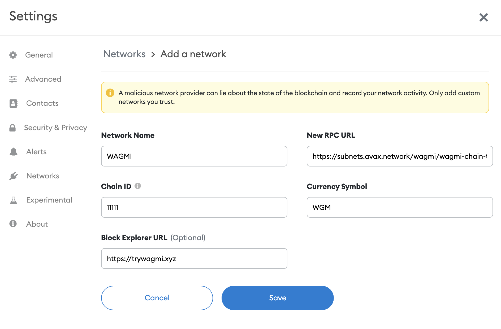

# Subnet EVM

[](https://github.com/ava-labs/subnet-evm/actions/workflows/lint-tests-release.yml)
[](https://github.com/ava-labs/subnet-evm/actions/workflows/codeql-analysis.yml)

[Avalanche](https://docs.avax.network/overview/getting-started/avalanche-platform) is a network composed of multiple blockchains.
Each blockchain is an instance of a Virtual Machine (VM), much like an object in an object-oriented language is an instance of a class.
That is, the VM defines the behavior of the blockchain.

Subnet EVM is the [Virtual Machine (VM)](https://docs.avax.network/overview/getting-started/avalanche-platform/#virtual-machines) that defines the Subnet Contract Chains. Subnet EVM is a simplified version of [Coreth VM (C-Chain)](https://github.com/ava-labs/coreth).

This chain implements the Ethereum Virtual Machine and supports Solidity smart contracts as well as most other Ethereum client functionality.

## Building

The Subnet EVM runs in a separate process from the main AvalancheGo process and communicates with it over a local gRPC connection.

### AvalancheGo Compatibility

```text
[v0.1.0] AvalancheGo@v1.7.0-v1.7.4
[v0.1.1-v0.1.2] AvalancheGo@v1.7.5-v1.7.6
[v0.2.0] AvalancheGo@v1.7.7-v1.7.9
[v0.2.1] AvalancheGo@v1.7.10
[v0.2.2] AvalancheGo@v1.7.11-v1.7.12
[v0.2.3] AvalancheGo@v1.7.13-v1.7.16
[v0.2.4] AvalancheGo@v1.7.13-v1.7.16
[v0.2.5] AvalancheGo@v1.7.13-v1.7.16
[v0.2.6] AvalancheGo@v1.7.13-v1.7.16
[v0.2.7] AvalancheGo@v1.7.13-v1.7.16
[v0.2.8] AvalancheGo@v1.7.13-v1.7.16
```

## API

The Subnet EVM supports the following API namespaces:

- `eth`
- `personal`
- `txpool`
- `debug`

Only the `eth` namespace is enabled by default.
Full documentation for the C-Chain's API can be found [here.](https://docs.avax.network/apis/avalanchego/apis/c-chain)

## Compatibility

The Subnet EVM is compatible with almost all Ethereum tooling, including [Remix](https://docs.avax.network/dapps/smart-contracts/deploy-a-smart-contract-on-avalanche-using-remix-and-metamask/), [Metamask](https://docs.avax.network/dapps/smart-contracts/deploy-a-smart-contract-on-avalanche-using-remix-and-metamask/) and [Truffle](https://docs.avax.network/dapps/smart-contracts/using-truffle-with-the-avalanche-c-chain/).

## Differences Between Subnet EVM and Coreth

- Added configurable fees and gas limits in genesis
- Merged Avalanche hardforks into the single "Subnet EVM" hardfork
- Removed Atomic Txs and Shared Memory
- Removed Multicoin Contract and State

## Block Format

To support these changes, there have been a number of changes to the SubnetEVM block format compared to what exists on the C-Chain and Ethereum. Here we list the changes to the block format as compared to Ethereum.

### Block Header

- `BaseFee`: Added by EIP-1559 to represent the base fee of the block (present in Ethereum as of EIP-1559)
- `BlockGasCost`: surcharge for producing a block faster than the target rate

## Create an EVM Subnet on a Local Network

### Clone Subnet-evm

First install Go 1.18.1 or later. Follow the instructions [here](https://golang.org/doc/install). You can verify by runing `go version`.

Set `$GOPATH` environment variable properly for Go to look for Go Workspaces. Please read [this](https://go.dev/doc/gopath_code) for details. You can verify by running `echo $GOPATH`.

As a few software will be installed into `$GOPATH/bin`, please make sure that `$GOPATH/bin` is in your `$PATH`, otherwise, you may get error running the commands below.

Download the `subnet-evm` repository into your `$GOPATH`:

```sh
cd $GOPATH
mkdir -p src/github.com/ava-labs
cd src/github.com/ava-labs
git clone git@github.com:ava-labs/subnet-evm.git
cd subnet-evm
```

This will clone and checkout to `master` branch.

### Run Local Network

[`scripts/run.sh`](https://github.com/ava-labs/subnet-evm/blob/master/scripts/run.sh) automatically installs `avalanchego`, sets up a local network,
and creates a `subnet-evm` genesis file. The usage of this script is

```bash
./scripts/run.sh [AVALANCHEGO VERSION] [GENESIS_ADDRESS]
```

```bash
# to startup a local cluster (good for development)
cd ${HOME}/go/src/github.com/ava-labs/subnet-evm
git pull

# TODO: update the "avalanchego" version to latest
SKIP_NETWORK_RUNNER_SHUTDOWN=true ./scripts/run.sh 1.7.17 0x8db97C7cEcE249c2b98bDC0226Cc4C2A57BF52FC
```

Note: make sure you check the version compatibility above between AvalancheGo and Subnet-evm and use the proper version of AvalancheGo.

Note that this ewoq address (`0x8db97C7cEcE249c2b98bDC0226Cc4C2A57BF52FC`) is a prefunded address on the local network, see [here](https://docs.avax.network/quickstart/fund-a-local-test-network) for more info. The private key for this address is
`0x56289e99c94b6912bfc12adc093c9b51124f0dc54ac7a766b2bc5ccf558d8027`.

With this command, `avalanchego`, `avalanche-network-runner` and GoLang packages will be downloaded and installed on a `/tmp` directory. Note: please make sure that your have fast internet connection to download these packages, otherwise, it will take a long time.

Once the the network is started up, the following info will be printed to the
console:

```bash
cluster is ready!

Logs Directory: /var/folders/0h/v4nrbbsn1vvbr5h2wfrh5h500000gn/T/network-runner-root-data2328077371

EVM Chain ID: 99999
Funded Address: 0x8db97C7cEcE249c2b98bDC0226Cc4C2A57BF52FC
RPC Endpoints:
- http://127.0.0.1:14463/ext/bc/28N1Tv5CZziQ3FKCaXmo8xtxoFtuoVA6NvZykAT5MtGjF4JkGs/rpc
- http://127.0.0.1:23930/ext/bc/28N1Tv5CZziQ3FKCaXmo8xtxoFtuoVA6NvZykAT5MtGjF4JkGs/rpc
- http://127.0.0.1:31984/ext/bc/28N1Tv5CZziQ3FKCaXmo8xtxoFtuoVA6NvZykAT5MtGjF4JkGs/rpc
- http://127.0.0.1:41274/ext/bc/28N1Tv5CZziQ3FKCaXmo8xtxoFtuoVA6NvZykAT5MtGjF4JkGs/rpc
- http://127.0.0.1:57529/ext/bc/28N1Tv5CZziQ3FKCaXmo8xtxoFtuoVA6NvZykAT5MtGjF4JkGs/rpc

WS Endpoints:
- ws://127.0.0.1:14463/ext/bc/28N1Tv5CZziQ3FKCaXmo8xtxoFtuoVA6NvZykAT5MtGjF4JkGs/ws
- ws://127.0.0.1:23930/ext/bc/28N1Tv5CZziQ3FKCaXmo8xtxoFtuoVA6NvZykAT5MtGjF4JkGs/ws
- ws://127.0.0.1:31984/ext/bc/28N1Tv5CZziQ3FKCaXmo8xtxoFtuoVA6NvZykAT5MtGjF4JkGs/ws
- ws://127.0.0.1:41274/ext/bc/28N1Tv5CZziQ3FKCaXmo8xtxoFtuoVA6NvZykAT5MtGjF4JkGs/ws
- ws://127.0.0.1:57529/ext/bc/28N1Tv5CZziQ3FKCaXmo8xtxoFtuoVA6NvZykAT5MtGjF4JkGs/ws

MetaMask Quick Start:
Funded Address: 0x8db97C7cEcE249c2b98bDC0226Cc4C2A57BF52FC
Network Name: Local EVM
RPC URL: http://127.0.0.1:14463/ext/bc/28N1Tv5CZziQ3FKCaXmo8xtxoFtuoVA6NvZykAT5MtGjF4JkGs/rpc
Chain ID: 99999
Curreny Symbol: LEVM
network-runner RPC server is running on PID 79100...

use the following command to terminate:

pkill -P 79100
kill -2 79100
pkill -9 -f srEXiWaHuhNyGwPUi444Tu47ZEDwxTWrbQiuD7FmgSAQ6X7Dy
```

You can then ping the local cluster or add the network to MetaMask:

```bash
curl --location --request POST 'http://127.0.0.1:14463/ext/bc/28N1Tv5CZziQ3FKCaXmo8xtxoFtuoVA6NvZykAT5MtGjF4JkGs/rpc' \
--header 'Content-Type: application/json' \
--data-raw '{
    "jsonrpc": "2.0",
    "method": "eth_blockNumber",
    "params":[],
    "id": 1
}'
```

Response:

```json
{
  "jsonrpc": "2.0",
  "id": 1,
  "result": "0x0"
}
```

To terminate the cluster, run the following commands:

```bash
pkill -P 79100
kill -2 79100
pkill -9 -f srEXiWaHuhNyGwPUi444Tu47ZEDwxTWrbQiuD7FmgSAQ6X7Dy
```

### Connect with Metamask

Please use the value provided by `MetaMask Quick Start` to connect with Metamask.

```text
MetaMask Quick Start:
Funded Address: 0x8db97C7cEcE249c2b98bDC0226Cc4C2A57BF52FC
Network Name: Local EVM
RPC URL: http://127.0.0.1:14463/ext/bc/28N1Tv5CZziQ3FKCaXmo8xtxoFtuoVA6NvZykAT5MtGjF4JkGs/rpc
Chain ID: 99999
Curreny Symbol: LEVM
```

You can create a new metamask account by importing the private key `0x56289e99c94b6912bfc12adc093c9b51124f0dc54ac7a766b2bc5ccf558d8027` and start experiencing with this account.

### Load Simulator

When building developing your own blockchain using `subnet-evm`, you may want
to analyze how your fee paramterization behaves and/or how many resources your VM
uses under different load patterns. For this reason, we developed `cmd/simulator`.
`cmd/simulator` lets your drive arbitrary load across any number of [endpoints]
with a user-specified `concurrency`, `base-fee`, and `priority-fee`.

To get started, open the directory `cmd/simulator` and add your network's endpoints to
the file at `.simulator/config.yml` (these will be provided after running
`./scripts/run.sh`. With the example above, the correct endpoints is `http://127.0.0.1:14463/ext/bc/28N1Tv5CZziQ3FKCaXmo8xtxoFtuoVA6NvZykAT5MtGjF4JkGs/rpc` to replace `http://localhost:9650/ext/bc/my-chain/rpc`.):

```yaml
endpoints:
  - http://localhost:9650/ext/bc/my-chain/rpc
base-fee: 25
priority-fee: 1
concurrency: 10
```

Once your config is specified, you can run the tool by either invoking `go run main.go` under the directory `cmd/simulator` or by installing the tool (`go install -v .`) and running the binary
(`simulator`).

To make getting started easier, the ewoq key `0x8db97C7cEcE249c2b98bDC0226Cc4C2A57BF52FC`
has been pre-added to the simulator key directory and can be added to genesis during local network
creation (`./scripts/run.sh [AVALANCHEGO VERSION] 0x8db97C7cEcE249c2b98bDC0226Cc4C2A57BF52FC`).
If you do not add this key to genesis, you'll need to manually fund the
`master` account when prompted in the terminal.

_The private key for the ewoq address (`0x8db97C7cEcE249c2b98bDC0226Cc4C2A57BF52FC`) is
`0x56289e99c94b6912bfc12adc093c9b51124f0dc54ac7a766b2bc5ccf558d8027`._

If you followed the directions successfully, you should see the following:

```bash
> go run main.go
go: downloading github.com/ava-labs/subnet-evm v0.1.2
go: downloading github.com/spf13/viper v1.10.1
2022/05/11 09:49:22 loaded config (endpoints=[http://127.0.0.1:14463/ext/bc/28N1Tv5CZziQ3FKCaXmo8xtxoFtuoVA6NvZykAT5MtGjF4JkGs/rpc] concurrency=25 base fee=1 priority fee=10)
2022/05/11 09:49:22 loaded worker 0x8db97C7cEcE249c2b98bDC0226Cc4C2A57BF52FC (balance=100000000000000000000000000 nonce=0)
2022/05/11 09:49:22 0xe8859AF6c05b512dF80A66b81dE89FDAB9fE5C1c requesting funds from master
2022/05/11 09:49:22 0xa2B32bcbA31d4dC7728aD73165cdeea5eCeD5e70 requesting funds from master
2022/05/11 09:49:22 0x837438175627A7A2ABbccf1727c5cA46fA7274b5 requesting funds from master
2022/05/11 09:49:22 0x14c908A82047C6bC66cd9282b4D68f3e003659f8 requesting funds from master
2022/05/11 09:49:22 0xbeE6DF853592d3699ac3292D134F59BEF278B048 requesting funds from master
2022/05/11 09:49:22 0x028Bc164dcC1c10f1Db5a1175c58eA84a7Fd34c9 requesting funds from master
2022/05/11 09:49:22 0x664D97348Bdb73fc3bC4447B4676573dbF6eEE5A requesting funds from master
2022/05/11 09:49:22 0x455aAB371261DC41a048e42Bf147ced4FaDE5fCF requesting funds from master
2022/05/11 09:49:22 0xA9b5C64E057F50730CA4Ba6205d55fa08C03ff75 requesting funds from master
2022/05/11 09:49:22 0x57645A2bdCEb6cFbC95e6a5Cac70F0c05B8d8515 requesting funds from master
2022/05/11 09:49:24 [block created] t: 2022-05-11 09:49:22 -0600 MDT index: 1 base fee: 1 block gas cost: 0 block txs: 1 gas used: 21000
2022/05/11 09:49:24 [block created] t: 2022-05-11 09:49:24 -0600 MDT index: 2 base fee: 1 block gas cost: 0 block txs: 1 gas used: 21000
2022/05/11 09:49:24 [stats] historical TPS: 1.00 last 10s TPS: 0.10 total txs: 2 historical GPS: 21000.0, last 10s GPS: 2100.0 elapsed: 2s
2022/05/11 09:49:26 [block created] t: 2022-05-11 09:49:26 -0600 MDT index: 3 base fee: 1 block gas cost: 0 block txs: 1 gas used: 21000
2022/05/11 09:49:26 [stats] historical TPS: 0.75 last 10s TPS: 0.20 total txs: 3 historical GPS: 15750.0, last 10s GPS: 4200.0 elapsed: 4s
2022/05/11 09:49:28 [block created] t: 2022-05-11 09:49:28 -0600 MDT index: 4 base fee: 1 block gas cost: 0 block txs: 2 gas used: 42000
2022/05/11 09:49:28 [stats] historical TPS: 0.83 last 10s TPS: 0.30 total txs: 5 historical GPS: 17500.0, last 10s GPS: 6300.0 elapsed: 6s
2022/05/11 09:49:30 [block created] t: 2022-05-11 09:49:30 -0600 MDT index: 5 base fee: 1 block gas cost: 0 block txs: 4 gas used: 84000
2022/05/11 09:49:30 [stats] historical TPS: 1.12 last 10s TPS: 0.50 total txs: 9 historical GPS: 23625.0, last 10s GPS: 10500.0 elapsed: 8s
2022/05/11 09:49:32 [block created] t: 2022-05-11 09:49:32 -0600 MDT index: 6 base fee: 1 block gas cost: 0 block txs: 5 gas used: 105000
2022/05/11 09:49:32 [stats] historical TPS: 1.40 last 10s TPS: 0.90 total txs: 14 historical GPS: 29400.0, last 10s GPS: 18900.0 elapsed: 10s
2022/05/11 09:49:34 [block created] t: 2022-05-11 09:49:34 -0600 MDT index: 7 base fee: 1 block gas cost: 0 block txs: 6 gas used: 126000
2022/05/11 09:49:34 [stats] historical TPS: 1.67 last 10s TPS: 1.30 total txs: 20 historical GPS: 35000.0, last 10s GPS: 27300.0 elapsed: 12s
2022/05/11 09:49:36 [block created] t: 2022-05-11 09:49:36 -0600 MDT index: 8 base fee: 1 block gas cost: 0 block txs: 7 gas used: 147000
2022/05/11 09:49:36 [stats] historical TPS: 1.93 last 10s TPS: 1.80 total txs: 27 historical GPS: 40500.0, last 10s GPS: 37800.0 elapsed: 14s
2022/05/11 09:49:38 [block created] t: 2022-05-11 09:49:38 -0600 MDT index: 9 base fee: 1 block gas cost: 0 block txs: 8 gas used: 168000
2022/05/11 09:49:38 [stats] historical TPS: 2.19 last 10s TPS: 2.40 total txs: 35 historical GPS: 45937.5, last 10s GPS: 50400.0 elapsed: 16s
2022/05/11 09:49:40 [block created] t: 2022-05-11 09:49:40 -0600 MDT index: 10 base fee: 1 block gas cost: 0 block txs: 9 gas used: 189000
2022/05/11 09:49:40 [stats] historical TPS: 2.44 last 10s TPS: 3.00 total txs: 44 historical GPS: 51333.3, last 10s GPS: 63000.0 elapsed: 18s
2022/05/11 09:49:42 [block created] t: 2022-05-11 09:49:42 -0600 MDT index: 11 base fee: 1 block gas cost: 0 block txs: 9 gas used: 189000
2022/05/11 09:49:42 [stats] historical TPS: 2.65 last 10s TPS: 3.50 total txs: 53 historical GPS: 55650.0, last 10s GPS: 73500.0 elapsed: 20s
2022/05/11 09:49:44 [block created] t: 2022-05-11 09:49:44 -0600 MDT index: 12 base fee: 1 block gas cost: 0 block txs: 10 gas used: 210000
2022/05/11 09:49:44 [stats] historical TPS: 2.86 last 10s TPS: 3.90 total txs: 63 historical GPS: 60136.4, last 10s GPS: 81900.0 elapsed: 22s
2022/05/11 09:49:46 [block created] t: 2022-05-11 09:49:46 -0600 MDT index: 13 base fee: 1 block gas cost: 0 block txs: 10 gas used: 210000
2022/05/11 09:49:46 [stats] historical TPS: 3.04 last 10s TPS: 4.30 total txs: 73 historical GPS: 63875.0, last 10s GPS: 90300.0 elapsed: 24s
.....

2022/05/11 09:55:51 [stats] historical TPS: 4.89 last 10s TPS: 5.00 total txs: 1896 historical GPS: 102618.6, last 10s GPS: 105000.0 elapsed: 6m28s
2022/05/11 09:55:52 0xa2B32bcbA31d4dC7728aD73165cdeea5eCeD5e70 requesting funds from master
2022/05/11 09:55:53 [block created] t: 2022-05-11 09:55:52 -0600 MDT index: 196 base fee: 1 block gas cost: 0 block txs: 11 gas used: 231000
2022/05/11 09:55:53 [stats] historical TPS: 4.89 last 10s TPS: 5.10 total txs: 1907 historical GPS: 102684.6, last 10s GPS: 107100.0 elapsed: 6m30s
2022/05/11 09:55:54 0x14c908A82047C6bC66cd9282b4D68f3e003659f8 requesting funds from master
2022/05/11 09:55:55 [block created] t: 2022-05-11 09:55:54 -0600 MDT index: 197 base fee: 1 block gas cost: 0 block txs: 11 gas used: 231000
2022/05/11 09:55:55 [stats] historical TPS: 4.89 last 10s TPS: 5.20 total txs: 1918 historical GPS: 102750.0, last 10s GPS: 109200.0 elapsed: 6m32s
2022/05/11 09:55:56 0xbeE6DF853592d3699ac3292D134F59BEF278B048 requesting funds from master
2022/05/11 09:55:57 [block created] t: 2022-05-11 09:55:56 -0600 MDT index: 198 base fee: 1 block gas cost: 0 block txs: 11 gas used: 231000
2022/05/11 09:55:57 [stats] historical TPS: 4.90 last 10s TPS: 5.30 total txs: 1929 historical GPS: 102814.7, last 10s GPS: 111300.0 elapsed: 6m34s
2022/05/11 09:55:58 0x028Bc164dcC1c10f1Db5a1175c58eA84a7Fd34c9 requesting funds from master
2022/05/11 09:55:59 [block created] t: 2022-05-11 09:55:58 -0600 MDT index: 199 base fee: 1 block gas cost: 0 block txs: 11 gas used: 231000
2022/05/11 09:55:59 [stats] historical TPS: 4.90 last 10s TPS: 5.40 total txs: 1940 historical GPS: 102878.8, last 10s GPS: 113400.0 elapsed: 6m36s
2022/05/11 09:56:00 0x664D97348Bdb73fc3bC4447B4676573dbF6eEE5A requesting funds from master
2022/05/11 09:56:01 [block created] t: 2022-05-11 09:56:00 -0600 MDT index: 200 base fee: 1 block gas cost: 0 block txs: 11 gas used: 231000
2022/05/11 09:56:01 [stats] historical TPS: 4.90 last 10s TPS: 5.50 total txs: 1951 historical GPS: 102942.2, last 10s GPS: 115500.0 elapsed: 6m38s
2022/05/11 09:56:02 0x455aAB371261DC41a048e42Bf147ced4FaDE5fCF requesting funds from master
2022/05/11 09:56:03 [block created] t: 2022-05-11 09:56:02 -0600 MDT index: 201 base fee: 1 block gas cost: 0 block txs: 11 gas used: 231000
2022/05/11 09:56:03 [stats] historical TPS: 4.91 last 10s TPS: 5.50 total txs: 1962 historical GPS: 103005.0, last 10s GPS: 115500.0 elapsed: 6m40s
2022/05/11 09:56:04 0xA9b5C64E057F50730CA4Ba6205d55fa08C03ff75 requesting funds from master
2022/05/11 09:56:05 [block created] t: 2022-05-11 09:56:04 -0600 MDT index: 202 base fee: 1 block gas cost: 0 block txs: 11 gas used: 231000
2022/05/11 09:56:05 [stats] historical TPS: 4.91 last 10s TPS: 5.50 total txs: 1973 historical GPS: 103067.2, last 10s GPS: 115500.0 elapsed: 6m42s
2022/05/11 09:56:06 0x57645A2bdCEb6cFbC95e6a5Cac70F0c05B8d8515 requesting funds from master
2022/05/11 09:56:07 [block created] t: 2022-05-11 09:56:06 -0600 MDT index: 203 base fee: 1 block gas cost: 0 block txs: 11 gas used: 231000
2022/05/11 09:56:07 [stats] historical TPS: 4.91 last 10s TPS: 5.50 total txs: 1984 historical GPS: 103128.7, last 10s GPS: 115500.0 elapsed: 6m44s
2022/05/11 09:56:09 [block created] t: 2022-05-11 09:56:08 -0600 MDT index: 204 base fee: 1 block gas cost: 0 block txs: 11 gas used: 231000
2022/05/11 09:56:09 [stats] historical TPS: 4.91 last 10s TPS: 5.50 total txs: 1995 historical GPS: 103189.7, last 10s GPS: 115500.0 elapsed: 6m46s
2022/05/11 09:56:11 [block created] t: 2022-05-11 09:56:10 -0600 MDT index: 205 base fee: 1 block gas cost: 0 block txs: 10 gas used: 210000
2022/05/11 09:56:11 [stats] historical TPS: 4.91 last 10s TPS: 5.50 total txs: 2005 historical GPS: 103198.5, last 10s GPS: 115500.0 elapsed: 6m48s
2022/05/11 09:56:13 [block created] t: 2022-05-11 09:56:12 -0600 MDT index: 206 base fee: 1 block gas cost: 0 block txs: 10 gas used: 210000
2022/05/11 09:56:13 [stats] historical TPS: 4.91 last 10s TPS: 5.40 total txs: 2015 historical GPS: 103207.3, last 10s GPS: 113400.0 elapsed: 6m50s
```

## Create an EVM Subnet on Fuji Testnet

See [this tutorial](https://docs.avax.network/subnets/create-a-fuji-subnet).

## Customize a Subnet

- [Genesis](https://docs.avax.network/subnets/customize-a-subnet#genesis)
- [Precompile](https://docs.avax.network/subnets/customize-a-subnet#precompiles)
- [Priority Regossip](https://docs.avax.network/subnets/customize-a-subnet#priority-regossip)

## Join the WAGMI Subnet Demo

<p align="center">
  
</p>

_Thanks to the @0xNeonMonsters for the logo!_

The WAGMI ("We're All Going to Make It") Subnet Demo is a high throughput
testbed for EVM (Ethereum Virtual Machine) optimizations. It is parameterized
to run at a factor more capacity than Fuji/Mainnet C-Chain and will be used
to experiment with release candidates before they make it into an
official [`coreth`](https://github.com/ava-labs/coreth) release.

We created a basic [WAGMI explorer](https://trywagmi.xyz) that surfaces
aggregated usage statistics about the subnet. If you'd like to see any other
stats added to this site, please send a DM to [@\_patrickogrady on Twitter](https://twitter.com/_patrickogrady).

Everyone that has used the the C-Chain more than twice (~970k addresses) has
been airdropped 10 WGM tokens. With the current fee parameterization, this
should be enough for hundreds of txs.

This is one of the first cases of using Avalanche Subnets as a proving ground
for changes in a production VM (coreth). Many underestimate how useful the isolation
of subnets is for performing complex VM testing on a live network (without impacting
the stability of the primary network).

### Network Creation

To create WAGMI, all we had to do was run the following command:

```bash
subnet-cli wizard \
--node-ids=NodeID-9TCq8np31pHjjhGaHtLjs6ptYYPEt3LGb,NodeID-BrYXghQSu6KKGjuzhs3nrkcB46Wc2yYHy,NodeID-89UCR1CsPzzEHuknxhJHKxuFPNCyPz7Bu,NodeID-Hfm8gpD4DpCz4KTzt2osJPfFvu7az3qiD,NodeID-LkdxkfYhg6nSw1EEUxDUSYPXPwmr2cUet \
--vm-genesis-path=networks/11111/genesis.json \
--vm-id=srEXiWaHuhNyGwPUi444Tu47ZEDwxTWrbQiuD7FmgSAQ6X7Dy \
--chain-name=wagmi
```

This added these NodeIDs as validators on Fuji, created the WAGMI Subnet, added
all validators to the WAGMI subnet, and created the WAGMI chain.

- SubnetID: [28nrH5T2BMvNrWecFcV3mfccjs6axM1TVyqe79MCv2Mhs8kxiY](https://testnet.avascan.info/blockchains?subnet=28nrH5T2BMvNrWecFcV3mfccjs6axM1TVyqe79MCv2Mhs8kxiY)
- ChainID: [2ebCneCbwthjQ1rYT41nhd7M76Hc6YmosMAQrTFhBq8qeqh6tt](https://testnet.avascan.info/blockchain/2ebCneCbwthjQ1rYT41nhd7M76Hc6YmosMAQrTFhBq8qeqh6tt)

### Network Parameters

```text
Network ID: 11111
Chain ID: 11111
Block Gas Limit: 20,000,000 (2.5x C-Chain)
10s Gas Target: 100,000,000 (~6.67x C-Chain)
Min Fee: 1 GWei (4% of C-Chain)
Target Block Rate: 2s (Same as C-Chain)
```

### Adding to MetaMask

```text
Network Name: WAGMI
RPC URL: https://subnets.avax.network/wagmi/wagmi-chain-testnet/rpc
Chain ID: 11111
Symbol: WGM
Explorer: https://subnets.avax.network/wagmi/wagmi-chain-testnet/explorer
```



### Wrapped WAGMI

#### Info

```text
Address: 0x3Ee7094DADda15810F191DD6AcF7E4FFa37571e4
IPFS: /ipfs/QmVAuheeidjD2ktdX3sSHMQqSfcjtmca1g9jr7w9GQf7pU
```

#### Metadata

```json
{
  "compiler": { "version": "0.5.17+commit.d19bba13" },
  "language": "Solidity",
  "output": {
    "abi": [
      {
        "anonymous": false,
        "inputs": [
          {
            "indexed": true,
            "internalType": "address",
            "name": "src",
            "type": "address"
          },
          {
            "indexed": true,
            "internalType": "address",
            "name": "guy",
            "type": "address"
          },
          {
            "indexed": false,
            "internalType": "uint256",
            "name": "wad",
            "type": "uint256"
          }
        ],
        "name": "Approval",
        "type": "event"
      },
      {
        "anonymous": false,
        "inputs": [
          {
            "indexed": true,
            "internalType": "address",
            "name": "dst",
            "type": "address"
          },
          {
            "indexed": false,
            "internalType": "uint256",
            "name": "wad",
            "type": "uint256"
          }
        ],
        "name": "Deposit",
        "type": "event"
      },
      {
        "anonymous": false,
        "inputs": [
          {
            "indexed": true,
            "internalType": "address",
            "name": "src",
            "type": "address"
          },
          {
            "indexed": true,
            "internalType": "address",
            "name": "dst",
            "type": "address"
          },
          {
            "indexed": false,
            "internalType": "uint256",
            "name": "wad",
            "type": "uint256"
          }
        ],
        "name": "Transfer",
        "type": "event"
      },
      {
        "anonymous": false,
        "inputs": [
          {
            "indexed": true,
            "internalType": "address",
            "name": "src",
            "type": "address"
          },
          {
            "indexed": false,
            "internalType": "uint256",
            "name": "wad",
            "type": "uint256"
          }
        ],
        "name": "Withdrawal",
        "type": "event"
      },
      { "payable": true, "stateMutability": "payable", "type": "fallback" },
      {
        "constant": true,
        "inputs": [
          { "internalType": "address", "name": "", "type": "address" },
          { "internalType": "address", "name": "", "type": "address" }
        ],
        "name": "allowance",
        "outputs": [
          { "internalType": "uint256", "name": "", "type": "uint256" }
        ],
        "payable": false,
        "stateMutability": "view",
        "type": "function"
      },
      {
        "constant": false,
        "inputs": [
          { "internalType": "address", "name": "guy", "type": "address" },
          { "internalType": "uint256", "name": "wad", "type": "uint256" }
        ],
        "name": "approve",
        "outputs": [{ "internalType": "bool", "name": "", "type": "bool" }],
        "payable": false,
        "stateMutability": "nonpayable",
        "type": "function"
      },
      {
        "constant": true,
        "inputs": [
          { "internalType": "address", "name": "", "type": "address" }
        ],
        "name": "balanceOf",
        "outputs": [
          { "internalType": "uint256", "name": "", "type": "uint256" }
        ],
        "payable": false,
        "stateMutability": "view",
        "type": "function"
      },
      {
        "constant": true,
        "inputs": [],
        "name": "decimals",
        "outputs": [{ "internalType": "uint8", "name": "", "type": "uint8" }],
        "payable": false,
        "stateMutability": "view",
        "type": "function"
      },
      {
        "constant": false,
        "inputs": [],
        "name": "deposit",
        "outputs": [],
        "payable": true,
        "stateMutability": "payable",
        "type": "function"
      },
      {
        "constant": true,
        "inputs": [],
        "name": "name",
        "outputs": [{ "internalType": "string", "name": "", "type": "string" }],
        "payable": false,
        "stateMutability": "view",
        "type": "function"
      },
      {
        "constant": true,
        "inputs": [],
        "name": "symbol",
        "outputs": [{ "internalType": "string", "name": "", "type": "string" }],
        "payable": false,
        "stateMutability": "view",
        "type": "function"
      },
      {
        "constant": true,
        "inputs": [],
        "name": "totalSupply",
        "outputs": [
          { "internalType": "uint256", "name": "", "type": "uint256" }
        ],
        "payable": false,
        "stateMutability": "view",
        "type": "function"
      },
      {
        "constant": false,
        "inputs": [
          { "internalType": "address", "name": "dst", "type": "address" },
          { "internalType": "uint256", "name": "wad", "type": "uint256" }
        ],
        "name": "transfer",
        "outputs": [{ "internalType": "bool", "name": "", "type": "bool" }],
        "payable": false,
        "stateMutability": "nonpayable",
        "type": "function"
      },
      {
        "constant": false,
        "inputs": [
          { "internalType": "address", "name": "src", "type": "address" },
          { "internalType": "address", "name": "dst", "type": "address" },
          { "internalType": "uint256", "name": "wad", "type": "uint256" }
        ],
        "name": "transferFrom",
        "outputs": [{ "internalType": "bool", "name": "", "type": "bool" }],
        "payable": false,
        "stateMutability": "nonpayable",
        "type": "function"
      },
      {
        "constant": false,
        "inputs": [
          { "internalType": "uint256", "name": "wad", "type": "uint256" }
        ],
        "name": "withdraw",
        "outputs": [],
        "payable": false,
        "stateMutability": "nonpayable",
        "type": "function"
      }
    ],
    "devdoc": { "methods": {} },
    "userdoc": { "methods": {} }
  },
  "settings": {
    "compilationTarget": { "contracts/wwagmi.sol": "WWAGMI" },
    "evmVersion": "istanbul",
    "libraries": {},
    "optimizer": { "enabled": false, "runs": 200 },
    "remappings": []
  },
  "sources": {
    "contracts/wwagmi.sol": {
      "keccak256": "0x0a6ce5559225d3c99db4a5e24777049df3c84886ba9a08147f23afae4261b509",
      "urls": [
        "bzz-raw://0aef254c65ae30b578256a7e2496ed18bf0cb68e97f5831050e17a2cf0192a7e",
        "dweb:/ipfs/QmSwAbdnaYvrjDHTKnE3qBZ3smT7uipSSfSGBUiKWmNWEY"
      ]
    }
  },
  "version": 1
}
```

#### Code

```solidity
// Copyright (C) 2015, 2016, 2017 Dapphub

// This program is free software: you can redistribute it and/or modify
// it under the terms of the GNU General Public License as published by
// the Free Software Foundation, either version 3 of the License, or
// (at your option) any later version.

// This program is distributed in the hope that it will be useful,
// but WITHOUT ANY WARRANTY; without even the implied warranty of
// MERCHANTABILITY or FITNESS FOR A PARTICULAR PURPOSE.  See the
// GNU General Public License for more details.

// You should have received a copy of the GNU General Public License
// along with this program.  If not, see <http://www.gnu.org/licenses/>.

// Contract name, token name, and token symbol modified by Ava Labs 2020

pragma solidity >=0.4.22 <0.6;

contract WWAGMI{
    string public name     = "Wrapped WAGMI";
    string public symbol   = "WWAGMI";
    uint8  public decimals = 18;

    event  Approval(address indexed src, address indexed guy, uint wad);
    event  Transfer(address indexed src, address indexed dst, uint wad);
    event  Deposit(address indexed dst, uint wad);
    event  Withdrawal(address indexed src, uint wad);

    mapping (address => uint)                       public  balanceOf;
    mapping (address => mapping (address => uint))  public  allowance;

    function() external payable {
        deposit();
    }
    function deposit() public payable {
        balanceOf[msg.sender] += msg.value;
        emit Deposit(msg.sender, msg.value);
    }
    function withdraw(uint wad) public {
        require(balanceOf[msg.sender] >= wad);
        balanceOf[msg.sender] -= wad;
        msg.sender.transfer(wad);
        emit Withdrawal(msg.sender, wad);
    }

    function totalSupply() public view returns (uint) {
        return address(this).balance;
    }

    function approve(address guy, uint wad) public returns (bool) {
        allowance[msg.sender][guy] = wad;
        emit Approval(msg.sender, guy, wad);
        return true;
    }

    function transfer(address dst, uint wad) public returns (bool) {
        return transferFrom(msg.sender, dst, wad);
    }

    function transferFrom(address src, address dst, uint wad)
        public
        returns (bool)
    {
        require(balanceOf[src] >= wad);

        if (src != msg.sender && allowance[src][msg.sender] != uint(-1)) {
            require(allowance[src][msg.sender] >= wad);
            allowance[src][msg.sender] -= wad;
        }

        balanceOf[src] -= wad;
        balanceOf[dst] += wad;

        emit Transfer(src, dst, wad);

        return true;
    }
}
```
