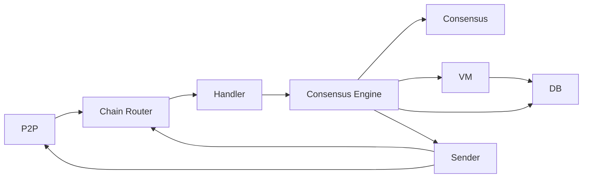

# Metrics

```mermaid
graph LR
    A[P2P] --> B[Chain Router]
    B --> C[Handler]
    C --> D[Consensus Engine]
    D --> E[Consensus]
    D --> F[VM]
    D --> G[DB]
    D --> I[Sender]
    F --> G
    I --> A
    I --> B 
```
