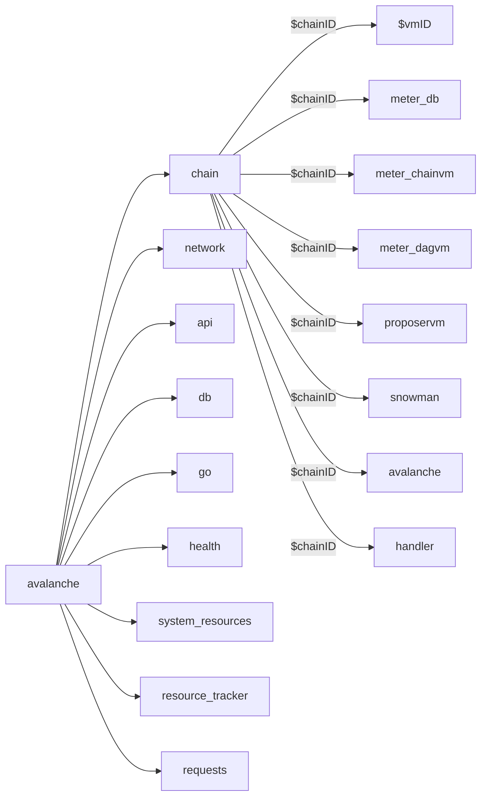

# Metrics

```mermaid
graph LR
    A[avalanche] --> B[chain]
    A --> C[network]
    A --> D[api]
    A --> E[db]
    A --> F[go]
    A --> G[health]
    A --> H[system_resources]
    A --> I[resource_tracker]
    A --> J[requests]
    B -- $chainID --> K[$vmID]
    B -- $chainID --> L[meter_db]
    B -- $chainID --> M[meter_chainvm]
    B -- $chainID --> N[meter_dagvm]
    B -- $chainID --> O[proposervm]
    B -- $chainID --> P[snowman]
    B -- $chainID --> Q[avalanche]
    B -- $chainID --> R[handler]
```
