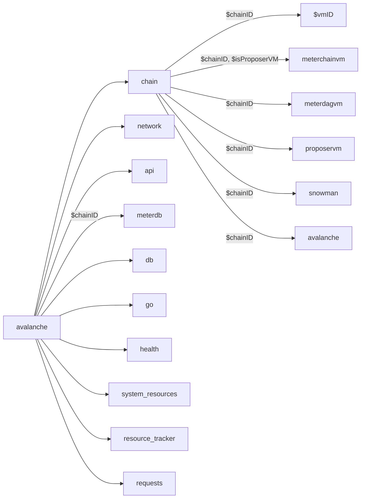

# Metrics

```mermaid
graph LR
    A[avalanche] --> B[chain]
    A --> C[network]
    A --> D[api]
    A -- $chainID --> E[meterdb]
    A --> F[db]
    A --> G[go]
    A --> H[health]
    A --> I[system_resources]
    A --> J[resource_tracker]
    A --> K[requests]
    B -- $chainID --> L[$vmID]
    B -- $chainID, $isProposerVM --> M[meterchainvm]
    B -- $chainID --> N[meterdagvm]
    B -- $chainID --> O[proposervm]
    B -- $chainID --> P[snowman]
    B -- $chainID --> Q[avalanche]
```
