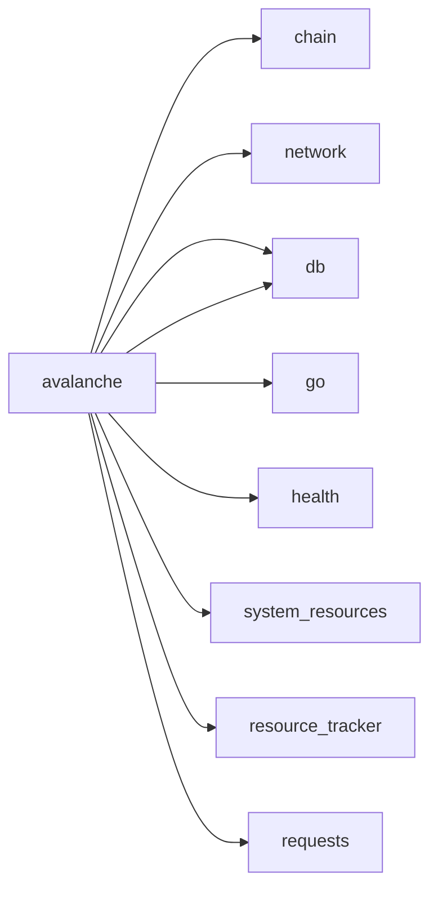

# Metrics

```mermaid
graph LR
    A[avalanche] --> B[chain]
    A --> C[network]
    A --> D[api]
    A --> D[db]
    A --> E[go]
    A --> F[health]
    A --> G[system_resources]
    A --> H[resource_tracker]
    A --> I[requests]
```
