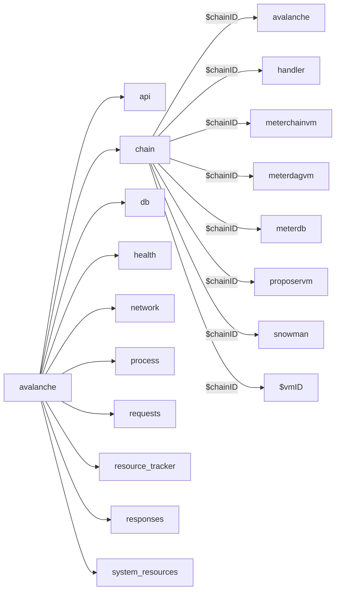

# Metrics

```mermaid
graph LR
    A[avalanche] --> B[api]
    A --> C[chain]
    A --> D[db]
    A --> E[health]
    A --> F[network]
    A --> G[process]
    A --> H[requests]
    A --> I[resource_tracker]
    A --> J[responses]
    A --> K[system_resources]
    C -- $chainID --> L[avalanche]
    C -- $chainID --> M[handler]
    C -- $chainID --> N[meterchainvm]
    C -- $chainID --> O[meterdagvm]
    C -- $chainID --> P[meterdb]
    C -- $chainID --> Q[proposervm]
    C -- $chainID --> R[snowman]
    C -- $chainID --> S[$vmID]
```
