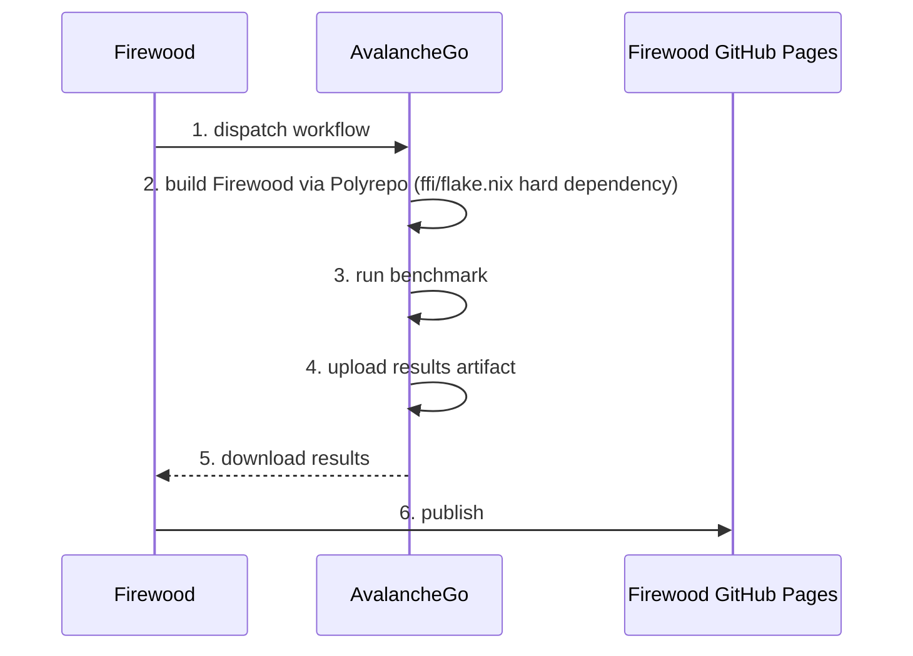

# C-Chain Re-Execution Benchmarks

Re-executes historical C-Chain blocks against a state snapshot. Results publish to GitHub Pages automatically.

For how the benchmark works, what S3 data exists, and how to create snapshots, see the authoritative source:[**AvalancheGo C-Chain Re-Execution Benchmark README**](https://github.com/ava-labs/avalanchego/blob/master/tests/reexecute/c/README.md)

## Table of Contents

- [How It Works](#how-it-works)
- [Quick Start](#quick-start)
- [Choosing a Test](#choosing-a-test)
- [Choosing a Runner](#choosing-a-runner)
- [When to use just bench-cchain vs AvalancheGo directly](#when-to-use-just-bench-cchain-vs-avalanchego-directly)
- [Scheduled Runs](#scheduled-runs)
- [Finding S3 Data](#finding-s3-data)
- [Monitoring a Run in Grafana](#monitoring-a-run-in-grafana)
- [Viewing Historical Results](#viewing-historical-results)
- [Gotchas](#gotchas)
- [References](#references)

## How It Works

`just bench-cchain` triggers Firewood's `track-performance.yml`, which
dispatches the benchmark workflow in AvalancheGo. AvalancheGo builds Firewood
at `FIREWOOD_REF` using the Polyrepo toolchain — `ffi/flake.nix` is a hard
dependency for this build. After the benchmark completes, AvalancheGo uploads
results as a workflow artifact. Firewood's workflow downloads them and publishes
to GitHub Pages, keeping all measurements scoped to the Firewood repository – [view benchmark trends](https://ava-labs.github.io/firewood/bench/).



Benchmarks run on AvalancheGo's self-hosted runners, not locally.

## Quick Start

Authenticate once:

```bash
nix run ./ffi#gh -- auth login   # or: gh auth login
export GH_TOKEN=$(gh auth token)
```

Run the recommended test:

```bash
TEST=firewood-40m-41m just bench-cchain
```

List all available named tests:

```bash
./scripts/bench-cchain-reexecution.sh tests
```

All env vars and options:

```bash
./scripts/bench-cchain-reexecution.sh help
```

## Choosing a Test

| Goal | Use |
| --- | --- |
| A/B test, daily-style run, quick regression check | `firewood-40m-41m` |
| Quick smoke test | `firewood-101-250k` (~7 min) |

**`firewood-40m-41m` is the right default for most work.** It covers a
contract-heavy slice of mature mainnet activity, finishes in <2h, and is the
same workload used in the daily scheduled run — making it directly comparable
to historical data.

To run with a specific Firewood commit or custom block range:

```bash
# Pin to a specific commit
FIREWOOD_REF=5406b68 TEST=firewood-40m-41m just bench-cchain

# Custom block range
START_BLOCK=40000001 END_BLOCK=41000000 \
  BLOCK_DIR_SRC=cchain-mainnet-blocks-40m-50m-ldb \
  CURRENT_STATE_DIR_SRC=cchain-current-state-firewood-40m \
  just bench-cchain
```

## Choosing a Runner

**Default: `avago-runner-i4i-2xlarge-local-ssd`** — always use this for A/B
testing and regression detection. It has 10 replicas with local NVMe SSD,
isolated per run.

Infrastructure variance on shared runners can exceed 15% between runs of
identical code. This runner keeps that below <10%. Switch runners and you
risk measuring infrastructure noise, not code changes.

If you need a different runner — for example to compare storage configurations
(local SSD vs EBS) — available runners are defined in
[`action-runner.yaml`](https://github.com/ava-labs/devops-argocd/blob/main/base/system/actions-runners/action-runner.yaml).
Look for the `releaseName` key to find valid runner labels.

> **Be aware:** runners other than `avago-runner-i4i-2xlarge-local-ssd` are not
> optimized for variance reduction. Results will differ and are not directly
> comparable to historical benchmark data. This is intentional when testing
> hardware or storage configuration differences — but not what you want for
> code-level A/B testing.

## When to use just bench-cchain vs AvalancheGo directly

`just bench-cchain` monitors the run via `gh run watch`, which has a hard
**6-hour polling limit**. When it exits, the benchmark may still be running in
AvalancheGo. If your test takes >6h (e.g. `firewood-33m-40m`), `just bench-cchain`
will lose track of the run before it finishes and results won't publish to
GitHub Pages.

| Test duration | Use |
| --- | --- |
| <6h (e.g. `firewood-40m-41m`) | `just bench-cchain` |
| >6h (e.g. `firewood-33m-40m`) | Trigger directly in AvalancheGo |

For long tests, trigger directly:
[AvalancheGo → Actions → C-Chain Re-Execution Benchmark w/ Container](https://github.com/ava-labs/avalanchego/actions)

## Scheduled Runs

| Schedule | Test | ~Duration |
| --- | --- | --- |
| Weekdays 05:00 UTC | `firewood-40m-41m` (blocks 40M–41M) | <2h |
| Weekdays 05:05 UTC | `firewood-33m-33m500k` (blocks 33M–33.5M) | <2h |

## Finding S3 Data

Needed only for custom block ranges. AWS credentials required
(Okta → Experimental → Access Keys, region `us-east-2`):

```bash
s5cmd ls s3://avalanchego-bootstrap-testing | grep blocks          # block sources
s5cmd ls s3://avalanchego-bootstrap-testing | grep current-state   # state snapshots
```

Strip the `s3://avalanchego-bootstrap-testing/` prefix and trailing `/` to get
`BLOCK_DIR_SRC` and `CURRENT_STATE_DIR_SRC` values. The naming convention
encodes height: `cchain-current-state-firewood-40m` = state at block 40,000,000.

## Monitoring a Run in Grafana

After triggering, you get a Firewood workflow URL:

```text
Monitor this workflow with cli: gh run watch 23198191542
 or with this URL: https://github.com/ava-labs/firewood/actions/runs/23198191542
```

1. Open the workflow URL and click the **benchmark** job
2. Expand the **Trigger C-Chain Reexecution Benchmark** step
3. The AvalancheGo run URL is printed directly in the output:

   ```text
   https://github.com/ava-labs/avalanchego/actions/runs/23198207568
   ```

   The number at the end is your `gh_run_id` — this is what Grafana uses to
   identify which CI run emitted the metrics. [Example](https://github.com/ava-labs/firewood/actions/runs/23198191542/job/67412514119#step:3:22).

4. Open the [Firewood Performance dashboard](https://grafana-poc.avax-dev.network/d/avw6fld/firewood-performance).
   This dashboard is scoped to a single CI run — it is not meant for multi-node
   or production use.
5. Add a filter: `gh_run_id = 23198207568` and set the time range to cover the
   run window

> **Time range matters.** Grafana defaults to "Last 5 minutes". Set it to cover
> the full run window or you'll see an empty or partial chart.

## Viewing Historical Results

Results are published to GitHub Pages via
[`gh-pages.yaml`](../../.github/workflows/gh-pages.yaml), maintained by the
Firewood team. It serves two purposes:

- **Rust docs** — built from `main` on every push via `cargo doc`
- **Benchmark history** — triggered after `track-performance.yml` completes;
  merges the `benchmark-data` branch into the pages deployment so docs and
  benchmark trends are served from a single GitHub Pages site

Links:

- [Main branch trends](https://ava-labs.github.io/firewood/bench/)
- [Feature branch trends](https://ava-labs.github.io/firewood/dev/bench/)
- Raw data: [benchmark-data/bench/data.js](https://github.com/ava-labs/firewood/blob/benchmark-data/bench/data.js)

## Gotchas

1. **Push before triggering.** The workflow builds from the remote branch.
   Unpushed commits benchmark the wrong code — the justfile catches this.

2. **`GH_TOKEN` needs cross-repo access (CI only).** In CI, the token must have
   access to both `ava-labs/firewood` and `ava-labs/avalanchego`. For local
   runs, `gh auth login` is sufficient.

3. **`AVALANCHEGO_REF` cannot be a commit SHA.** GitHub's `workflow_dispatch`
   only accepts branch or tag names. The justfile validates this.

4. **Monitoring timeout ≠ run failure.** `gh run watch` has a hard 6h limit.
   When it exits, the benchmark may still be running. Check the AvalancheGo
   run URL printed at trigger time before concluding failure.

5. **Results location = triggering branch, not benchmarked code.**
   `github.ref` controls storage, `FIREWOOD_REF` controls what runs:
   - `main` → `bench/` (official history — blocked in justfile, scheduled only)
   - feature branch → `dev/bench/{branch}/`

6. **Block/state pairing is your responsibility in custom mode.** No
   validation — wrong pairs silently produce bad results.

7. **Do not remove `ffi/flake.nix`.** The `track-performance` workflow depends
   on it via the Polyrepo toolchain. It is not dead code.

## References

- [AvalancheGo C-Chain benchmark README](https://github.com/ava-labs/avalanchego/blob/master/tests/reexecute/c/README.md) — S3 data, snapshot creation, local runs, full config reference
- [Available named tests](https://github.com/ava-labs/avalanchego/blob/master/scripts/benchmark_cchain_range.sh)
- [Firewood daily measurements](https://ava-labs.github.io/firewood/bench/)
