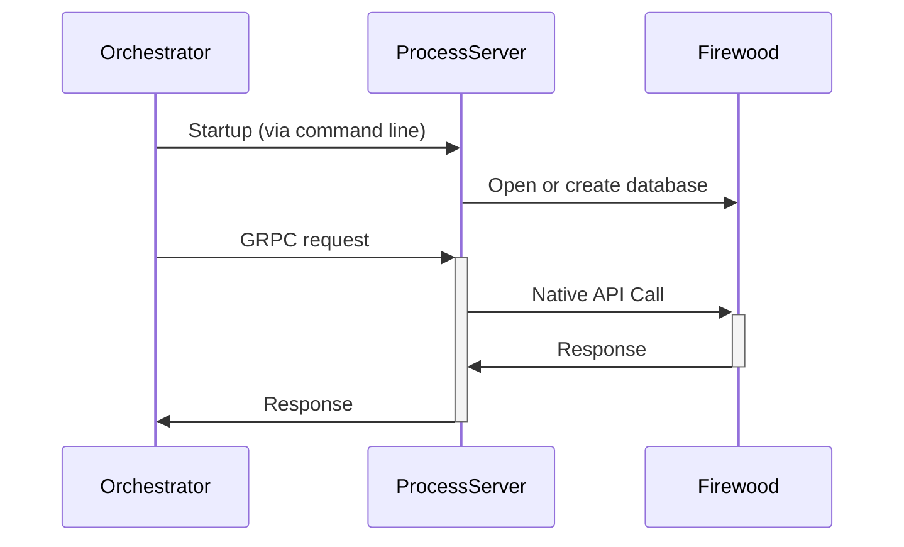

# Firewood process-server implementation

This service is a plug-in for the test tool orchestrator (currently closed source).
The test tool is used for both performance and correctness testing, especially for the syncer.

There are 3 RPC specs that must be implemented:

1. The rpcdb proto, which supports simple operations like Has, Get, Put, Delete, and some iterators.
2. The sync proto, which supports retrieving range and change proofs
3. The process-server proto, which currently only retrieves metrics

# Running

To test the release version of firewood, just run `RUST_MIN_STACK=7000000 cargo bench`. If you make some changes and then
run it again, it will give you a report showing how much it sped up or slowed down.

If you want to run this against merkledb, first build the process-server following the instructions in
the [merkledb-tester](https://github.com/ava-labs/merkledb-tester) directory, then modify your PATH so
that `process-server` from the merkledbexecutable is found first, then run `cargo bench`.
