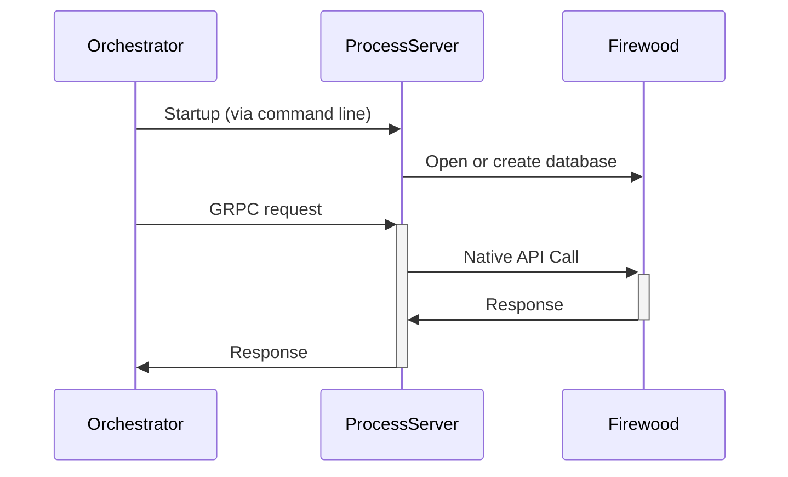

# Firewood process-server implementation

This service is a plug-in for the test tool orchestrator (currently closed source).
The test tool is used for both performance and correctness testing, especially for the syncer.

There are 3 RPC specs that must be implemented:

1. The rpcdb proto, which supports simple operations like Has, Get, Put, Delete, and some iterators.
2. The sync proto, which supports retrieving range and change proofs
3. The process-server proto, which currently only retrieves metrics

