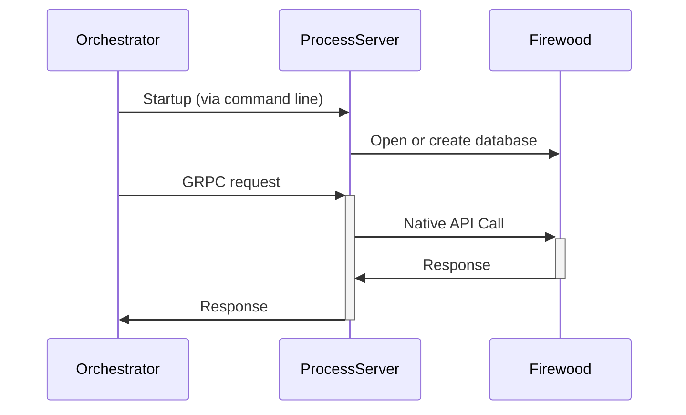

# Firewood process-server implementation

This service is a plug-in for the test tool orchestrator (currently closed source).
The test tool is used for both performance and correctness testing, especially for the syncer.



There are 3 RPC specs that must be implemented:

1. The rpcdb proto, which supports simple operations like Has, Get, Put, Delete, and some iterators.
2. The sync proto, which supports retrieving range and change proofs
3. The process-server proto, which currently only retrieves metrics

# Running

To run a single test and make sure things are working, first check out and build the go and rust code.
These have to be in the same directory. See the corresponding README for specific build requirements.

```sh
BASE=$HOME
cd $BASE && git clone git@github.com:ava-labs/merkledb-tester.git
cd $BASE && git clone git@github.com:ava-labs/firewood.git
```

Then, build the rust process server and symlink it to where the testtool expects it:

```sh
cd $BASE/firewood
cargo build --release
ln -sf $BASE/firewood/target/release/process-server $BASE/merkledb-tester/process/process-server
```

Then, run the test you want:

```sh
cd $BASE/merkledb-tester/tests
go test -timeout 5m github.com/ava-labs/merkledb-tester/... -v -count=1
```
