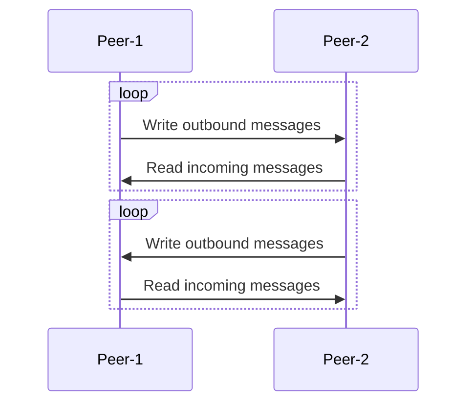
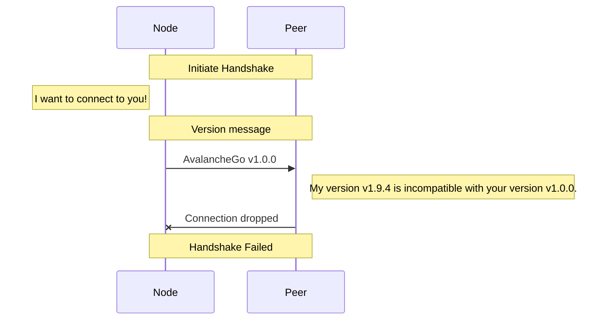
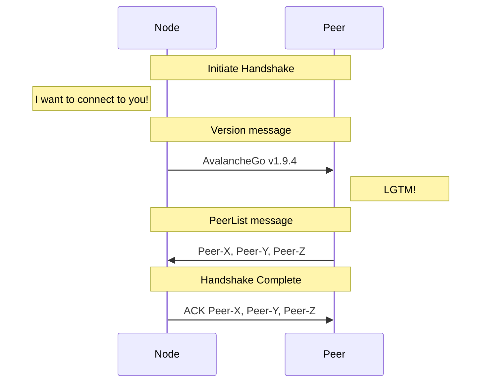
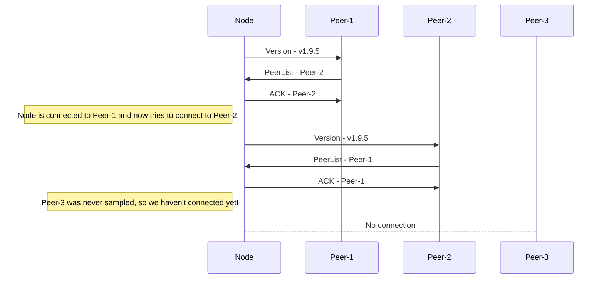
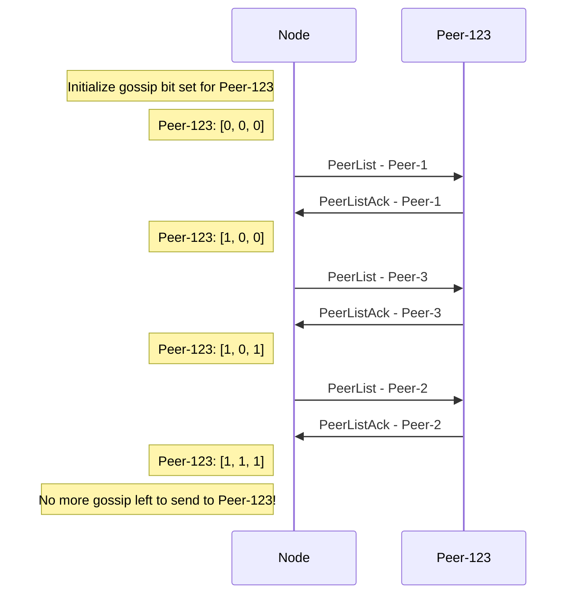

# Avalanche Networking

## Table of Contents

- [Overview](#overview)
- [Peers](#peers)
  - [Lifecycle](#lifecycle)
    - [Bootstrapping](#bootstrapping)
    - [Connecting](#connecting)
      - [Peer Handshake](#peer-handshake)
    - [Connected](#connected)
      - [PeerList Gossip](#peerlist-gossip)
        - [Messages](#messages)
        - [Gossip](#gossip)

## Overview

Avalanche is a decentralized [p2p](https://en.wikipedia.org/wiki/Peer-to-peer) (peer-to-peer) network of nodes that work together to run the Avalanche blockchain protocol.

The `network` package implements the networking layer of the protocol which allows a node to discover, connect to, and communicate with other peers.

## Peers

Peers are defined as members of the network that communicate with one another to participate in the Avalanche protocol.

Peers communicate by enqueuing messages between one another. Each peer on either side of the connection asynchronously reads and writes messages to and from the remote peer. Messages include both application-level messages used to support the Avalanche protocol, as well as networking-level messages used to implement the peer-to-peer communication layer.

### Lifecycle

#### Bootstrapping

When starting an Avalanche node, a node needs to be able to initiate some process that eventually allows itself to become a participating member of the network. In traditional web2 systems, it's common to use a web service by hitting the service's DNS and being routed to an available server behind a load balancer. In decentralized p2p systems however, connecting to a node is more complex as no single entity owns the network. [Avalanche consensus](https://docs.avax.network/overview/getting-started/avalanche-consensus) requires a node to repeatedly sample peers in the network, so each node needs some way of discovering and connecting to every other peer to participate in the protocol.

In Avalanche, nodes connect to an initial set of bootstrapper nodes known as **beacons** (this is user-configurable). Once connected to a set of beacons, a node is able to discover other nodes in the network. Over time, a node eventually discovers other peers in the network through `PeerList` messages it receives through:

- The handshake initiated between two peers when attempting to connect to a peer (see [Connecting](#connecting)).
- Periodic `PeerList` gossip messages that every peer sends to the peers it's connected to (see [Connected](#connected)).

#### Connecting

##### Peer Handshake

Upon connection to any peer, a handshake is performed between the node attempting to establish the outbound connection to the peer and the peer receiving the inbound connection.

When attempting to establish the connection, the first message that the node attempting to connect to the peer in the network is a `Version` message describing compatibility of the candidate node with the peer. As an example, nodes that are attempting to connect with an incompatible version of AvalancheGo or a significantly skewed local clock are rejected by the peer.

If the `Version` message is successfully received and the peer decides that it wants a connection with this node, it replies with a `PeerList` message that contains metadata about other peers that allows a node to connect to them. Upon reception of a `PeerList` message, a node will attempt to connect to any peers that the node is not already connected to to allow the node to discover more peers in the network.

Once the node attempting to join the network receives this `PeerList` message, the handshake is complete and the node is now connected to the peer. The node attempts to connect to the new peers discovered in the `PeerList` message. Each connection results in another peer handshake, which results in the node incrementally discovering more and more peers in the network as more and more `PeerList` messages are exchanged.

#### Connected

Some peers aren't discovered through the `PeerList` messages exchanged through peer handshakes. This can happen if a peer is either not randomly sampled, or if a new peer joins the network after the node has already connected to the network.

To guarantee that a node can discover all peers, each node periodically gossips a sample of the peers it knows about to other peers.

##### PeerList Gossip

###### Messages

A `PeerList` is the message that is used to communicate the presence of peers in the network. Each `PeerList` message contains networking-level metadata about the peer that provides the necessary information to connect to it, alongside the corresponding transaction id that added that peer to the validator set. Transaction ids are unique hashes that only add a single validator, so it is guaranteed that there is a 1:1 mapping between a validator and its associated transaction id.

`PeerListAck` messages are sent in response to `PeerList` messages to allow a peer to confirm which peers it will actually attempt to connect to. Because nodes only gossip peers they believe another peer doesn't already know about to optimize bandwidth, `PeerListAck` messages are important to confirm that a peer will attempt to connect to someone. Without this, a node might gossip a peer to another peer and assume a connection between the two is being established, and not re-gossip the peer in future gossip cycles. If the connection was never actually wanted by the peer being gossiped to due to a transient reason, that peer would never be able to re-discover the gossiped peer and could be isolated from a subset of the network.

Once a `PeerListAck` message is received from a peer, the node that sent the original `PeerList` message marks the corresponding acknowledged validators as already having been transmitted to the peer, so that it's excluded from subsequent iterations of `PeerList` gossip.

###### Gossip

Handshake messages provide a node with some knowledge of peers in the network, but offers no guarantee that learning about a subset of peers from each peer the node connects with will result in the node learning about every peer in the network.

In order to provide a probabilistic guarantee that all peers in the network will eventually learn of one another, each node periodically gossips a sample of the peers that they're aware of to a sample of the peers that they're connected to. Over time, this probabilistically guarantees that every peer will eventually learn of every other peer.

To optimize bandwidth usage, each node tracks which peers are guaranteed to know of which peers. A node learns this information by tracking both inbound and outbound `PeerList` gossip.

- Inbound
  - If a node ever receives `PeerList` from a peer, that peer _must_ have known about the peers in that `PeerList` message in order to have gossiped them.
- Outbound
  - If a node sends a `PeerList` to a peer and the peer replies with an `PeerListAck` message, then all peers in the `PeerListAck` must be known by the peer.

To efficiently track which peers know of which peers, the peers that each peer is aware of is represented in a [bit set](https://en.wikipedia.org/wiki/Bit_array). A peer is represented by either a `0` if it isn't known by the peer yet, or a `1` if it is known by the peer.

An node follows the following steps for every cycle of `PeerList` gossip:

1. Get a sample of peers in the network that the node is connected to
2. For each peer:
    1. Figure out which peers the node hasn't gossiped to them yet.
    2. Take a random sample of these unknown peers.
    3. Send a message describing these peers to the peer.

Because network state is generally expected to be stable (i.e nodes are not continuously flickering online/offline), as more and more gossip messages are exchanged nodes eventually realize that the peers that they are connected to have learned about every other peer.

A node eventually stops gossiping peers when there's no more new peers to gossip about. `PeerList` gossip only resumes once:

1. a new peer joins
2. a peer disconnects and reconnects
3. a new validator joins the network
4. a validator's IP is updated
