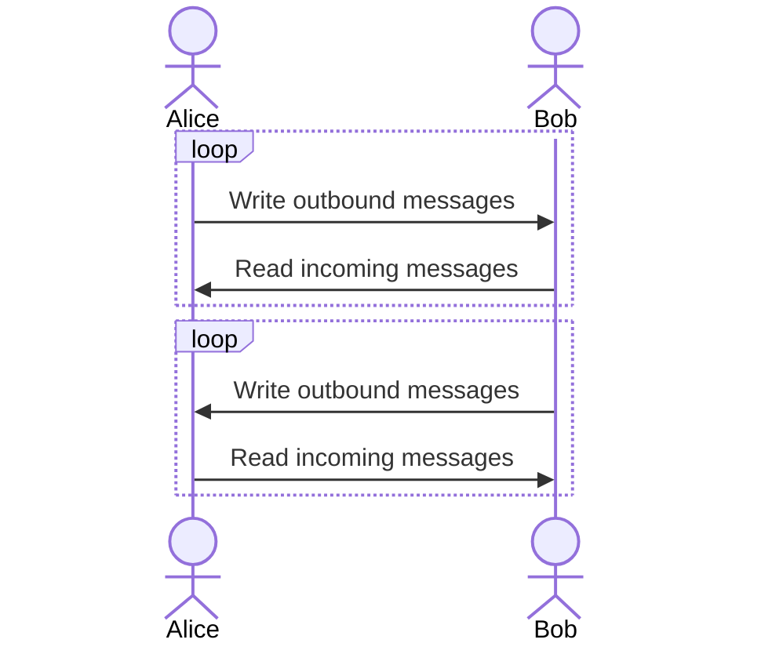
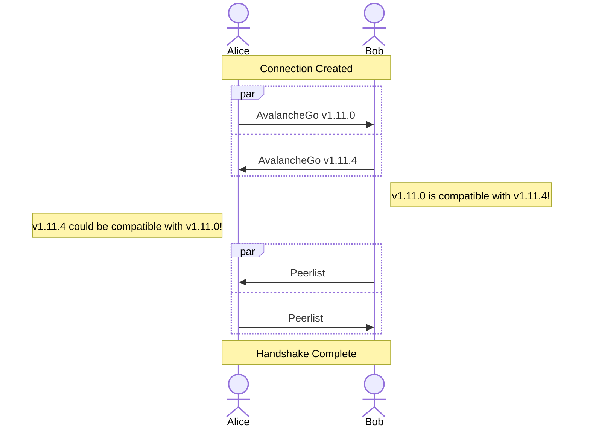
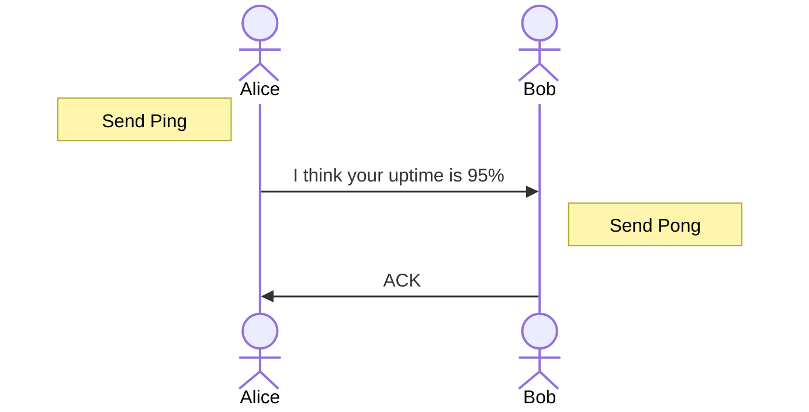
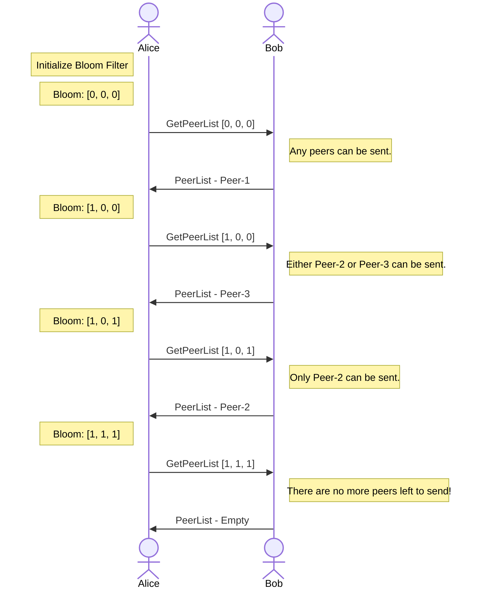

# Avalanche Networking

## Table of Contents

- [Overview](#overview)
- [Peers](#peers)
  - [Message Handling](#message-handling)
  - [Peer Handshake](#peer-handshake)
  - [Ping-Pong Messages](#ping-pong-messages)
- [Peer Discovery](#peer-discovery)
    - [Inbound Connections](#inbound-connections)
    - [Outbound Connections](#outbound-connections)
      - [IP Authentication](#ip-authentication)
    - [Bootstrapping](#bootstrapping)
    - [PeerList Gossip](#peerlist-gossip)
      - [Bloom Filter](#bloom-filter)
      - [GetPeerList](#getpeerlist)
      - [PeerList](#peerlist)

## Overview

Avalanche is a decentralized [p2p](https://en.wikipedia.org/wiki/Peer-to-peer) (peer-to-peer) network of nodes that work together to run the Avalanche blockchain protocol.

The `network` package implements the networking layer of the protocol which allows a node to discover, connect to, and communicate with other peers.

All connections are authenticated using [TLS](https://en.wikipedia.org/wiki/Transport_Layer_Security). However, there is no reliance on any certificate authorities. The `network` package identifies peers by the public key in the leaf certificate.

## Peers

Peers are defined as members of the network that communicate with one another to participate in the Avalanche protocol.

Peers communicate by enqueuing messages between one another. Each peer on either side of the connection asynchronously reads and writes messages to and from the remote peer. Messages include both application-level messages used to support the Avalanche protocol, as well as networking-level messages used to implement the peer-to-peer communication layer.

### Message Handling

All messages are prefixed with their length. Reading a message first reads the 4-byte message length from the connection. The rate-limiting logic then waits until there is sufficient capacity to read these bytes from the connection.

A peer will then read the full message and attempt to parse it into either a networking message or an application message. If the message is malformed the connection is not dropped. The peer will simply continue to the next sent message.

### Peer Handshake

Upon connection to a new peer, a handshake is performed between the node attempting to establish the outbound connection to the peer and the peer receiving the inbound connection.

When attempting to establish the connection, the first message that the node sends is a `Handshake` message describing the compatibility of the nodes. If the `Handshake` message is successfully received and the peer decides that it wants a connection with this node, it replies with a `PeerList` message that contains metadata about other peers that allows a node to connect to them. See [Peerlist Gossip](#peerlist-gossip).

As an example, nodes that are attempting to connect with an incompatible version of AvalancheGo or a significantly skewed local clock are rejected.

Nodes that mutually desire the connection will both respond with `PeerList` messages and complete the handshake.

### Ping-Pong Messages

Peers periodically send `Ping` messages containing perceived uptime information. This information can be used to monitor how the node is considered to be performing by the network. It is expected for a node to reply to a `Ping` message with a `Pong` message.

## Peer Discovery

When starting an Avalanche node, a node needs to be able to initiate some process that eventually allows itself to become a participating member of the network. In traditional web2 systems, it's common to use a web service by hitting the service's DNS and being routed to an available server behind a load balancer. In decentralized p2p systems, however, connecting to a node is more complex as no single entity owns the network. [Avalanche consensus](https://docs.avax.network/overview/getting-started/avalanche-consensus) requires a node to repeatedly sample peers in the network, so each node needs some way of discovering and connecting to every other peer to participate in the protocol.

### Inbound Connections

It is expected for Avalanche nodes to allow inbound connections. If a validator does not allow inbound connections, its observed uptime may be reduced.

### Outbound Connections

Avalanche nodes that have identified the `IP:Port` pair of a node they want to connect to will initiate outbound connections to this `IP:Port` pair. If the connection is not able to complete the [Peer Handshake](#peer-handshake), the connection will be re-attempted with an [Exponential Backoff](https://en.wikipedia.org/wiki/Exponential_backoff).

A node should initiate outbound connections to an `IP:Port` pair that is believed to belong to a node that is not connected and meets at least one of the following conditions:
- The node is in the initial bootstrapper set.
- The node is in the default bootstrapper set.
- The node in the current Primary Network validator set.

#### IP Authentication

To ensure that outbound connections are being made to the correct `IP:Port` pair of a node, all `IP:Port` pairs sent by the network are signed by the node that is claiming ownership of the pair. To prevent replays of these messages, the signature is over the `Timestamp` in addition to the `IP:Port` pair.

The `Timestamp` guarantees that nodes provided an `IP:Port` pair can track the most up-to-date `IP:Port` pair of a peer.

### Bootstrapping

In Avalanche, nodes connect to an initial set (this is user-configurable) of bootstrap nodes.

### PeerList Gossip

Once connected to an initial set of peers, a node can use these connections to discover additional peers.

Peers are discovered by receiving [`PeerList`](#peerlist) messages during the [Peer Handshake](#peer-handshake). These messages quickly provide a node with knowledge of peers in the network. However, they offer no guarantee that the node will connect to and maintain connections with every peer in the network.

To provide an eventual guarantee that all peers learn of one another, nodes periodically send a [`GetPeerList`](#getpeerlist) message to a randomly selected validator with the node's current [Bloom Filter](#bloom-filter) and `Salt`.

#### Bloom Filter

A [Bloom Filter](https://en.wikipedia.org/wiki/Bloom_filter) is used to track which nodes are known.

The parameterization of the Bloom Filter is based on the number of desired peers.

Entries in the Bloom Filter are determined by a locally calculated [`Salt`](https://en.wikipedia.org/wiki/Salt_(cryptography)) along with the `NodeID` and `Timestamp` of the most recently known `IP:Port`. The `Salt` is added to prevent griefing attacks where malicious nodes intentionally generate hash collisions with other virtuous nodes to reduce their connectivity.

The Bloom Filter is reconstructed if there are more entries than expected to avoid increasing the false positive probability. It is also reconstructed periodically. When reconstructing the Bloom Filter, a new `Salt` is generated.

To prevent a malicious node from arbitrarily filling this Bloom Filter, only `2` entries are added to the Bloom Filter per node. If a node's `IP:Port` pair changes once, it will immediately be added to the Bloom Filter. If a node's `IP:Port` pair changes more than once, it will only be added to the Bloom Filter after the Bloom Filter is reconstructed.

#### GetPeerList

A `GetPeerList` message contains the Bloom Filter of the currently known peers along with the `Salt` that was used to add entries to the Bloom Filter. Upon receipt of a `GetPeerList` message, a node is expected to respond with a `PeerList` message.

#### PeerList

`PeerList` messages are expected to contain `IP:Port` pairs that satisfy all of the following constraints:
- The Bloom Filter sent when requesting the `PeerList` message does not contain the node claiming the `IP:Port` pair.
- The node claiming the `IP:Port` pair is currently connected.
- The `IP:Port` pair the node shared during the `Handshake` message is the node's most recently known `IP:Port` pair.
- The node claiming the `IP:Port` pair is either in the default bootstrapper set or is a current Primary Network validator.

#### Example PeerList Gossip

The following diagram shows an example of `Alice` repeatedly learning about new peers from `Bob`.

