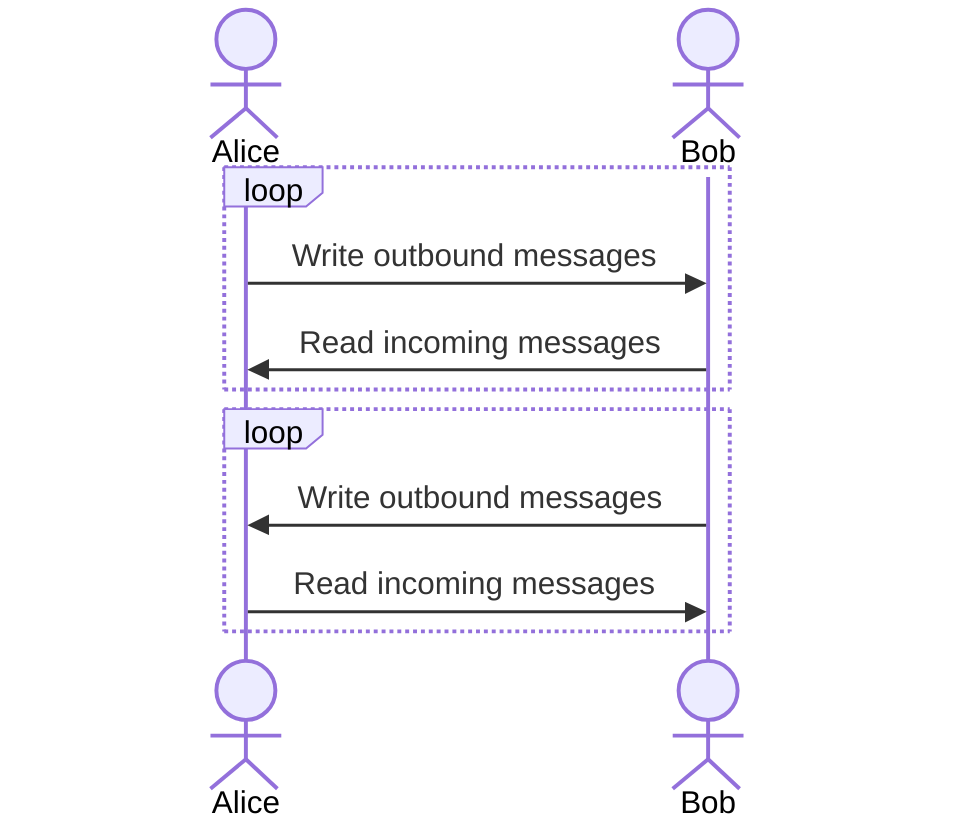
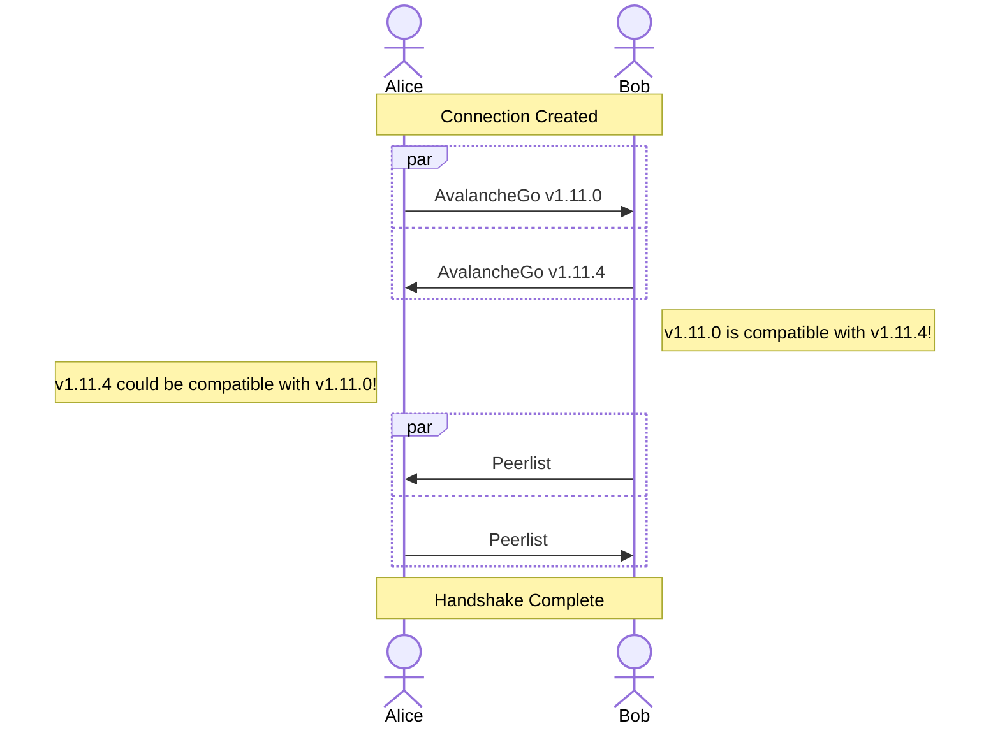
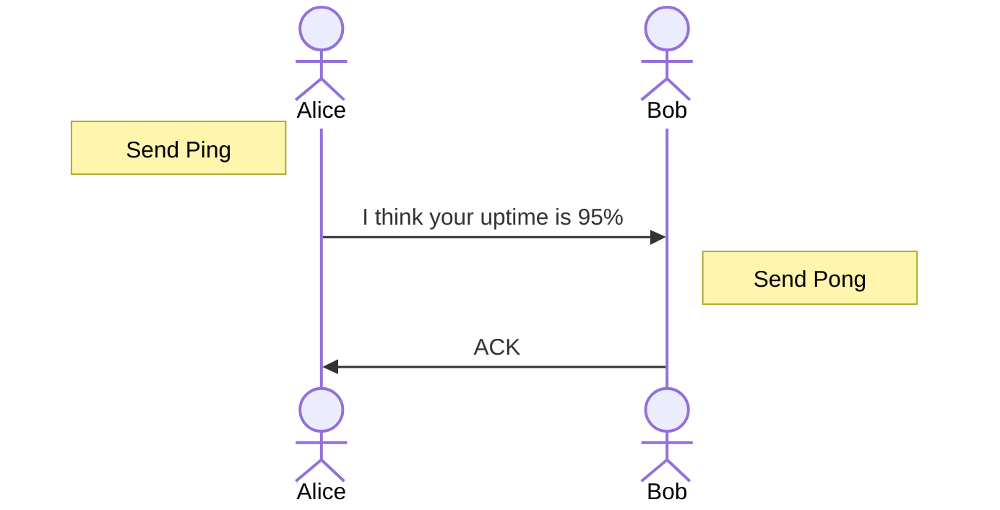
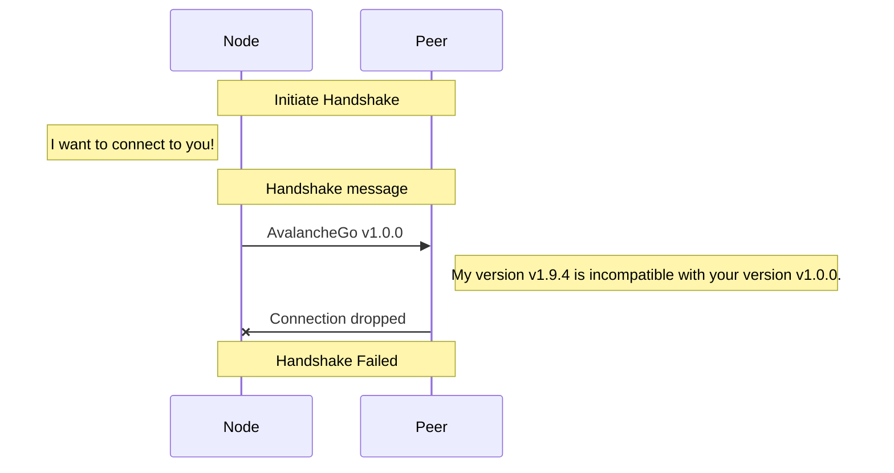
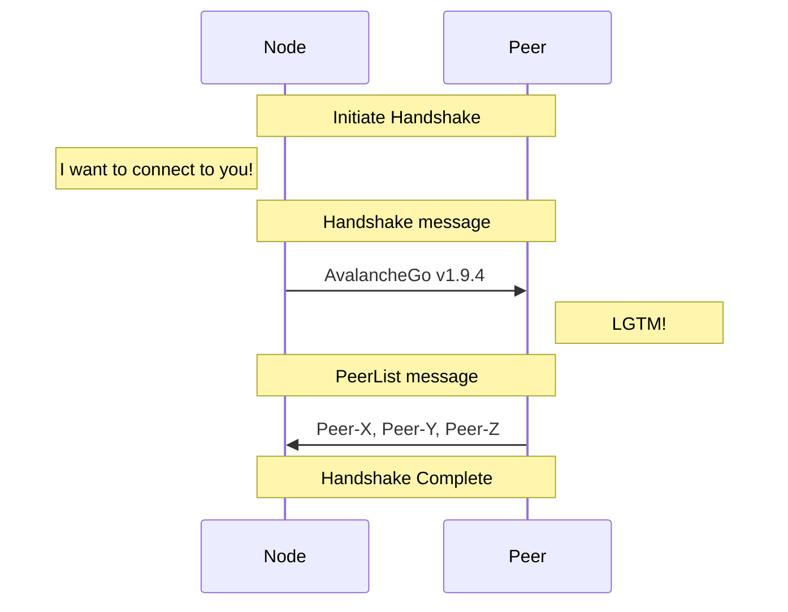
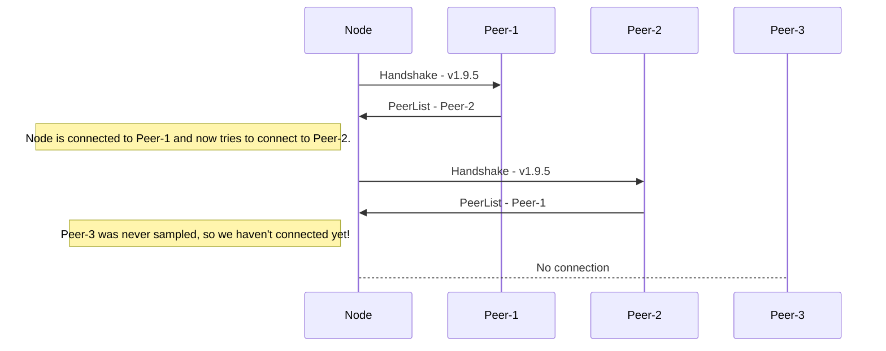
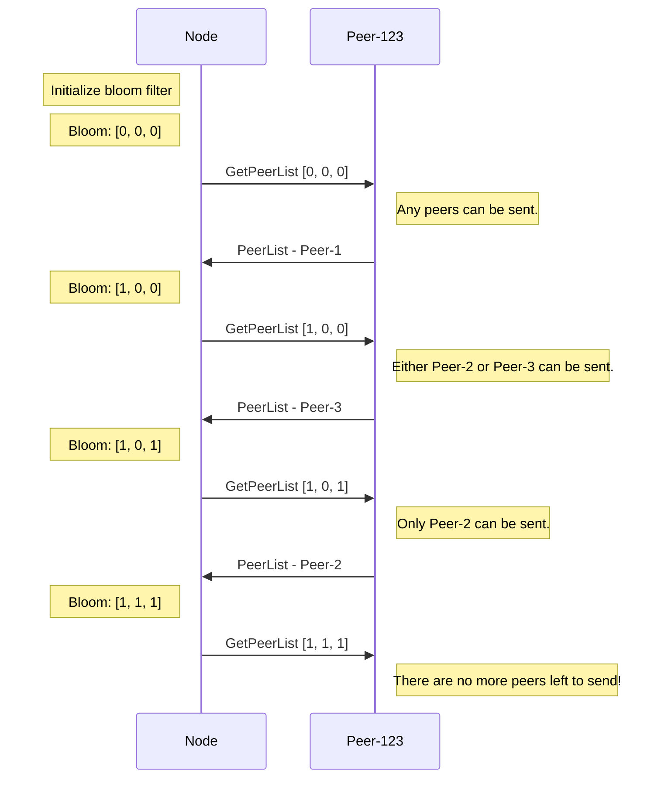

# Avalanche Networking

## Table of Contents

- [Overview](#overview)
- [Peers](#peers)
  - [Message Handling](#peer-handshake)
  - [Peer Handshake](#peer-handshake)
  - [Ping-Pong Messages](#ping-pong)
- [Peer Discovery](#peer-discovery)
    - [Inbound Connection](#inbound-connections)
    - [Bootstrapping](#bootstrapping)
    - [PeerList Gossip](#peerlist-gossip)
      - [Messages](#messages)
      - [Gossip](#gossip)

## Overview

Avalanche is a decentralized [p2p](https://en.wikipedia.org/wiki/Peer-to-peer) (peer-to-peer) network of nodes that work together to run the Avalanche blockchain protocol.

The `network` package implements the networking layer of the protocol which allows a node to discover, connect to, and communicate with other peers.

## Peers

Peers are defined as members of the network that communicate with one another to participate in the Avalanche protocol.

Peers communicate by enqueuing messages between one another. Each peer on either side of the connection asynchronously reads and writes messages to and from the remote peer. Messages include both application-level messages used to support the Avalanche protocol, as well as networking-level messages used to implement the peer-to-peer communication layer.

### Message Handling

All messages are prefixed with their length. Reading a message first reads the 4-byte message length from the connection. The rate limiting logic then waits until there is sufficient capacity to read these bytes from the connection.

A peer will then read the full message and attempt to parse it into either a networking message or an application message. If the message is malformed the connection is not dropped. The peer will simply continue to the next sent message.

### Peer Handshake

Upon connection to a new peer, a handshake is performed between the node attempting to establish the outbound connection to the peer and the peer receiving the inbound connection.

When attempting to establish the connection, the first message that the node sends is a `Handshake` messages describing compatibility of the nodes. If the `Handshake` message is successfully received and the peer decides that it wants a connection with this node, it replies with a `PeerList` message that contains metadata about other peers that allows a node to connect to them. See [Peerlist Gossip](#peerlist-gossip).

As an example, nodes that are attempting to connect with an incompatible version of AvalancheGo or a significantly skewed local clock are rejected.

Nodes that multually desire the connection will both respond with `PeerList` messages and complete the handshake.

### Ping-Pong Messages

Peers periodically send `Ping` messages containing perseived uptime information. This information can be used to monitor how the node is considered to be perform by the network. It is expected for a node to reply to a `Ping` message with a `Pong` message.

## Peer Discovery

When starting an Avalanche node, a node needs to be able to initiate some process that eventually allows itself to become a participating member of the network. In traditional web2 systems, it's common to use a web service by hitting the service's DNS and being routed to an available server behind a load balancer. In decentralized p2p systems however, connecting to a node is more complex as no single entity owns the network. [Avalanche consensus](https://docs.avax.network/overview/getting-started/avalanche-consensus) requires a node to repeatedly sample peers in the network, so each node needs some way of discovering and connecting to every other peer to participate in the protocol.

### Inbound Connections

It is expected for Avalanche nodes to allow inbound connections. If a validator does not allow inbound connections, its observed uptime may be reduced.

### Outbound Connections

Avalanche nodes that have identified the `IP:Port` pair of a node they want to connect to will initiate outbound connections to this `IP:Port` pair. If the connection is not able to complete the [Peer Handshake](#peer-handshake), the connection will be re-attempted with an [Exponential Backoff](https://en.wikipedia.org/wiki/Exponential_backoff).

A node should initiate outbound connections to an `IP:Port` pair if one of the following is true:
- The `IP:Port` is currently believed to belong to a node in the initial bootstrapper set.
- The `IP:Port` is currently believed to belong to a node in the current Primary Network validator set.

### Bootstrapping

In Avalanche, nodes connect to an initial set (this is user-configurable) of bootstrap nodes.

### PeerList Gossip

Once connected to an initial set of peers, a node is able to use these connections to discover additional peers.

Peers are discovered by receiving `PeerList` messages:
- sent during the [Peer Handshake](#peer-handshake).
- sent in response to `GetPeerList` messages.

#### Connecting

##### Peer Handshake

Upon connection to any peer, a handshake is performed between the node attempting to establish the outbound connection to the peer and the peer receiving the inbound connection.

When attempting to establish the connection, the first message that the node attempting to connect to the peer in the network is a `Handshake` message describing compatibility of the candidate node with the peer. As an example, nodes that are attempting to connect with an incompatible version of AvalancheGo or a significantly skewed local clock are rejected by the peer.

If the `Handshake` message is successfully received and the peer decides that it wants a connection with this node, it replies with a `PeerList` message that contains metadata about other peers that allows a node to connect to them. Upon reception of a `PeerList` message, a node will attempt to connect to any peers that the node is not already connected to to allow the node to discover more peers in the network.

Once the node attempting to join the network receives this `PeerList` message, the handshake is complete and the node is now connected to the peer. The node attempts to connect to the new peers discovered in the `PeerList` message. Each connection results in another peer handshake, which results in the node incrementally discovering more and more peers in the network as more and more `PeerList` messages are exchanged.

#### Connected

Some peers aren't discovered through the `PeerList` messages exchanged through peer handshakes. This can happen if a peer is either not randomly sampled, or if a new peer joins the network after the node has already connected to the network.

To guarantee that a node can discover all peers, each node periodically sends a `GetPeerList` message to a random peer.

##### PeerList Gossip

###### Messages

A `GetPeerList` message requests that the peer sends a `PeerList` message. `GetPeerList` messages contain a bloom filter of already known peers to reduce useless bandwidth on `PeerList` messages. The bloom filter reduces bandwidth by enabling the `PeerList` message to only include peers that aren't already known.

A `PeerList` is the message that is used to communicate the presence of peers in the network. Each `PeerList` message contains signed networking-level metadata about a peer that provides the necessary information to connect to it.

Once peer metadata is received, the node will add that data to its bloom filter to prevent learning about it again.

###### Gossip

Handshake messages provide a node with some knowledge of peers in the network, but offers no guarantee that learning about a subset of peers from each peer the node connects with will result in the node learning about every peer in the network.

To provide an eventual guarantee that all peers learn of one another, each node periodically requests peers from a random peer.

To optimize bandwidth, each node tracks the most recent IPs of validators. The validator's nodeID and timestamp are inserted into a bloom filter which is used to select only necessary IPs to gossip.

As the number of entries increases in the bloom filter, the probability of a false positive increases. False positives can cause recent IPs not to be gossiped when they otherwise should be, slowing down the rate of `PeerList` gossip. To prevent the bloom filter from having too many false positives, a new bloom filter is periodically generated and the number of entries a validator is allowed to have in the bloom filter is capped. Generating the new bloom filter both removes stale entries and modifies the hash functions to avoid persistent hash collisions.

A node follows the following steps for of `PeerList` gossip:

