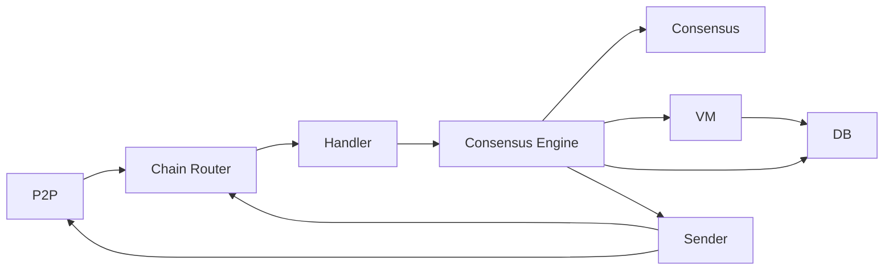

# Flow of a Single Blockchain

## Intro

The Avalanche primary network consists of 3 built-in blockchains: the X-Chain, C-Chain, and P-Chain. All three chains rely on the Snowman consensus protocol. The X-Chain, which previously used DAG-based Avalanche consensus, was upgraded to Snowman in the Cortina network update. 

The X-Chain is used to manage assets. The C-Chain is used to create and interact with smart contracts. The P-Chain is used to coordinate validators and stake. At the time of writing, the Avalanche network has ~1200 validators. A set of validators makes up a subnet. Subnets can validate 1 or more chains. It is a common misconception that 1 subnet = 1 chain and this is shown by the primary subnet of Avalanche which is made up of the X-Chain, C-Chain, and P-Chain.

A node in the Avalanche network can either be a validator or a non-validator. A validator stakes AVAX tokens and participates in consensus to earn rewards. A non-validator does not participate in consensus or have any AVAX staked but is used as a public API. Both validators and non-validator need to have their own copy of the chain and to know the current state of the mempool. At the time of writing, there are ~1200 validators and ~1800 non-validator.

Each blockchain on Avalanche has several components: the virtual machine, database, consensus engine, sender, and handler. These components help the chain run smoothly. Blockchains also interact with the P2P layer and the chain router to send and receive messages.

## P2P

### [Outbound Messages](https://github.com/ava-labs/avalanchego/blob/master/message/outbound_msg_builder.go)

The `OutboundMsgBuilder` interface specifies methods that build messages of type `OutboundMessage`. Nodes communicate to other nodes by sending `OutboundMessage` messages.

All messaging functions in `OutboundMsgBuilder` can be categorized as follows:

- **Handshake**
  - Nodes need to be on a certain version before they can be accepted into the network.
- **State Sync**
  - A new node can ask other nodes for the current state of the network. It only syncs the required state for a specific block.
- **Bootstrapping**
  - Nodes can ask other nodes for blocks to build their own copy of the chain. A node can fetch all blocks from the locally last accepted block to the current last accepted block in the network.
- **Consensus**
  - Once a node is up to tip they can participate in consensus! During consensus, a node conducts a poll to several different small random samples of the validator set. They can communicate decisions on whether or not they have accepted/rejected a block.
- **App**
  - VMs communicate application-specific messages to other nodes through app messages. A common example is mempool gossiping.

Currently, Avalanchego implements its own message serialization to communicate. In the future, Avalanchego will use protocol buffers to communicate.

### [Network](../network/network.go)

The networking interface is shared across all chains. It implements functions from the `ExternalSender` interface. The two functions it implements are `Send` and `Gossip`. `Send` sends a message of type `OutboundMessage` to a specific set of nodes (specified by an array of `NodeIDs`). `Gossip` sends a message of type `OutboundMessage` to a random group of nodes in a subnet (can be a validator or a non-validator). Gossiping is used to push transactions across the network. The networking protocol uses TLS to pass messages between peers.

Along with sending and gossiping, the networking library is also responsible for making connections and maintaining connections. Any node whether they are a validator or non-validator will attempt to connect to the primary network.

## [Router](./networking/router/chain_router.go)

The `ChainRouter` routes all incoming messages to its respective blockchain using `ChainID`. It does this by pushing all the messages onto the respective Chain handler’s queue. The `ChainRouter` references all existing chains on the network such as the X-chain, C-chain, P-chain and possibly any other chain. The `ChainRouter` handles timeouts as well. When sending messages on the P2P layer, timeouts are registered on the sender and cleared on the `ChainRouter` side when a response is received. If no response is received, then we trigger a timeout. Because we handle timeouts on the `ChainRouter` side, the handler is reliable. Peers not responding means timeouts trigger and the `ChainRouter` will still notify the handler of failure cases. The timeout manager within `ChainRouter` is also adaptive. If the network is experiencing long latencies, timeouts will then be adjusted as well.

## [Handler](./networking/handler/handler.go)

The main function of the `Handler` is to pass messages from the network to the consensus engine. It receives these messages from the `ChainRouter`. It passes messages by pushing them onto a sync or async queue (depends on message type). Messages are then popped from the queue, parsed, and routed to the correct function in consensus engine. This can be one of the following.

- **State sync message (sync queue)**
- **Bootstrapping message (sync queue)**
- **Consensus message (sync queue)**
- **App message (async queue)**

## [Sender](./networking/sender/sender.go)

The main role of the `sender` is to build and send outbound messages. It is actually a very thin wrapper around the normal networking code. The main difference here is that sender registers timeouts and tells the [router] to expect a response message. The timer starts on the sender side. If there is no response, sender will send a failed response to the [router]. If a node is repeatedly unresponsive, that node will get benched and sender will immediately start marking those messages as failed. If a sufficient amount of network deems the node benched, it might not get rewards (as a validator).

## [Consensus Engine](./consensus/snowman/consensus.go)

Consensus is defined as getting a group of distributed systems to agree on an outcome. In the case of the Avalanche network, consensus is achieved when validators are in agreement with the state of the blockchain. The novel consensus algorithm is documented in the [white paper](https://assets.website-files.com/5d80307810123f5ffbb34d6e/6009805681b416f34dcae012_Avalanche%20Consensus%20Whitepaper.pdf). There are two main consensus algorithms: Avalanche and Snowman. The engine is responsible for proposing a new block to consensus, repeatedly polling the network for decisions (accept/reject), and communicating that decision to the `Sender`.

## [Blockchain Creation](../chains/manager.go)

The `Manager` is what kickstarts everything in regards to blockchain creation, starting with the P-Chain. Once the P-Chain finishes bootstrapping, it will kickstart C-Chain and X-Chain and any other chain. The `Manager`’s job is not done yet, if a create chain transaction is seen by a validator, a whole new process to create a chain will be started by the `Manager`. This can happen dynamically, long after the original 3 chains are created and bootstrapped.
