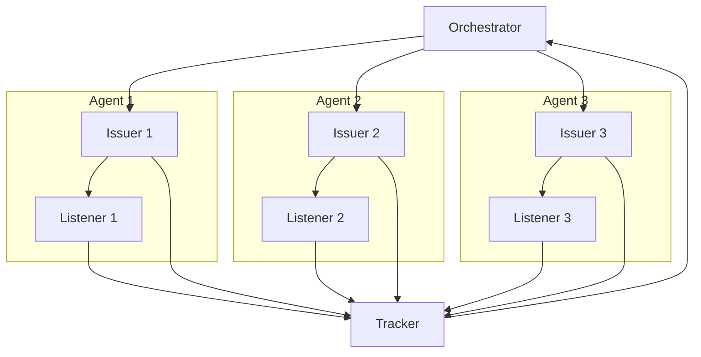

# Load

This package provides generic utilities for blockchain load testing. We break load generation down into the following components:

- tx issuer(s)
- tx listener(s)
- tracker
- orchestrator

The transaction issuer(s) and listener(s) may be VM specific and provide the
necessary injected dependencies for the orchestrator. This enables us to
construct different load testing strategies on top of the same re-usable code.
For example, we can re-use these components for a short burst of transactions or
to perform gradual load testing.

## Architecture



### Issuer

The issuer is responsible for generating and issuing transactions.
It notifies the tracker of all issued transactions.

### Listener

The listener is responsible for listening to the network and confirming
transactions or marking them as failed. As it receives transactions, it
notifies the tracker of the transaction status.

### Tracker

The tracker is responsible for maintaining metrics for all sent txs. Since the
tracker is used by both the issuers, listeners and the orchestrator, all methods of the
tracker must be thread safe.

### Orchestrator

The orchestrator supports the following modes:

- Gradual Load: the orchestrator sends transactions at an initial rate (TPS) and
increases that rate until hitting the maximum desired rate or until the
orchestrator determines that it can no longer make progress.
- Burst: for each issuer, the orchestrator sends `MinTPS` transactions at once
  and waits for all transactions to be marked as accepted.

Setting `MaxTPS` in the orchestrator configuration to `-1` sets the orchestrator
in burst mode. Otherwise, the orchestator will run in gradual load mode.

The current TPS in the gradual orchestrator is determined by taking the
number of transactions confirmed in a given time window (`SustainedTime`) and
diving it by `SustainedTime` (in terms of seconds) Furthermore, the orchestator
has `MaxAttempts` tries to try and achieve a given TPS before determining that
the given TPS is not achievable.

Below is the pseudocode for how the orchestrator in gradual load mode determines TPS and
for how it increases TPS:

```
currTargetTPS := current TPS we want to achieve
maxAttempts := maximum number of attempts we have to achieve currTargetTPS

txsPerIssuer := currTargetTPS / numOfIssuers
attempts := 0

for each issuer { // Async
    send txsPerIssuer txs per second
}

for {
    wait for SustainedTime

    tps := number of accepted txs divided by the SustainedTime
    if tps >= currTargetTPS:
        increase currTargerTPS by step
        iters = 0
    else:
        if attempts >= maxAttempts:
            fail
        iters += 1
}
```

