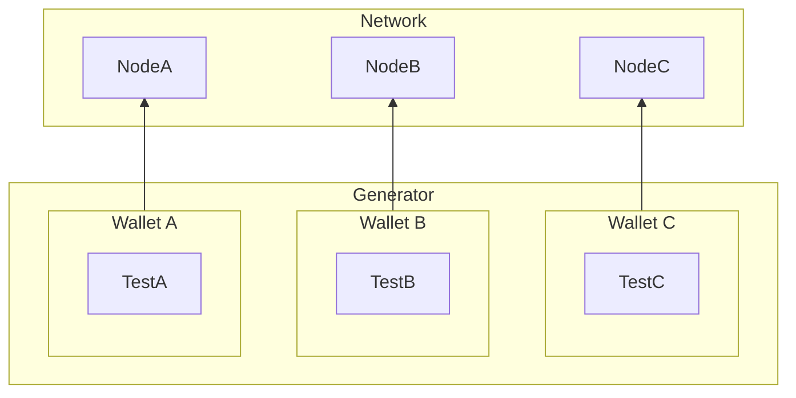

# EVM Load Test

This executable utilizes the `load` package to perform a load test against an instance of Coreth. 

## Prerequisites

Using this executable requires `nix`: to install `nix`, please refer to the AvalancheGo [flake.nix](../../../flake.nix) file for installation instructions.

Reading the `load` package [README.md](../README.md) is highly recommended as well,
especially for those considering modifying this executable for their own load tests.

## Quick Start

To run an EVM load test, execute the following commands:

```bash
# Start nix development environment
nix develop

# Start load test with monitoring
task test-load -- --start-metrics-collector --start-logs-collector
```

This command will create a temporary Avalanche network and perform any test setup prior
to starting the load test.

### Monitoring

The test will start a new Avalanche network along with deploying a set of 
wallets which will send transactions to the network for the lifetime of the test.
To view the state of the test network, `tmpnet` will log a Grafana URL:

```
[07-25|13:47:36.137] INFO tmpnet/network.go:410 metrics and logs available via grafana (collectors must be running) {"url": "https://grafana-poc.avax-dev.network/d/kBQpRdWnk/avalanche-main-dashboard?&var-filter=network_uuid%7C%3D%7Ce1b9dd69-5204-4c24-8b98-d3aea14c0eeb&var-filter=is_ephemeral_node%7C%3D%7Cfalse&from=1753465644564&to=now"}
```

Clicking on this Grafana link will take you to monitoring stack where you can view 
the state of the network.

## Architecture



The load test architecture consists of two main components that work together to simulate realistic blockchain usage:

### Network

The network is created via `tmpnet`, which provisions a temporary cluster of validator nodes. The number of nodes is configurable through the `--node-count` flag (default: 5).
In addition to network creation, the executable directs `tmpnet` to create `n` prefunded accounts for use by the load generator.

#### Kubernetes Support

By default, the nodes of a network created by a load test are local processes. However, it's possible for network nodes to run within a Kubernetes cluster as pods. For example, to run a load test with nodes in a Kind cluster, execute the following:

```bash
# Start nix development environment
nix develop

# Start load test against kind cluster
task test-load-kube-kind
```

`nix` handles the installation of any Kubernetes/Kind dependencies, making it trivial to run load tests with a kind cluster.

### Load Generator

The load generator creates exactly `n` worker wallets, where `n` matches the number of network nodes. Each worker runs in parallel for maximum throughput and executes a `RandomTest` continuously for the lifetime of the load test.

The load test also manages the deployment of the `EVMLoadSimulator` contract, which is a required dependency for the `RandomTest` operations.

## Configuration

### Load Test Flags

- `--load-timeout`: Maximum duration to run the load test (default: unlimited)

### Network Configuration (`tmpnet` Flags)

The following common flags control the underlying Avalanche network setup:

- `--node-count`: Number of validator nodes in the test network (default: 5)
- `--start-metrics-collector`: Starts a metrics collector for node and test metrics. If already running, this is a no-op.
- `--start-logs-collector`: Starts a logs collector for node output. If already running, this is a no-op.

