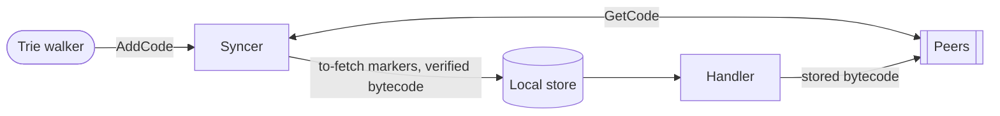
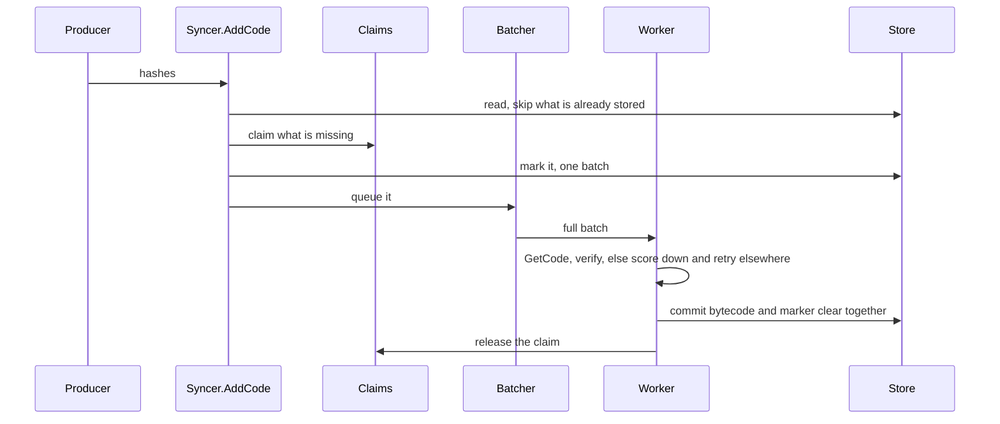

# Code Sync

State sync references contract bytecode that it does not carry. This package
resolves those references, and serves the same request for peers doing the same.

## Roles

| | Owns | Does not |
| --- | --- | --- |
| **Handler** | answering a peer's request from local storage | fetch, verify, or write anything |
| **Syncer** | every write this package makes, on both keys | decide which hashes are worth resolving |
| **Producer** | discovering hashes and handing them to `AddCode` | touch the store, or live in this package |

## Storage invariants

Two keys exist per contract. The syncer writes both.

| State | Written by | Meaning |
| --- | --- | --- |
| Bytecode | `Sync`, after verifying it | the contract is resolved |
| To-fetch marker | `AddCode`, before queueing | the hash is still owed |

The marker is the durable record of outstanding work. An interrupted sync
resumes by iterating markers, so the store is the source of truth and the queue
is only a hand-off.

1. **A hash is marked before it is queued.** `AddCode` commits the marker
   before enqueueing, so a crash in between costs a rediscovered hash, not a
   lost one.

2. **Bytecode and its marker clear commit together.** One batch, so recovery
   sees both or neither, and code is never stored with its marker still set.

3. **Nothing unverified is written.** Every answered hash must match what was
   asked. A response may answer fewer than requested when a batch would not
   fit in one message, but never more. Size is otherwise unchecked, except a
   single hash too large for any message is rejected outright.

4. **A claim outlives its commit.** `AddCode` claims a hash before marking it
   and releases the claim on failure or once the bytecode commits, so a
   repeat defers to whoever holds it.

5. **Code already stored is never marked or claimed.** `AddCode` reads the
   store first, so shared bytecode costs neither a marker, a claim, nor a slot.

6. **A repeat racing a commit costs a redundant fetch, never a lost one.** Code
   arriving between the read and the claim still gets refetched once.
   Persisting is idempotent, so the redundancy is harmless.

## Lifecycle

`NewSyncer` clears the markers of code that arrived before the last shutdown and
re-queues the rest. `AddCode` accepts hashes without ever waiting on the network.
`CloseInput` stops taking hashes, and `Sync` returns once what is queued has
been fetched. `Sync` closes input on its way out, so a producer outliving it
learns through `ErrInputClosed` rather than marking code nothing will fetch.
