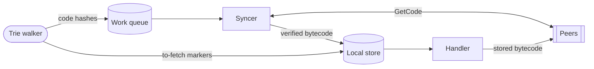
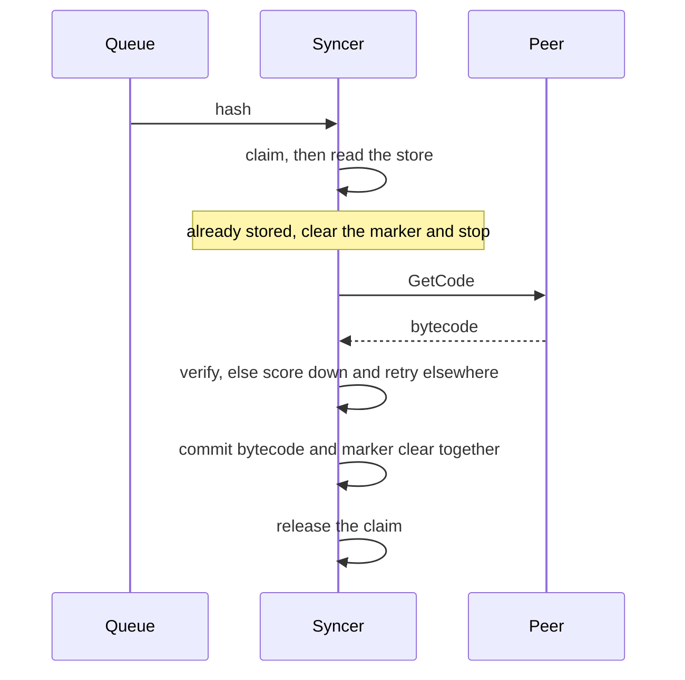

# Code Sync

State sync references contract bytecode that it does not carry. This package
resolves those references, and serves the same request for peers doing the same.

## Roles

| | Owns | Does not |
| --- | --- | --- |
| **Handler** | answering a peer's request from local storage | fetch, verify, or write anything |
| **Syncer** | consuming the queue, and every write this package makes | write a to-fetch marker, or decide what enters the queue |
| **Producer** | discovering hashes, marking them outstanding | live in this package |

## Storage invariants

Two keys exist per contract, written by different parties.

| State | Written by | Meaning |
| --- | --- | --- |
| Bytecode | the syncer, after verifying it | the contract is resolved |
| To-fetch marker | the producer, before enqueueing | the hash is still owed |

The marker is the durable record of outstanding work. An interrupted sync
resumes by iterating markers, so the store is the source of truth and the queue
is only a hand-off.

1. **A hash is marked before it is enqueued.** The syncer only ever clears a
   marker, never writes one, so a crash between the two costs a rediscovered
   hash rather than a lost one. A marker on bytecode already stored is
   therefore routine, since the producer may enqueue a hash whose code arrived
   meanwhile. Clearing it is the one write the syncer makes outside a commit.

2. **Bytecode and its marker clear commit together.** One batch, so recovery
   sees both or neither. Code is never stored with its marker still set, which
   would leave it owed forever.

3. **Nothing unverified is written.** Count, size, and hash are checked before
   the commit is reached. A peer failing any check is scored down and the
   request is retried elsewhere.

4. **A claim outlives its commit.** The syncer claims a hash while fetching it
   and releases it only once the bytecode is committed, so a repeat arriving
   later reads the code from disk instead of fetching it again.

5. **A hash is claimed before the store is read.** Only this order makes the
   read conclusive. Reading first lets a repeat see the bytecode missing, then
   claim it just as the commit lands, and fetch it a second time.

## TODO

The queue producer arrives in a follow-up PR. Until then it is a contract that
no code in the tree upholds, so nothing enforces invariant 1.
