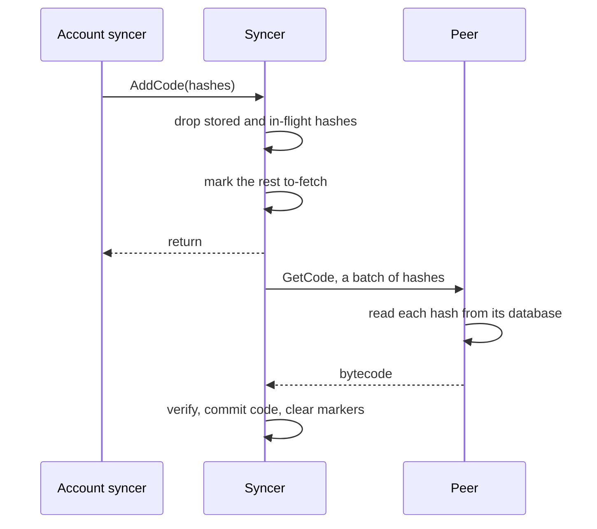

# Code sync

An EVM account references its contract code by hash. The bytecode lives outside the account trie. As the account syncer discovers code hashes, it passes them to this package to resolve that code from peers. This package also defines how to respond to that same request for syncing peers.

`AddCode` MUST NOT block on the network. It is called from the same message handlers that deliver the syncer's own responses, so a blocked add could deadlock the sync. To avoid this blocking, `AddCode` does not bound the amount of outstanding code to fetch.

## Crash recovery

Once `AddCode` returns, the account syncer persists accounts that reference the code. The to-fetch marker records the pending download in case the node crashes before it completes.

| Entry | Meaning | Written | Deleted |
| --- | --- | --- | --- |
| To-fetch marker | code is referenced but not yet downloaded | by `AddCode`, before it returns | in the same batch as the code write |
| Code | verified bytecode | by `Sync`, after verification | never |

`NewSyncer` re-queues any marked hash that still lacks code, resuming the download after a crash.

## Duplicates

Many accounts carry identical bytecode, so `AddCode` sees the same hash repeatedly. Repeats are dropped by an in-memory claim, taken before the disk read and released only after the code is committed, so the read cannot miss code from a racing fetch.

## Verification

A response is accepted only if it carries one entry per requested hash and every entry hashes to its request. Anything else de-scores the peer, and the batch is retried elsewhere.

## Serving

`RegisterHandler` installs the peer side of the exchange, answering `GetCode` from the node's database. A request is answered in full or rejected, since the syncer discards partial responses. Both sides cap a request at the number of maximum-size contracts that fit in one response.
