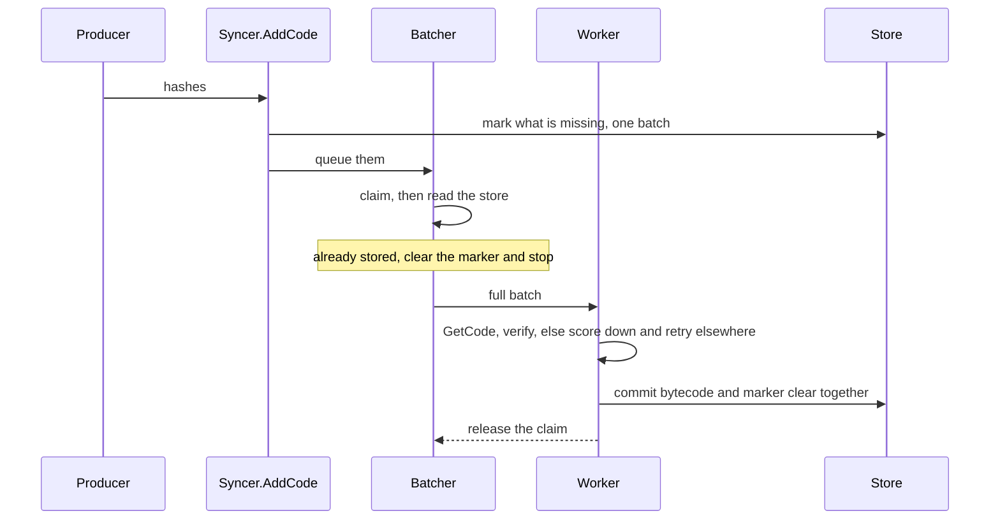

# Code Sync

State sync references contract bytecode that it does not carry. This package
resolves those references, and serves the same request for peers doing the same.

## Roles

| | Owns | Does not |
| --- | --- | --- |
| **Handler** | answering a peer's request from local storage | fetch, verify, or write anything |
| **Syncer** | every write this package makes, on both keys | decide which hashes are worth resolving |
| **Producer** | discovering hashes and handing them to `AddCode` | touch the store, or live in this package |

## Storage invariants

Two keys exist per contract. The syncer writes both.

| State | Written by | Meaning |
| --- | --- | --- |
| Bytecode | `Sync`, after verifying it | the contract is resolved |
| To-fetch marker | `AddCode`, before queueing | the hash is still owed |

The marker is the durable record of outstanding work. An interrupted sync
resumes by iterating markers, so the store is the source of truth and the queue
is only a hand-off.

1. **A hash is marked before it is queued.** `AddCode` commits the marker batch
   and only then makes the hash visible to the batcher, so a crash between the
   two costs a rediscovered hash rather than a lost one. This is statement order
   inside one method, not a contract between components.

2. **Bytecode and its marker clear commit together.** One batch, so recovery
   sees both or neither. Code is never stored with its marker still set, which
   would leave it owed forever.

3. **Nothing unverified is written.** Count, size, and hash are checked before
   the commit is reached. A peer failing any check is scored down and the
   request is retried elsewhere.

4. **A claim outlives its commit.** The syncer claims a hash while fetching it
   and releases it only once the bytecode is committed, so a repeat arriving
   later reads the code from disk instead of fetching it again.

5. **A hash is claimed before the store is read.** Only this order makes the
   read conclusive. Reading first lets a repeat see the bytecode missing, then
   claim it just as the commit lands, and fetch it a second time.

6. **Code already stored is never marked.** `AddCode` skips it, so the common
   case of shared bytecode costs neither a marker nor a queue slot. A marker
   written just as a concurrent commit lands is cleared by the batcher on the
   next pass.

## Lifecycle

`NewSyncer` clears the markers of code that arrived before the last shutdown and
re-queues the rest. `AddCode` accepts hashes without ever waiting on the network.
`CloseInput` stops taking hashes, and `Sync` returns once what is queued has
been fetched. `Sync` closes input on its way out, so a producer outliving it
learns through `ErrInputClosed` rather than marking code nothing will fetch.
