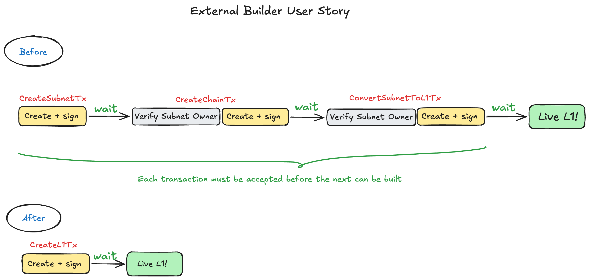
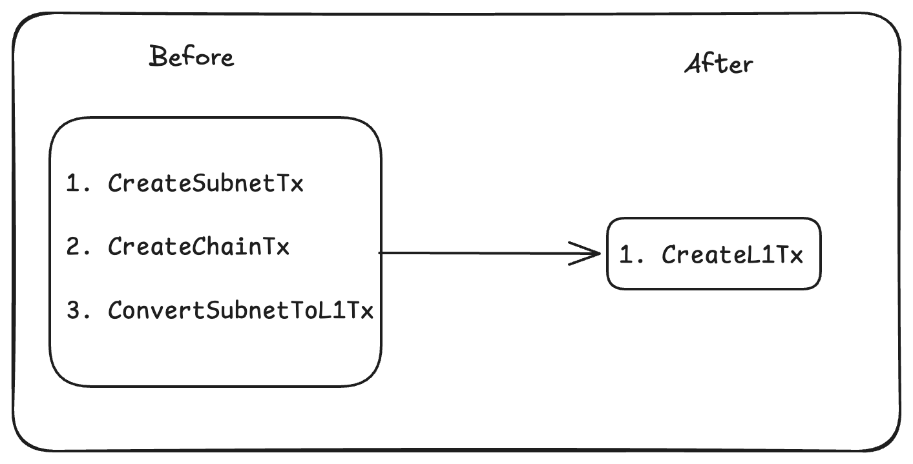
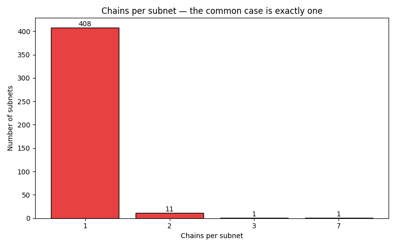

# Introduction
The Avalanche network is built around two core elements on the P-Chain: Subnets and Chains
A __Subnet__ is a set of validators that agrees to validate one (or more) blockchains. Every subnet is identified by a SubnetID, and its validators are responsible for achieving consensus on the chains under it. 
A __Chain__ is a blockchain that runs under a Subnet. It is identified by a ChainID and runs a specific VM, which is the code that defines how blocks are produced and validated. The validators of the parent subnet are responsible for running that VM and validating the chain. 
An __L1__ is a Subnet whose validator set is managed by a smart contract (ValidatorManager). Instead of the P-Chain being the one authorizing validator changes, the ValidatorManager smart contract sends warp messages that the P-Chain accepts, giving the L1 full control over its own validator set. 
The relationship between these components is: a subnet owns one or more chains, and an L1 is a subnet that basically owns itself. 
# Motivation
Currently, creating an Avalanche L1 requires three separate P-Chain transactions: [CreateSubnetTx](https://github.com/ava-labs/avalanchego/blob/master/vms/platformvm/txs/create_subnet_tx.go), [CreateChainTx](https://github.com/ava-labs/avalanchego/blob/master/vms/platformvm/txs/create_chain_tx.go), and [ConvertSubnetToL1Tx](https://github.com/ava-labs/avalanchego/blob/master/vms/platformvm/txs/convert_subnet_to_l1_tx.go). This process has the following downsides:

- It is complex and requires managing and storing Subnet owners ([authorization credentials](https://github.com/ava-labs/avalanchego/blob/master/vms/platformvm/txs/convert_subnet_to_l1_tx.go#L46)) in a database for verification which become irrelevant after conversion.
- In the [Builder Hub](https://docs.avax.network/console/create-l1), this three-step flow increases the number of operations DevRel must document and support. The user also has to physically create and sign all three different transactions and wait for each previous transaction to be accepted into the blockchain before building the next transaction. 

Therefore, a single atomic transaction provides a better user experience for builders on Avalanche, both internally and externally, by: 
1. Eliminating the intermediary Subnet Authorization credentials step and their database.
2. Creating an L1 in one step and signing one transaction.
3. Minimizing the cost and friction that it takes to set up a new Simplex L1. 



# Background 
[CreateSubnetTx](https://github.com/ava-labs/avalanchego/blob/master/vms/platformvm/txs/create_subnet_tx.go):
- Creates a new subnet on the P-Chain
- The subnetID is the transaction ID
- Sets the subnet owner, which is stored on the P-Chain and acts as the authorization credential for all subsequent operations on the subnet (Any transaction that adds a chain or converts it to an L1 must include a SubnetAuth credential)

[CreateChainTx](https://github.com/ava-labs/avalanchego/blob/master/vms/platformvm/txs/create_chain_tx.go):
- Creates a chain under an existing Subnet
- Requires SubnetAuth to prove ownership of the subnet
- Extracts the subnetID from the tx and uses it to register the chain in memory
- It starts the VM described by the chain (i.e subnet EVM, XSVM, etc...)
- The chainID is the transaction ID

[ConvertSubnetToL1Tx](https://github.com/ava-labs/avalanchego/blob/master/vms/platformvm/txs/convert_subnet_to_l1_tx.go):
- Converts an existing subnet to an L1
- Requires SubnetAuth to prove ownership of the subnet
- Records the Subnet to L1 conversion and stores the validator manager chain and address
- After acceptance, a warp signature becomes available for the validator manager contract to bootstrap
- Any existing PoA validators continue until their staking period expires but no new ones can be added, as the subnet owner is set to empty on conversion.

## Current Node Startup Flow:
On startup, a node tracks only the subnets it is explicitly configured to validate. For each tracked subnet, it retrieves all associated chains from P-Chain state and starts their VMs. Currently, this process assumes all chains were created the same way. The proposed design must account for the fact that chains can now be created via a new transaction type, so the startup flow needs to determine which type created each chain and handle it accordingly. This is the main point where the node startup logic changes, and it is kept intentionally minimal.


# Proposed Solution


This design doc implements CreateL1Tx, which is an idea inspired by [ACP-191](https://github.com/avalanche-foundation/ACPs/tree/main/ACPs/191-seamless-l1-creation), which suggests a simple atomic transaction that combines all three steps. It simplifies L1 creation, eliminates the intermediary subnet step, and removes the need for SubnetAuth management. This PR follows [ACP-191](https://github.com/avalanche-foundation/ACPs/tree/main/ACPs/191-seamless-l1-creation), with some deliberate deviations:

Transaction Schema (see section below) supports one chain per subnet, not multiple chains as ACP-191 suggests. The reason for that is no one creates subnets with multiple chains (see histogram in Alternatives section). Additionally, after we convert the subnet to L1, the current flow doesn't allow the creation of any more chains on that subnet.

P-Chain state stores chains as a prefixed key-value structure under chains/{subnetID}, where the value is simply a list of transaction IDs. When retrieving chains, the state looks up the full transaction for each stored ID. This generic structure (storing only transaction IDs) is what allows CreateL1Tx to integrate with minimal state changes. The CreateL1Tx transaction is stored under the same chains/{subnetID} prefix as CreateChainTx. This way, the callers are responsible for adding type switches to handle both types, which is a minimal change to the code base, rather than introducing a new prefixed key-value P-Chain structure. 

For createL1Tx, the blockchainID is defined to be equal to the subnetID (both being the transactionID). Since the subnet and its chain are created atomically by a single transaction and an L1 consists of exactly one chain. This removes the need for a derived blockchainID. 

## Transaction Schema
```go
type CreateL1Tx struct {

// Metadata:  inputs, outputs, newotrk ID, Chain ID, memo 
BaseTx `serialize:"true"`


// VM ID running on the chain: Identifies which VM binary should load to run this chain. Nodes look up this ID in local VM registry to find the executable. 
VMID        ids.ID   `serialize:"true" json:"vmID"`

// Byte representation of genesis state of the chain. Stored in the tx so all nodes, including those joining later, read the same bytes off the P-Chain and produce the identical genesis block. 
GenesisData []byte   `serialize:"true" json:"genesisData"`

// Chain where the L1 validator manager contract lives. All future validator changes must carry a warp message originating from this chain verified against this value. 
ManagerChainID ids.ID              `serialize:"true" json:"chainID"`

// Address of the L1 validator manager contract. ManagerAddress and ManagerChainID are stored via SetSubnetToL1Conversion. Only Warp messages from this contract are accpeted by the P-Chain for changes in the validator set.
ManagerAddress types.JSONByteSlice `serialize:"true" json:"address"`

// Initial pay-as-you-go validators for the L1. Each entry includes NodeID, Weight, Balance, BLS key, and owner addresses for remaining balance and deactivation.  
Validators []*CreateL1Validator `serialize:"true" json:"validators"`

}
```

## Notes on Transaction Schema:
- Base Tx includes the legacy memo field. Base Tx is included in every P-Chain transaction type. Removing it would require either creating a new Base Tx type that excludes the memo field, which would introduce more types to maintain in the code base, or removing it from the existing Base Tx type which dictates updating all of the transactions that include this Base Tx type (and both pose a higher review complexity). Thus, since the memo field is 0 bytes and it is harmless, we decided to keep it in this new implementation.
- ChainName exists in the current transaction schema, but it only contributes to the fee calculation when users choose their own chain name, and it has no functional role in the code. Thus we decided to remove it from this new transaction type, and the responsibility of giving the chains a name would fall on block explorers/ indexers. 
- VMID is used to look up and run the VM. If we decide to remove it, then using a default VM ID could potentially block the option of future VM customization by the operators. Another option would be to create a mapping (SubnetID -> VMID) which needs to be updated with every new transaction. Additionally, the mechanism to find the VM binary would have to change to support L1s created using CreateL1Tx and the current approach. Thus, we decided to keep it in the new transaction type for consistency.
- GenesisData initializes the VM and is used to construct the same genesis block for all nodes. If we were to remove it, we would have to update every VM (subnet-evm, avm, xsvm, etc..) to hard code the first block. On the other hand, removing it would eliminate the 1 Mib limit of the genesis data ([see here](https://github.com/ava-labs/avalanchego/blob/master/vms/platformvm/txs/create_chain_tx.go#L20)) and allows users to create the genesis block with unlimited size (ex. A user who wants to transfer L2 to L1 could store the state of the L2 in the genesis block). But the user can achieve that by hashing the data in the genesis block, which provides a less invasive approach than removing the genesis field completely. Ultimately, we decided to keep it in the new transaction type for consistency and to avoid supporting different mechanisms for building the genesis block for L1s created in the suggested and old approaches. 
- ManagerChainID is the ID of the chain where the validator manager lives. If the validator manager lives on the chain created by this transaction, we create a new sentinel constant “SelfManagerChainID” and when the transaction executes the sentinel is resolved to the actual ChainID (= SubnetID). An empty ManagerChainID is rejected by syntactic verification. 
- In the current implementation, CreateChainTx stores [FxIDs](https://github.com/ava-labs/avalanchego/blob/master/vms/platformvm/txs/create_chain_tx.go#L46) (feature extension IDs), which are only used by the X-Chain. The one possible use case for them is if a user is deploying an AVM chain as a new L1, but in reality nobody deploys avalanche VMs anymore. Thus, we decided to remove them in the new implementation.
- A new CreateL1Validator type was introduced, replacing the [convertSubnetToL1Validator](https://github.com/ava-labs/avalanchego/blob/master/vms/platformvm/txs/convert_subnet_to_l1_tx.go#L86) and identical to it. This way, the new transaction is fully independent of the old flow.

## How CreateL1Tx Works
CreateL1Tx atomically replaces all three steps above:

1. Creates a new subnet. The SubnetID is derived deterministically as the transaction ID, eliminating the need for CreateSubnetTx.


2. Creates a chain. Chain configuration (vmID, genesisData) is embedded directly in the transaction. The BlockchainID,which is the chain identifier that  is used for starting the VM described by the chain and looking up the chain in the P-Chain Service, is equal to the subnetID (both being the ID of the createl1Tx transaction)


3. Sets the validator manager (validatorManagerChainID, validatorManagerAddress) and registers the initial validator set with their BLS keys and balances, identical to what ConvertSubnetToL1Tx does.


# Alternatives
In this section, we will discuss other approaches and how they benefit the common use case: 


As we can see in the histograms above, the common case is one chain per subnet (408 subnets have one chain – 96.9%)

- This data was acquired from the Avalanche Blocks and this Data API. 
- All of the subnets with 2 chains, and the subnet with 7 chains, have exactly 0 validators. 
- The subnet with the 3 chains is the primary network. 

(This data is accurate as of June 30th 2026)

1. __Keep the three separate transactions__
    1. __Tradeoffs__
        1. __Pros__
            1. It fits within the current codebase with no changes.
        2. __Cons__
            1. Requires storing an intermediate state on the P-Chain along with the SubnetAuth credentials in the SubnetOwnerDB.
            2. Suboptimal experience for users and DevRel, for example, Builder Hub.
2. __Two transactions__: Transaction 1 creates the subnet, registers validators, and sets the validator manager contract. Transaction 2 creates the chain under that subnet and converts it to an L1.
    1. __Tradeoffs__
        1. __Pros__
            1. We can deploy an L1 with multiple chains. But for the common case (one chain per subnet), it is still two transactions, which means two Builder Hub steps.
        2. __Cons__
            1. We still need to store the SubnetAuth credentials in order to verify the owner of the subnet before turning it into an L1.
3. __Composable Transactions__: One transaction with multiple operations, signed by the user to create a multi-step workflow.
    1. __Tradeoffs__
        1. __Pros__
            1. Reusable for any multi-step flow, not just L1 creation.
            2. No new transaction type, reuse the existing logic.
            3. Users compose exactly the operations they need.
        2. __Cons__
            1. Requires a new framework for ordering operations and fee calculations.
            2. The P-Chain still needs to handle state between sub-operations, which requires storing the SubnetAuth credentials.
4. __Current Approach, One Transaction__
    1. __Tradeoffs__
        1. __Pros__
            1. Simpler UX: One step for creating an L1 with one chain.
            2. The current flow leaves SubnetAuth credentials permanently in SubnetAuthDB after converting the subnet to an L1. CreateL1Tx doesn't store any SubnetAuth.
            3. Less Fees: the old flow creates an L1 in three transactions, the proposed flow creates an L1 with one transaction resulting in fewer fees.
        2. __Cons__
            1. We can't create a subnet with multiple chains. This approach only allows one chain per subnet.
            2. The validatorManager still needs to receive the SubnetToL1Conversion warp message in order to initialize itself since we can't include the ConversionID in the genesis block.
            3. Wallets, indexers, explorers all need to change to accommodate the new transaction type.

# Testing Plan
E2E test:
"atomically creates an L1 using CreateL1Tx" in tests/e2e/p/l1.go. Runs a full local network, issues the transaction, and verifies the subnet conversion ID (which is required to initialize the validator manager contract), validator set, and L1 validator state via the P-Chain API. 
“Creates an L1 using CreateL1Tx and updates its validators via the manager” tests the validator lifecycle on the L1. restarts the genesis validator with the new subnet tracked, registers new validatores, increasing its weight, removing it, and verifies the warp message. 
# Monitoring
We can use the current Grafana dashboards to monitor this transaction to make sure that it is being executed properly; P-chain transaction and block rejection rates are tracked in the Terraform-P-Chain dashboard, though these are aggregate signals and won't isolate subnet creation transaction failures specifically.
The P-Chain CI dashboard also tracks rejected blocks per minute.

