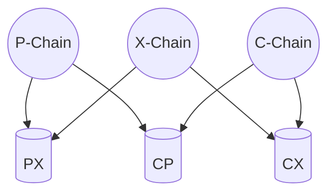
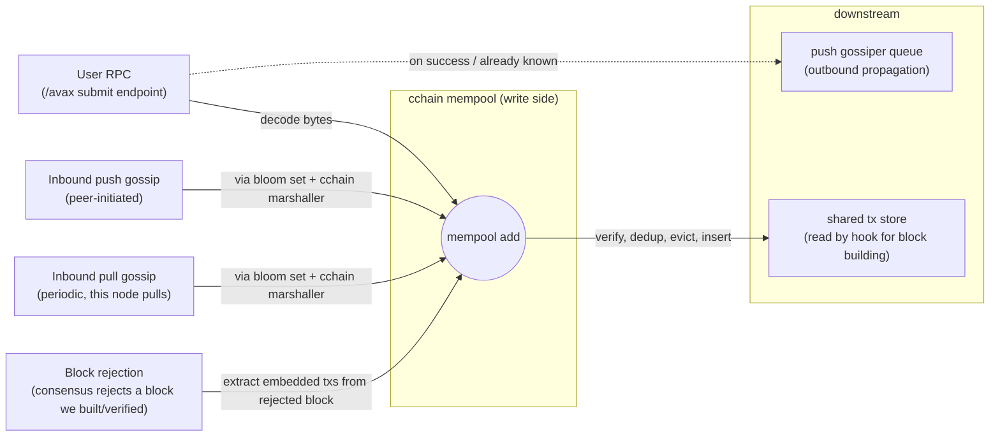

# C-Chain VM (`cchain`)

`cchain` is the C-Chain VM. It is a thin chain-specific harness around [saevm](../), the generic EVM framework that implements [ACP-194](https://github.com/avalanche-foundation/ACPs/tree/main/ACPs/194-streaming-asynchronous-execution). `saevm` does the heavy lifting — block execution, settlement, gas accounting, and EVM gossip. `cchain` adds what makes the chain *the C-Chain*: Transactions for moving assets between Primary Network chains, Warp messaging, and validator-voted chain parameters.

## Architecture

The C-Chain is composed of three major components:

1. **AvalancheGo** — networking, consensus, validator-set management, and the external API surface.
2. **SAE** — the generic, Turing-complete EVM implementation.
3. **C-Chain** (this package) — the wrapper that adds C-Chain-specific behavior.

## What `cchain` adds

`cchain` layers three chain-specific behaviors on top of SAE: Import/Export transactions for cross-chain transfers, Warp messaging, and chain parameters that validators vote on each block.

### Export and Import transactions

The Primary Network is the set of three chains — P, X, and C — that exchange assets through pair-wise shared stores. Each pair of chains has its own store, readable and writable by both chains in the pair.

A cross-chain transfer happens in two steps. An **Export** transaction on the source chain burns the asset there and writes a corresponding entry into the shared store between the source and destination chains. The destination chain later picks up that entry with an **Import** transaction, consuming it and crediting the recipient account.

`cchain` defines both transaction types and their validation rules, runs a dedicated mempool keyed on the entries each transaction consumes, and operates a bloom-filter gossip system for them. See [tx](tx/) and [txpool](txpool/).

The mempool does not support dependent transactions: every transaction it holds must be valid on its own against the current chain state. Two invariants follow. First, the mempool is always valid against a recently-executed state, so anything it offers up for block building can be applied directly. Second, if block production stalls, all mempool transactions are eventually guaranteed to be valid against the last accepted block.

#### How transactions enter the Txpool

Import/Export transactions reach the Txpool from four independent sources. They all converge on the same write-side gate, where signature, against-state, and conflict-resolution checks happen before insertion.

The four entry paths in detail:

- **User RPC submission.** The HTTP `/avax` endpoint decodes a transaction from request bytes and submits it. On a successful add (or on "already known"), the same call also enqueues the transaction onto the local push-gossiper so this node will propagate it.
- **Inbound push gossip.** A peer pushes a transaction over the Import/Export gossip protocol. saevm's network dispatches it to `cchain`'s registered gossip handler, the gossip system unmarshals using `cchain`'s gossip marshaller, and a bloom-set wrapper around the mempool routes the decoded transaction to the same add path.
- **Inbound pull gossip.** A periodic goroutine inside `cchain` pulls digests from peers; transactions returned in response flow into the same bloom-set wrapper and the same add path.
- **Block rejection.** When the consensus engine rejects a block this node had previously verified, `cchain` extracts the Import/Export transactions embedded in the block's extension data and re-submits each one to the mempool. The point is to keep otherwise-valid transactions from being dropped by an unlucky reorg.

### Warp messaging

The C-Chain participates in cross-subnet Warp messaging on both sides — sending messages to other chains and receiving messages from them. Three pieces are involved:

- A custom precompile that lets EVM contracts emit and consume Warp messages.
- An encoding that places Warp message payloads into transaction access lists, so the message rides alongside the transaction that produced or accepted it.
- The [ACP-118](https://github.com/avalanche-foundation/ACPs/tree/main/ACPs/118) p2p protocol for collecting BLS signatures from peer validators on outbound messages.

`cchain` persists this chain's Warp messages, serves signature requests against that store, and verifies Warp predicates during block execution. See [warp](warp/).

### Validator-voted parameters

Three chain parameters are settled by validator vote on each block: validators choose to raise, lower, or hold each value.

- **Gas target per second** ([ACP-176](https://github.com/avalanche-foundation/ACPs/tree/main/ACPs/176)) — the throughput target. The rest of ACP-176 (gas accounting and excess tracker) lives in SAE; `cchain` contributes only the target value. See [hook/acp176](hook/acp176/).
- **Minimum block delay** ([ACP-226](https://github.com/avalanche-foundation/ACPs/tree/main/ACPs/226)) — a lower bound on the time between consecutive blocks. Prevents block production faster than the network has agreed to. See [hook](hook/).
- **Minimum gas price** ([ACP-283](https://github.com/avalanche-foundation/ACPs/tree/main/ACPs/283)) — a floor on the gas price for transactions to be included in a block. See [hook](hook/).

## Shutdown

Shutdown unwinds in reverse order. `cchain` runs its cleanup callbacks last-in-first-out, then asks the inner saevm VM to shut down. The order matters because the resources `cchain` cleans up hold references *into* the inner VM:

- The gossip goroutines pull from peers via the inner VM's Network. If saevm tore the Network down first, those goroutines would be reading dead state.
- The mempool subscribes to chain-head events from the inner VM's RPC backend. The subscription must be unsubscribed before the inner VM finishes its own shutdown.

The hook, the Warp storage, and the shared tx store carry no goroutines or external subscriptions of their own; releasing the references is enough.

## Subpackages at a glance

- [api/](api/) — `avax_*` JSON-RPC service for Import/Export submission, status, and UTXO lookup
- [hook/](hook/) — implementation of saevm's hook surface; orchestrates header construction, end-of-block operations, and per-block timing
- [hook/acp176/](hook/acp176/) — validator-voted gas-per-second target
- [state/](state/) — genesis parsing, the synchronous-boundary pointer, and state-trie helpers
- [tx/](tx/) — Import / Export transaction types and their gossip marshaller
- [txpool/](txpool/) — the shared store, the mempool that wraps it, and conflict tracking
- [warp/](warp/) — Warp message storage, the ACP-118 verifier, and predicate handling
