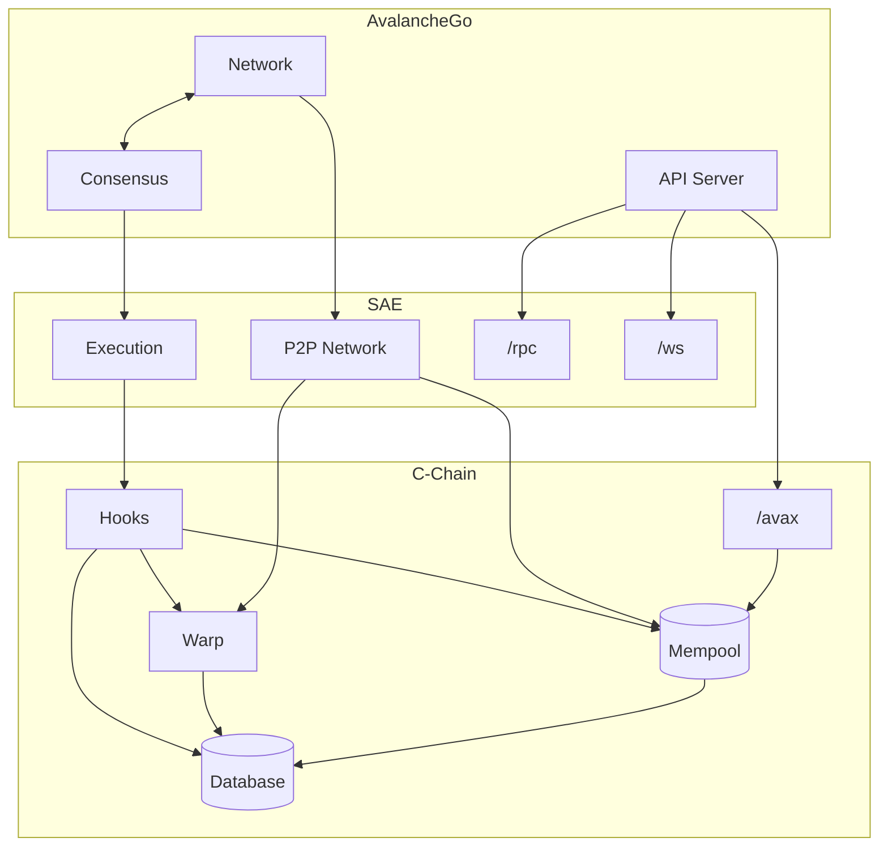
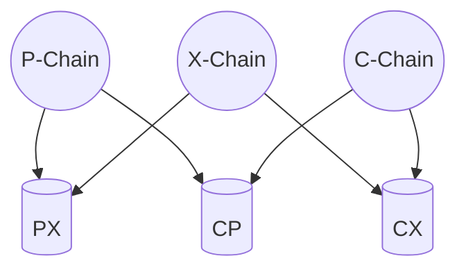
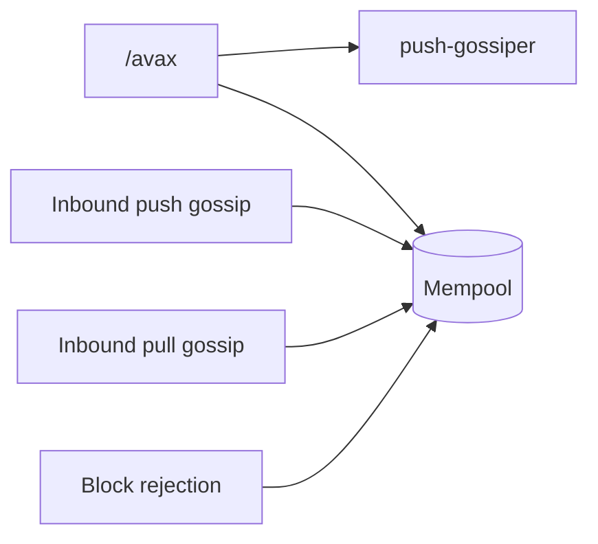

# C-Chain VM (`cchain`)

`cchain` is the C-Chain VM. It is a thin chain-specific harness around [saevm](../), the generic EVM framework that implements [ACP-194](https://github.com/avalanche-foundation/ACPs/tree/main/ACPs/194-streaming-asynchronous-execution). `saevm` does the heavy lifting — block execution, settlement, gas accounting, and EVM gossip. `cchain` adds what makes the chain *the C-Chain*: transactions for moving assets between Primary Network chains, Warp messaging, and validator-voted chain parameters.

## Architecture

The C-Chain is composed of three major components:

1. **AvalancheGo** — networking, consensus, validator-set management, and the external API surface.
2. **SAE** — the generic, Turing-complete EVM implementation.
3. **C-Chain** (this package) — the wrapper that adds C-Chain-specific behavior.

Hooks are the seam through which SAE calls into C-Chain–specific code. SAE invokes them at the relevant points of a block's lifecycle:

- **Build** — construct custom header fields and embed cross-chain transactions into the block body.
- **Verify** — enforce validation rules on header fields, embedded transactions, and Warp predicates.
- **Execute** — apply cross-chain transaction state effects.

## What `cchain` adds

`cchain` extends the standard Ethereum block format. The block header gains the following extra fields:

- `blockGasCost` — legacy block-level required priority fee.
- `extDataGasUsed` — legacy gas used by cross-chain transactions.
- `extDataHash` — keccak256 of the block's cross-chain transaction data.
- `gasTargetExcess` — ACP-176 gas-target vote tracker.
- `minDelayExcess` — ACP-226 minimum-delay vote tracker.
- `minimumPriceExcess` — ACP-283 minimum-gas-price vote tracker.
- `timestampMilliseconds` — millisecond-precise timestamp.

The block body adds one extra field:

- `blockExtraData` — encoded cross-chain transactions; their semantics are described under [Cross-chain transactions](#cross-chain-transactions) below.

The standard `extraData` field carries Warp predicate verification results — see [Warp messaging](#warp-messaging).

### Cross-chain transactions

The Primary Network is the set of three chains — P, X, and C — that exchange assets through pair-wise shared stores. Each pair of chains has its own store, readable and writable by both chains in the pair.

A cross-chain transfer happens in two steps. An **Export** transaction on the source chain burns the asset and writes a UTXO into the shared store between the source and destination chains. The UTXO specifies who is allowed to consume it. An **Import** transaction, issued by that party on the destination chain, consumes the UTXO and credits funds to addresses of the Import issuer's choice.

`cchain` defines both transaction types, their validation rules, and runs a dedicated mempool that gossips them in a bandwidth-optimized way using bloom filters.

#### How transactions enter the mempool

Cross-chain transactions reach the mempool from four independent sources. Each transaction passes the same checks — signature, state validity, and conflict resolution — before being added.

The four entry paths in detail:

User RPC submission is the only path that registers transactions with the local push-gossiper for proactive propagation; the other three sources reach the mempool without enqueuing for outbound gossip.

- **User RPC submission.** The `/avax` JSON-RPC endpoint receives a transaction and forwards it to the mempool, also enqueuing it on the push-gossiper.
- **Inbound push gossip.** A peer pushes a transaction over the transaction gossip protocol; the transaction is routed to the same add path.
- **Inbound pull gossip.** Periodically, `cchain` sends a bloom filter representing the current state of the mempool to a peer. The peer returns transactions not referenced in the bloom filter; those transactions are forwarded to the same add path.
- **Block rejection.** When the consensus engine rejects a block this node had previously verified, `cchain` extracts the transactions from the block and submits each to the mempool. The point is to keep otherwise-valid transactions from being dropped by an unlucky conflict.

### Warp messaging

The C-Chain participates in cross-subnet Warp messaging on both sides — sending messages to other chains and receiving messages from them. Four pieces are involved:

- A custom precompile that lets EVM contracts emit and consume Warp messages.
- Incoming Warp messages encoded into the access-list, so the hook implementation can verify them prior to EVM execution.
- Predicate verification results encoded into the block header's `extraData`, so a bootstrapping node doesn't need to re-verify historical Warp messages.
- The [ACP-118](https://github.com/avalanche-foundation/ACPs/tree/main/ACPs/118-warp-signature-request) p2p protocol for collecting BLS signatures from peer validators on outbound messages.

`cchain` persists this chain's Warp messages, serves signature requests against that store, and verifies Warp predicates during block verification.

### Validator-voted parameters

Three chain parameters are settled by validator vote on each block. The block builder casts the vote: when building a block they can move each parameter toward their ideal value. Because block production is stake-weighted, this yields a stake-weighted voting mechanism over the long run.

- **Gas target per second** ([ACP-176](https://github.com/avalanche-foundation/ACPs/tree/main/ACPs/176-dynamic-evm-gas-limit-and-price-discovery-updates)) — the throughput target. The rest of ACP-176 (gas accounting and excess tracker) lives in SAE; `cchain` contributes only the target value.
- **Minimum block delay** ([ACP-226](https://github.com/avalanche-foundation/ACPs/tree/main/ACPs/226-dynamic-minimum-block-times)) — a lower bound on the time between consecutive blocks. Prevents block production faster than the network can maintain.
- **Minimum gas price** ([ACP-283](https://github.com/avalanche-foundation/ACPs/tree/main/ACPs/283-dynamic-minimum-gas-price)) — a floor on the gas price for transactions to be included in a block.
