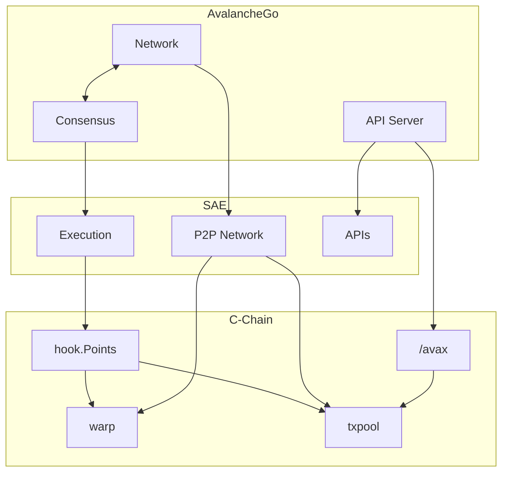
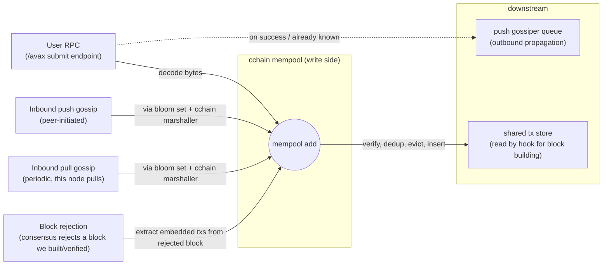
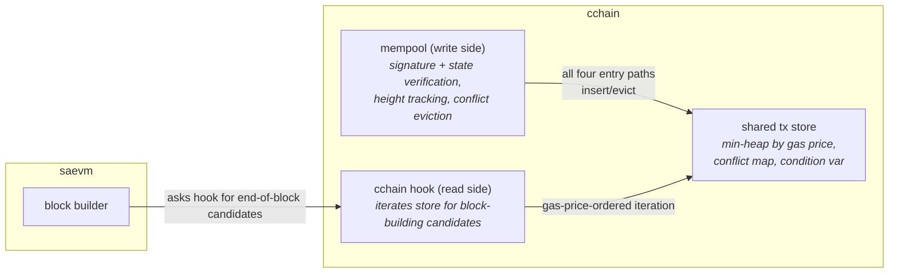
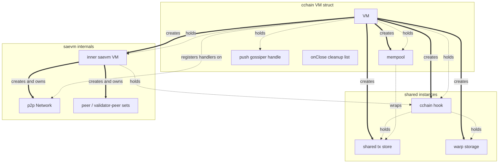

# C-Chain VM (`cchain`)

`cchain` is the C-Chain VM. It is a thin chain-specific harness wrapped around [saevm](../), the generic streaming-asynchronous EVM framework that implements [ACP-194](https://github.com/avalanche-foundation/ACPs/tree/main/ACPs/194-streaming-asynchronous-execution). `saevm` does the heavy lifting — block execution, settlement, gas accounting, EVM gossip, and the Snowman adaptor. `cchain` adds what makes the chain *the C-Chain*: Import/Export transactions for moving assets between Primary Network chains, warp signatures, dynamic gas targeting, minimum-delay block production, and the migration boundary from the chain's historical synchronous era.

## Architecture

The C-Chain is implemented as three layered services. AvalancheGo provides the host infrastructure; SAE is a generic streaming-async EVM that AvalancheGo drives through; the C-Chain plugs in at SAE's integration points (and, for `/avax`, attaches directly to AvalancheGo).

- **AvalancheGo** — the host node. Three subsystems hand off to the chain VMs: the network delivers peer messages, consensus drives blocks, and the API server serves JSON-RPC.
- **SAE** — the generic streaming-asynchronous EVM service ([saevm](../)) implementing [ACP-194](https://github.com/avalanche-foundation/ACPs/tree/main/ACPs/194-streaming-asynchronous-execution). Three integration points receive AvalancheGo's traffic: a p2p handler-ID dispatcher, a block-building and execution pipeline, and an `eth_*` JSON-RPC server. The first two fan out into the C-Chain layer; the JSON-RPC server terminates inside SAE.
- **C-Chain** — the C-Chain-specific service (this package). [hook Points](hook/) plugs into SAE's execution pipeline for chain-specific behavior. SAE's p2p dispatcher routes Import/Export gossip into the [txpool](txpool/) and ACP-118 signature requests at [warp](warp/) storage. The [/avax](api/) endpoints attach directly to AvalancheGo's API server, bypassing SAE, and submit user-issued transactions into the same txpool.

Inside the C-Chain, hook Points reads the txpool for transaction candidates during block building and writes warp storage for messages emitted during execution. The txpool's flow from arrival to inclusion is detailed in [the next section](#how-transactions-enter-the-mempool).

## What `cchain` adds

The Primary Network is the set of three chains (P, X, and C) that exchange assets through a per-chain shared key-value store. Each chain has a slot, and chains hand assets to each other by writing to the recipient's slot.

### Import / Export transactions
Transfers between the C-Chain and the other Primary Network chains, via that shared store. **Import** transactions consume entries another chain wrote into the C-Chain's slot and credit the matching C-Chain accounts; **Export** transactions burn C-Chain balances and write the matching entries into the destination chain's slot. `cchain` defines the transaction types and validation rules, runs a dedicated mempool keyed on consumed inputs, and operates a bloom-filter gossip system for them. See [tx](tx/) and [txpool](txpool/).

### Warp signature service
Cross-subnet signed messages following [ACP-118](https://github.com/avalanche-foundation/ACPs/tree/main/ACPs/118). When the chain emits a warp message, `cchain` stores it; when peers ask this node to sign a message they have, `cchain` verifies the request against the stored set and (for accepted messages) returns a BLS signature. See [warp](warp/).

### Dynamic gas target (ACP-176)
The target gas-per-second is not a fixed parameter. It follows an excess tracker that adjusts up or down based on observed usage, letting the network discover a sustainable throughput rate from the bottom up. See [hook/acp176](hook/acp176/).

### Minimum block delay (ACP-226)
A configurable lower bound on the time between consecutive blocks, derived from the parent header. The bound prevents accelerated block production beyond what the network has agreed to. See [hook](hook/).

### Synchronous-to-asynchronous migration
The C-Chain executed synchronously for years before streaming-asynchronous execution was introduced. `cchain` records the boundary block at which the chain switched modes, so a node bootstrapping from genesis correctly replays the synchronous era and then hands off to saevm's asynchronous pipeline for everything after. See [state](state/) and [hook](hook/).

## How transactions enter the mempool

Import/Export transactions can reach the mempool from four independent sources, but every source ends at the same call into the mempool's add path. The mempool is the single write-side gate: signature checks, against-state checks, and conflict resolution all happen there.

The four entry paths in detail:

- **User RPC submission.** The HTTP `/avax` endpoint decodes a transaction from request bytes and submits it. On a successful add (or on "already known"), the same call also enqueues the transaction onto the local push-gossiper so this node will propagate it.
- **Inbound push gossip.** A peer pushes a transaction over the Import/Export gossip protocol. saevm's network dispatches it to `cchain`'s registered gossip handler, the gossip system unmarshals using `cchain`'s gossip marshaller, and a bloom-set wrapper around the mempool routes the decoded transaction to the same add path.
- **Inbound pull gossip.** A periodic goroutine inside `cchain` pulls digests from peers; transactions returned in response flow into the same bloom-set wrapper and the same add path.
- **Block rejection.** When the consensus engine rejects a block this node had previously verified, `cchain` extracts the Import/Export transactions embedded in the block's extension data and re-submits each one to the mempool. The point is to keep otherwise-valid transactions from being dropped by an unlucky reorg.

### Write side versus read side — the shared tx store

The user-facing mempool wraps a smaller heap-sorted store. The store is shared.

The store is purely mechanical — sorting, deduplication by ID, conflict tracking by consumed input, and a condition variable that signals waiters when something is added. The mempool layered on top adds the policy: it tracks the latest accepted height, drops conflicts when a new block lands, and runs sanity, signature, shared-state, and current-state checks before any insert.

Block building goes the other way. saevm's block builder asks the `cchain` hook for end-of-block candidates; the hook iterates the same store in decreasing gas-price order. Construction of the hook receives the store directly — the hook never goes through the mempool — so reads are cheap and never contend with the mempool's verification logic.

## Ownership and lifecycle

The `cchain` VM struct holds the inner saevm VM, a mempool, a push-gossiper handle, a hook reference, and a list of cleanup callbacks. Its construction order matters because several components are shared by reference between consumers, and shared things must exist before either consumer is built.

Solid arrows are *creates*; dashed arrows are *holds a reference to*. The shared boxes — store, warp storage, hook — each have one creator and two holders. The store is created before the hook and the mempool, and is then handed to both. The warp storage is created before the hook and the warp signature verifier, and is handed to both. The hook is created before the inner saevm VM, and is held by both the inner VM (which calls into it during block execution) and the `cchain` VM struct.

Once everything is built, gossip is wired: a bloom-set wrapper, a push gossiper, a pull gossiper, and a network handler are all produced together and the handler is registered on the inner VM's Network under the Import/Export handler ID. A separate warp signature handler is registered under the warp handler ID. Two long-running goroutines drive periodic push and pull gossip; their cancel function and a wait group are added to the cleanup list.

### Shutdown

Shutdown unwinds in reverse order. `cchain` runs its cleanup callbacks last-in-first-out, then asks the inner saevm VM to shut down. The order matters because the resources `cchain` cleans up hold references *into* the inner VM:

- The gossip goroutines pull from peers via the inner VM's Network. If saevm tore the Network down first, those goroutines would be reading dead state.
- The mempool subscribes to chain-head events from the inner VM's RPC backend. The subscription must be unsubscribed before the inner VM finishes its own shutdown.

The hook, the warp storage, and the shared tx store carry no goroutines or external subscriptions of their own. They live and die with the process and need no explicit cleanup; releasing the references is enough.

## Subpackages at a glance

- [api/](api/) — `avax_*` JSON-RPC service for Import/Export submission, status, and UTXO lookup
- [hook/](hook/) — implementation of saevm's hook surface; orchestrates header construction, end-of-block operations, and per-block timing
- [hook/acp176/](hook/acp176/) — dynamic gas-target excess tracker
- [state/](state/) — genesis parsing, the synchronous-boundary pointer, and state-trie helpers
- [tx/](tx/) — Import / Export transaction types and their gossip marshaller
- [txpool/](txpool/) — the shared store, the mempool that wraps it, and conflict tracking
- [warp/](warp/) — warp message storage, the ACP-118 verifier, and predicate handling
