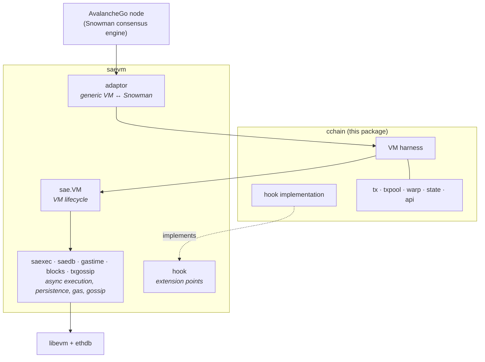
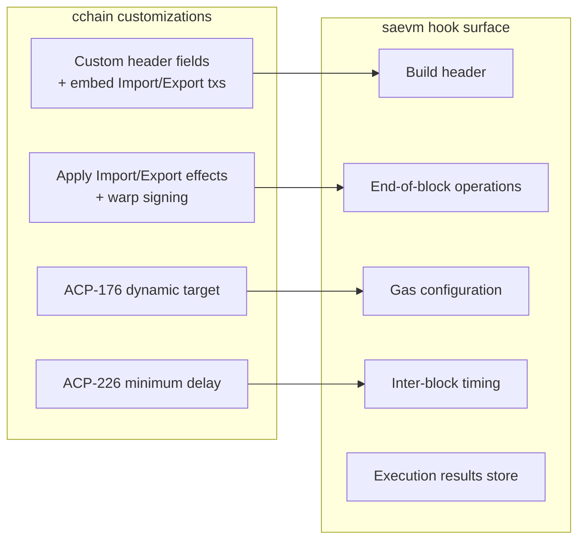

# C-Chain VM (`cchain`)

`cchain` is the C-Chain VM. It is a thin chain-specific harness on top of [saevm](../), which provides streaming asynchronous EVM execution per [ACP-194](https://github.com/avalanche-foundation/ACPs/tree/main/ACPs/194-streaming-asynchronous-execution). On its own, `saevm` is a generic streaming-async EVM framework. `cchain` is what turns that framework into the C-Chain — adding Import/Export transactions for moving assets between Primary Network chains, warp messaging, dynamic gas targeting, and minimum-delay block production.

## Where `cchain` sits

`cchain` is one slim layer wedged between the consensus adaptor at the top and `saevm`'s execution engine at the bottom. Block execution, persistence, gas accounting, and gossip plumbing all run unchanged underneath. `saevm`'s [hook](../hook/) package is `cchain`'s seam into that engine: `cchain` implements the hook interface, and `saevm` calls back into it at the points where chain-specific behavior is needed.

## Responsibility split

`saevm` handles everything that is true of any streaming-async EVM chain:

- EVM block execution and the asynchronous execution pipeline
- Settlement (the delayed-finality model from ACP-194)
- Time-based gas accounting
- Mempool and gossip plumbing
- Worst-case state validation for safe block building
- Adapting the VM to Snowman consensus

`cchain` adds what makes the C-Chain *the C-Chain*:

- **Import / Export transactions** for moving assets between Primary Network chains
- **Warp messaging** — storage and verification of cross-subnet signed messages
- **ACP-176 dynamic gas target** — gas-per-second target floats with usage
- **ACP-226 minimum block delay** — lower bound on inter-block time
- **Synchronous → asynchronous migration** — knowledge of where the C-Chain's historical synchronous era ends and streaming-async execution begins
- The C-Chain's `avax_*` JSON-RPC service

The Primary Network is made up of three chains (P, X, and C) that exchange assets through a small per-chain shared key-value store. Each chain has a slot, and chains hand assets to each other by writing to the recipient's slot. **Import** transactions consume entries that another chain wrote into the C-Chain's slot and credit the corresponding C-Chain accounts; **Export** transactions burn C-Chain balances and write the matching entries for the destination chain to consume.

## How `cchain` plugs into `saevm`

`saevm` exposes a set of extension points through its [hook](../hook/) package — places where chain-specific behavior can be injected without touching the engine. `cchain`'s [hook](hook/) implementation fills those slots to attach C-Chain-specific header fields, validate and apply Import/Export transactions alongside warp signing as end-of-block effects, and configure the dynamic gas target and minimum delay per block.

Outside the hook seam, `cchain` reuses `saevm` directly: it constructs an inner `sae.VM`, registers gossip and warp message handlers on it, and lets the engine drive the rest.

## C-Chain-specific behavior

Each item below links to the package where it lives.

### Import / Export transactions
Transfers between the C-Chain and the other Primary Network chains, via the shared key-value store described above. `cchain` defines the transaction types, their validation rules, and their state effects, and runs a dedicated mempool and bloom-filter gossip system for them. → [tx](tx/), [txpool](txpool/)

### Warp messaging
Cross-subnet signed messages following [ACP-118](https://github.com/avalanche-foundation/ACPs/tree/main/ACPs/118). `cchain` stores warp messages emitted by the chain and verifies inbound signature requests from peers. → [warp](warp/)

### Dynamic gas target (ACP-176)
The target gas-per-second is not a fixed parameter; it follows an excess tracker that adjusts up or down based on observed usage, letting the network discover a sustainable throughput rate. → [hook/acp176](hook/acp176/)

### Minimum block delay (ACP-226)
A configurable lower bound on the time between consecutive blocks, derived from the parent header. The bound prevents accelerated block production beyond what the network has agreed to. → [hook](hook/)

### Synchronous → asynchronous migration
The C-Chain executed synchronously for years before streaming-async execution was introduced. `cchain` records the boundary block at which the chain switched modes, so a node bootstrapping from genesis can correctly replay the synchronous era and then hand off to `saevm`'s asynchronous pipeline for everything after. → [state](state/), [hook](hook/)

## Subpackages at a glance

- [api/](api/) — `avax_*` JSON-RPC service for Import/Export submission and status
- [hook/](hook/) — implementation of `saevm`'s hook interface; orchestrates block building and end-of-block operations
- [hook/acp176/](hook/acp176/) — dynamic gas-target excess
- [state/](state/) — genesis parsing and the synchronous-boundary pointer
- [tx/](tx/) — Import / Export transaction types
- [txpool/](txpool/) — Import / Export mempool with bloom-filter gossip
- [warp/](warp/) — warp message storage and the ACP-118 verifier
