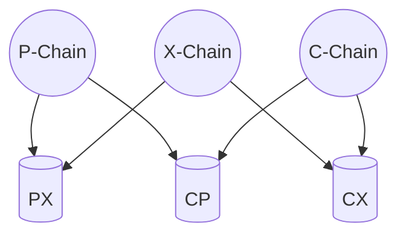
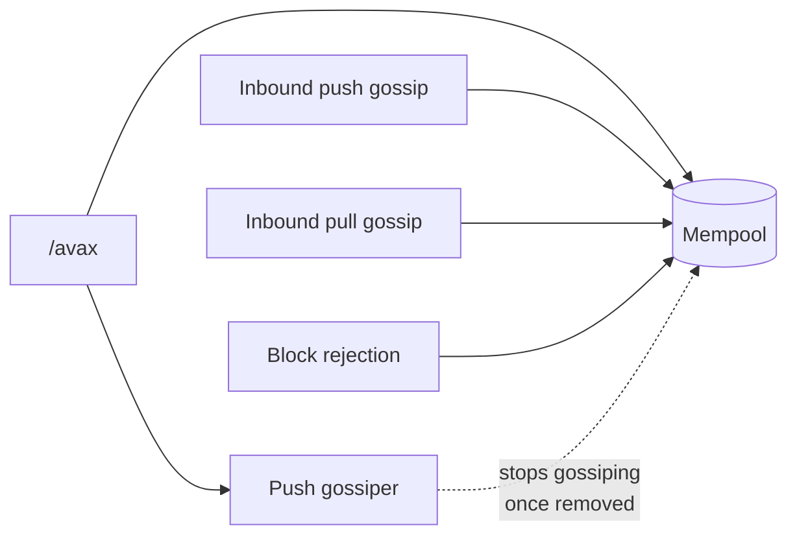

# C-Chain VM (`cchain`)

`cchain` is the C-Chain VM. It is a thin chain-specific harness around [saevm](../), the generic EVM framework that implements [ACP-194](https://github.com/avalanche-foundation/ACPs/tree/main/ACPs/194-streaming-asynchronous-execution). `saevm` does the heavy lifting — block execution, settlement, gas accounting, and EVM gossip. `cchain` adds what makes the chain *the C-Chain*: Transactions for moving assets between Primary Network chains, Warp messaging, and validator-voted chain parameters.

## Architecture

The C-Chain is composed of three major components:

1. **AvalancheGo** — networking, consensus, validator-set management, and the external API surface.
2. **SAE** — the generic, Turing-complete EVM implementation.
3. **C-Chain** (this package) — the wrapper that adds C-Chain-specific behavior.

## What `cchain` adds

### Export and Import transactions

The Primary Network is the set of three chains — P, X, and C — that exchange assets through pair-wise shared stores. Each pair of chains has its own store, readable and writable by both chains in the pair.

A cross-chain transfer happens in two steps. An **Export** transaction on the source chain burns the asset and writes a UTXO into the shared store between the source and destination chains. The UTXO specifies who is allowed to consume it. An **Import** transaction, issued by that party on the destination chain, consumes the UTXO and credits funds to addresses of the Import issuer's choice.

`cchain` defines both transaction types, their validation rules, and runs a dedicated mempool that gossips them in a bandwidth-optimized way using bloom filters. See [tx](tx/) and [txpool](txpool/).

#### How transactions enter the Txpool

Import/Export transactions reach the mempool from four independent sources. They all converge on the same gate, where signature, against-state, and conflict-resolution checks happen before insertion.

The four entry paths in detail:

User RPC submission is the only path that registers transactions with the local push-gossiper for proactive propagation; the other three sources reach the mempool without enqueuing for outbound gossip.

- **User RPC submission.** The `/avax` JSON-RPC endpoint receives a transaction and forwards it to the mempool, also enqueuing it on the push-gossiper.
- **Inbound push gossip.** A peer pushes a transaction over the Import/Export gossip protocol; the transaction is routed to the same add path.
- **Inbound pull gossip.** Periodically, `cchain` sends a bloom filter representing the current state of the mempool to a peer. The peer returns transactions not referenced in the bloom filter; those transactions are forwarded to the same add path.
- **Block rejection.** When the consensus engine rejects a block this node had previously verified, `cchain` submits each included transaction to the mempool. The point is to keep otherwise-valid transactions from being dropped by an unlucky conflict.

### Warp messaging

The C-Chain participates in cross-subnet Warp messaging on both sides — sending messages to other chains and receiving messages from them. Three pieces are involved:

- A custom precompile that lets EVM contracts emit and consume Warp messages.
- Incoming Warp messages encoded into the access-list, so the hook implementation can verify them prior to EVM execution.
- The [ACP-118](https://github.com/avalanche-foundation/ACPs/tree/main/ACPs/118) p2p protocol for collecting BLS signatures from peer validators on outbound messages.

`cchain` persists this chain's Warp messages, serves signature requests against that store, and verifies Warp predicates during block execution. See [warp](warp/).

### Validator-voted parameters

Three chain parameters are settled by validator vote on each block: validators choose to raise, lower, or hold each value.

- **Gas target per second** ([ACP-176](https://github.com/avalanche-foundation/ACPs/tree/main/ACPs/176)) — the throughput target. The rest of ACP-176 (gas accounting and excess tracker) lives in SAE; `cchain` contributes only the target value. See [hook/acp176](hook/acp176/).
- **Minimum block delay** ([ACP-226](https://github.com/avalanche-foundation/ACPs/tree/main/ACPs/226)) — a lower bound on the time between consecutive blocks. Prevents block production faster than the network can maintain. See [hook](hook/).
- **Minimum gas price** ([ACP-283](https://github.com/avalanche-foundation/ACPs/tree/main/ACPs/283)) — a floor on the gas price for transactions to be included in a block. See [hook](hook/).

## Subpackages at a glance

- [api/](api/) — `avax_*` JSON-RPC service for Import/Export submission and UTXO lookup
- [hook/](hook/) — implementation of saevm's hook surface; orchestrates header construction and end-of-block operations
- [hook/acp176/](hook/acp176/) — validator-voted gas-per-second target
- [state/](state/) — genesis parsing, the synchronous-boundary pointer, and state-trie helpers
- [tx/](tx/) — Import / Export transaction types
- [txpool/](txpool/) — the mempool and conflict tracking
- [warp/](warp/) — Warp message storage, the ACP-118 verifier, and predicate handling
