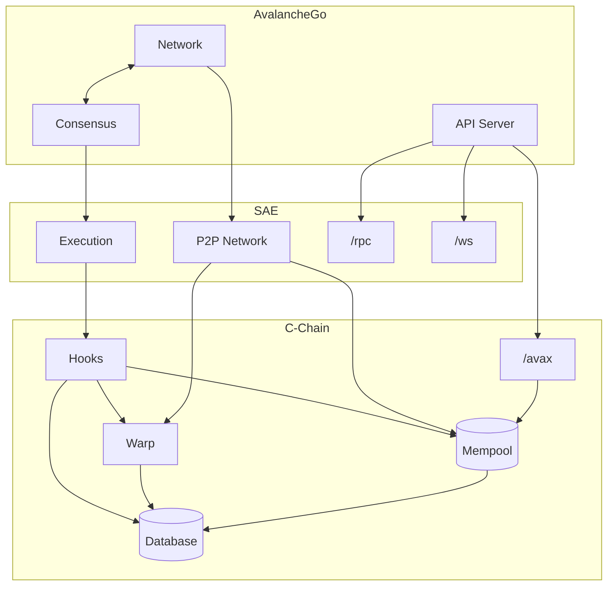
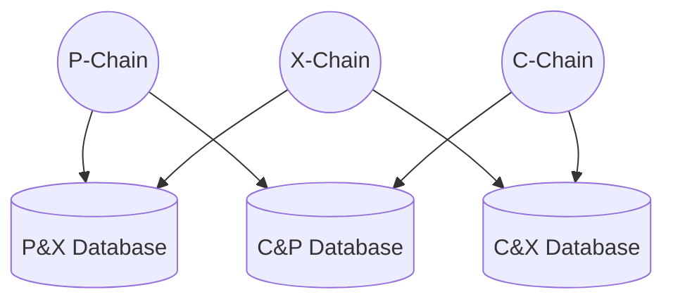
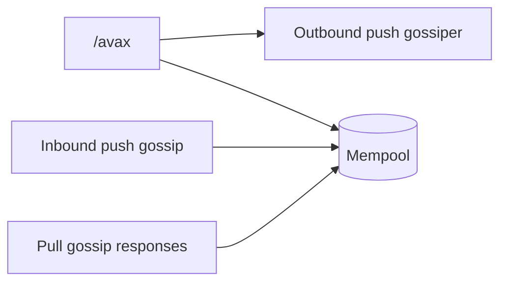

# C-Chain VM (`cchain`)

`cchain` is the C-Chain VM. It is a thin chain-specific harness around [saevm](../), the generic EVM framework that implements [ACP-194](https://github.com/avalanche-foundation/ACPs/tree/main/ACPs/194-streaming-asynchronous-execution). `saevm` does the heavy lifting of block execution, settlement, gas accounting, and EVM gossip. `cchain` adds what makes the chain *the C-Chain*, transactions for moving assets between Primary Network chains, Warp messaging, and validator-voted chain parameters.

## Architecture

The C-Chain is composed of three major components:

1. **AvalancheGo** — [networking](../../../network), [consensus](../../../snow), validator-set management, and the external API surface.
2. **SAE** — the generic EVM implementation.
3. **C-Chain** (this package) — the wrapper that adds C-Chain-specific behavior.

Hooks are the seam through which SAE calls into C-Chain-specific code. SAE invokes them throughout a block's lifecycle, most notably:

- **Build** — construct custom header fields and embed cross-chain transactions into the block body.
- **Verify** — enforce validation rules on header fields, embedded transactions, and Warp predicates.
- **Execute** — apply cross-chain transaction state effects and persist emitted Warp messages.

## What `cchain` adds

### Block format extensions

`cchain` extends the standard Ethereum block format. The C-Chain transitioned to this VM from coreth on the same database and block format, so historical blocks must keep parsing and hashing identically and vestigial fields cannot be removed.

The block header gains the following extra fields:

- `extDataHash` — keccak256 of the block's cross-chain transaction data.
- `extDataGasUsed` — gas used by cross-chain transactions. No longer used.
- `blockGasCost` — block-level required priority fee. No longer used.
- `timestampMilliseconds` — millisecond-precise timestamp.
- `minDelayExcess` — ACP-226 minimum-delay vote tracker.
- `targetExponent` — ACP-176 gas-target vote tracker.
- `minPriceExponent` — ACP-283 minimum-gas-price vote tracker.
- `settledHeight` — height of the block this header settles.
- `settledGasUnix` — seconds component of the settled block's gas time.
- `settledGasNumerator` — sub-second numerator of the settled block's gas time.
- `settledExcess` — gas excess after executing the settled block.

The `settled*` fields track ACP-194 settlement and are required by SAE rather than C-Chain-specific.

The block body adds two extra fields:

- `version` — legacy format version. Always 0, enforced at parse time.
- `extData` — the encoded cross-chain transactions described under [Cross-chain transactions](#cross-chain-transactions).

The standard `extra` field carries the Warp predicate verification results described under [Warp messaging](#warp-messaging).

### Cross-chain transactions

The Primary Network chains, P, X, and C, exchange assets through pair-wise [shared databases](../../../chains/atomic). Each pair of chains has its own database, readable and writable by both chains in the pair.

A cross-chain transfer happens in two steps. An **Export** transaction on the source chain burns the asset and writes a UTXO into the shared store between the source and destination chains. The UTXO specifies who is allowed to consume it. An **Import** transaction, issued by that party on the destination chain, consumes the UTXO and credits funds to addresses of the Import issuer's choice. A transaction's shared-database writes are applied after the block containing it executes, which under SAE is after acceptance.

`cchain` defines both transaction types and their validation rules, and runs a dedicated mempool that gossips them in a bandwidth-optimized way using bloom filters.

#### How transactions enter the mempool

Cross-chain transactions reach the mempool from three independent sources. Every source funnels into the same add path, which checks signatures, state validity, and conflicts.

The entry paths in detail:

- **User RPC submission.** The `/avax` JSON-RPC endpoint receives a transaction and forwards it to the mempool, also enqueuing it on the push gossiper. This is the only path that registers transactions with the push gossiper.
- **Inbound push gossip.** A peer pushes a transaction over the transaction gossip protocol, and the transaction is routed to the same add path.
- **Pull gossip responses.** Periodically, `cchain` sends a bloom filter representing the current state of the mempool to a peer. The peer returns transactions not referenced in the bloom filter, and those transactions are forwarded to the same add path.

Transactions leave the mempool in only three ways. A conflicting higher-fee transaction replaces them, a full pool evicts the lowest-fee transaction in favor of a higher-fee arrival, or an executed block consumes their UTXOs.

### Warp messaging

The C-Chain participates in cross-subnet [Warp messaging](../../platformvm/warp) on both sides, sending messages to other chains and receiving messages from them. Four pieces are involved:

- A custom precompile that lets EVM contracts emit and consume Warp messages.
- Incoming Warp messages encoded in the access list, so the hook implementation can verify them prior to EVM execution.
- [Predicate verification](../../evm/predicate) results encoded into the block header's `extra`.
- The [ACP-118](https://github.com/avalanche-foundation/ACPs/tree/main/ACPs/118-warp-signature-request) p2p protocol for collecting BLS signatures from peer validators on outbound messages.

The [warp](warp/README.md) package documents the full message lifecycle, what makes a message signable, and the storage compatibility constraints.

### Validator-voted parameters

Three chain parameters are set by validator vote. Each block moves each parameter toward the builder's configured value. Because block production is stake-weighted, this yields a stake-weighted voting mechanism over the long run.

- **Gas target per second** ([ACP-176](https://github.com/avalanche-foundation/ACPs/tree/main/ACPs/176-dynamic-evm-gas-limit-and-price-discovery-updates)) — the throughput target. The rest of ACP-176, gas accounting and the excess tracker, lives in SAE. `cchain` contributes only the target value.
- **Minimum block delay** ([ACP-226](https://github.com/avalanche-foundation/ACPs/tree/main/ACPs/226-dynamic-minimum-block-times)) — a lower bound on the time between consecutive blocks. Prevents block production faster than the network can maintain.
- **Minimum gas price** ([ACP-283](https://github.com/avalanche-foundation/ACPs/tree/main/ACPs/283-dynamic-minimum-gas-price)) — a floor on the gas price for transactions to be included in a block.

## References

- [config.md](config.md) — node operator configuration for this VM.
- [warp](warp/README.md) — Warp message lifecycle, signability rules, and storage constraints.
