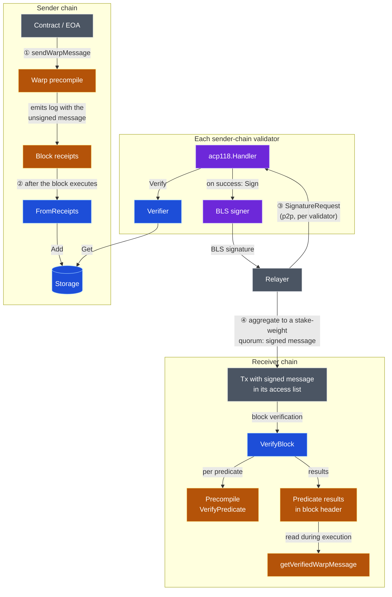
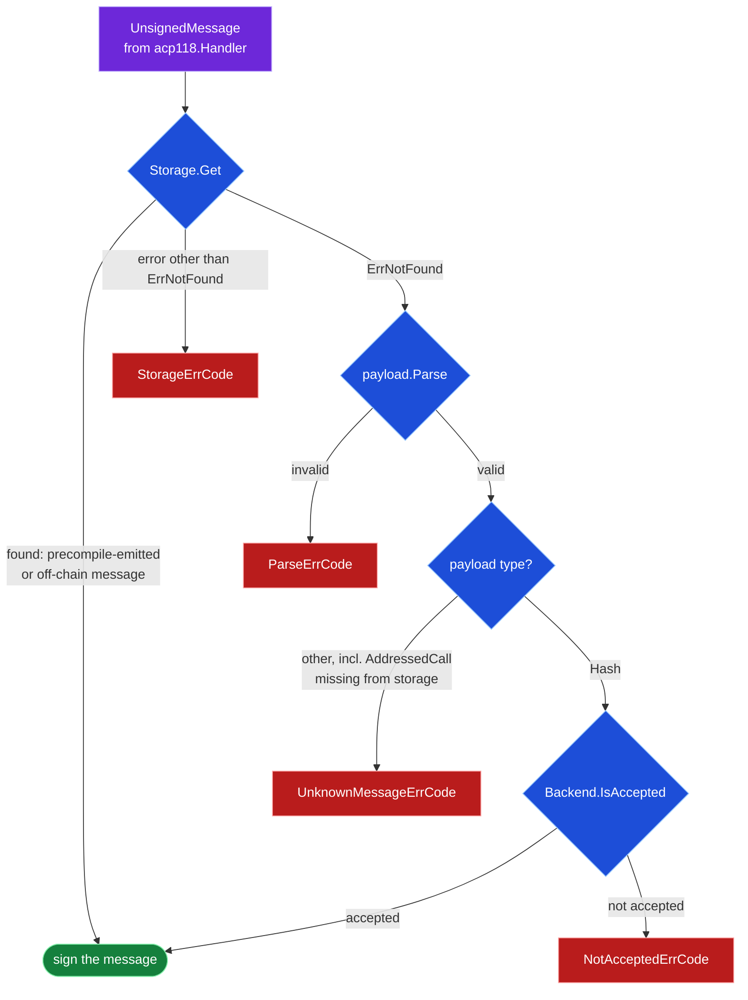
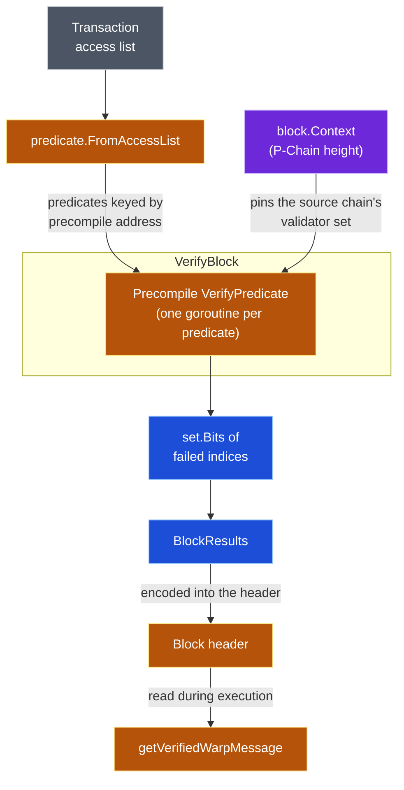

# Warp (SAE C-Chain)

This package handles the parsing, verification, and storage of [Avalanche Warp Messages](../../../platformvm/warp/README.md) for the C-Chain implementation of [Streaming Asynchronous Execution (SAE)](https://github.com/avalanche-foundation/ACPs/tree/main/ACPs/194-streaming-asynchronous-execution).

A warp message is a payload attested by the validator set of a source chain: each validator signs the message with the BLS key it registered on the P-Chain, and the individual signatures are aggregated into a single multi-signature. Because every validator's BLS public key and stake weight are readable from the P-Chain, any chain can verify that a stake-weight quorum of the source chain endorsed a message — without additional trust assumptions or messaging infrastructure. (Newer documentation also calls this Avalanche Interchain Messaging, ICM.)

This package provides the pieces the VM needs to participate in that protocol: `FromReceipts` and `Storage` capture and persist the messages a block emits, `Verifier` decides what this node is willing to sign, and `VerifyBlock` checks the signed messages that transactions deliver. The rest of the lifecycle — the precompile that creates messages, the p2p protocol that collects signatures, the predicate machinery that carries signed messages in transactions — lives outside this package. This README shows how the pieces fit together.

## Message lifecycle

| Style | Meaning |
|---|---|
| Blue | This package |
| Orange | EVM side: [warp precompile](../../../../graft/coreth/precompile/contracts/warp/README.md) and [predicate handling](../../../evm/predicate/README.md) |
| Purple | AvalancheGo platform: [ACP-118 handler](../../../../network/p2p/acp118/handler.go), BLS signer |
| Gray | External actors |

1. **Send** — a contract calls `sendWarpMessage` on the warp precompile, which packs the payload into an unsigned warp message and emits it as a log.
2. **Persist** — after the block executes (under SAE, execution happens after acceptance), the VM collects every message in the block with [`FromReceipts`](./warp.go) and persists them with [`Storage.Add`](./storage.go).
3. **Sign** — a relayer asks each validator for its signature over p2p ([ACP-118](https://github.com/avalanche-foundation/ACPs/tree/main/ACPs/118-warp-signature-request)). The handler consults [`Verifier.Verify`](./verifier.go), which checks `Storage`; on success the node responds with its BLS signature, and the relayer aggregates responses until a stake-weight quorum is reached.
4. **Receive** — anyone submits a transaction on the receiver chain carrying the signed message in its access list. [`VerifyBlock`](./warp.go) checks the multi-signature during block verification and the results are recorded in the block header, so execution can serve the message to contracts via `getVerifiedWarpMessage`.

Every validator of the sender chain runs the full sender-chain stack, which is why the `Verifier` in stage ③ reads the same `Storage` its node populated in stage ②. Sender and receiver chains need not run identical software, but they share this logical flow — and a single instance of this VM plays both ends of the diagram, sending some messages and receiving others.

## Conceptual model

### What makes a message signable

Three message types can be signed:

- **Precompile messages** — `AddressedCall` payloads the Warp contract emitted via `sendWarpMessage`.
- **Block-hash attestations** — `Hash` payloads attesting that this chain accepted a given block.
- **Off-chain messages** — messages the operator lists in the chain config for the node to sign, even though they were never emitted on chain.

The [`Verifier`](./verifier.go) doesn't track these kinds explicitly; it validates a message by checking two sources in order:

Green means the node signs; red is the error code returned to the requester.

The two `Storage`-backed kinds are indistinguishable to the `Verifier`: precompile and off-chain messages both live in `Storage`, so a single `Storage.Get` confirms either one. Only when that lookup misses does the `Verifier` fall back to the block-hash path — parsing the payload and asking the `Backend` whether the named block is accepted. Anything else — a corrupt payload, a non-`Hash` payload, or an `AddressedCall` absent from `Storage` — is refused with an error code that tells the requester why.

### Inbound messages are predicates

A signed message rides into the receiver chain inside a transaction's access list — a *predicate* (see the [predicate encoding](../../../evm/predicate/README.md)). Verifying it means checking the multi-signature against the source chain's validator set, which changes over time; the proposervm block context supplies the P-Chain height that pins it.

The results — which predicates failed, per transaction — are encoded into the block header, so nodes that process the block later read the recorded outcome instead of re-verifying signatures. Execution, including historical re-execution, only reads the recorded bits when a contract calls `getVerifiedWarpMessage`.

### Easy to misunderstand

- There are two unrelated "verify"s: `Verifier.Verify` decides whether this node should *sign* an outbound message; `VerifyBlock` checks the *multi-signature* on inbound messages. They share no code path.
- `Verifier` doesn't check `NetworkID` or `SourceChainID` — the ACP-118 contract assigns those checks to the BLS signer.
- `Storage` holds only unsigned messages; signatures are never persisted.
- A message becomes signable only once the block that emitted it has been *executed* — under SAE, strictly after acceptance.

## Maintenance notes

- **Database compatibility.** `Storage`'s on-disk layout must remain byte-compatible with coreth's warp database: the C-Chain transitions from coreth to this VM on the same database, and breaking the layout silently orphans every previously persisted message. This constraint only expires once the transition is far enough in the past that those messages no longer matter.
- **Off-chain messages are memory-only on purpose.** They are operator-supplied configuration, not chain data, so the persisted set stays exactly what the precompile emitted — and an off-chain message is removed by simply not supplying it on the next construction.
- **Predicate results are encoded in the header so warp messages are never verified during bootstrapping.** Verification needs the source chain's validator set, which isn't guaranteed to be available then — bootstrapping nodes must be able to rely on the recorded results instead of re-checking signatures.
- **VM wiring.** Harvested messages are persisted in `(*hooks).AfterExecutingBlock`, the predicate results are encoded into the header in `(*builder).BuildBlock` (both in [`../hooks.go`](../hooks.go)), and the ACP-118 handler is registered with a `Backend` implementation at VM initialization. Persisting in `AfterExecutingBlock` preserves coreth's guarantee that only messages from accepted blocks are signable, because SAE executes blocks only after acceptance.

## References

Integration points:

- [`../hooks.go`](../hooks.go) - `AfterExecutingBlock`, `BuildBlock`

Message format:

- [`vms/platformvm/warp`](../../../platformvm/warp/README.md) - message structure and `BitSetSignature`
- [`vms/platformvm/warp/payload`](../../../platformvm/warp/payload/README.md) - `AddressedCall` and `Hash` payloads

Signing protocol:

- [`network/p2p/acp118`](../../../../network/p2p/acp118/handler.go) - signature request handler and aggregator
- [ACP-118](https://github.com/avalanche-foundation/ACPs/tree/main/ACPs/118-warp-signature-request) - protocol specification

EVM side:

- [coreth warp precompile](../../../../graft/coreth/precompile/contracts/warp/README.md) - `sendWarpMessage`, `getVerifiedWarpMessage`, predicate verification
- [`vms/evm/predicate`](../../../evm/predicate/README.md) - access-list predicate encoding and results
