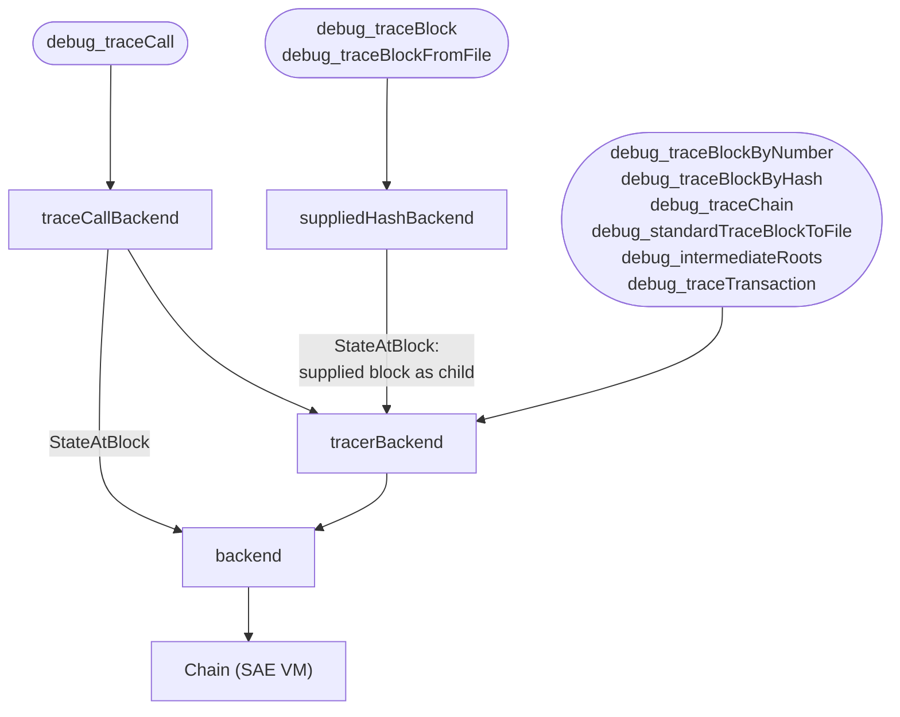

# RPC

This package serves all of the SAE VM's JSON-RPC APIs. It adapts the VM into
the backends expected by libevm's `ethapi`, `tracers`, and `filters` packages
and registers every namespace (`eth`, `debug`, `txpool`, `net`, `web3`, …) on a
single `rpc.Server`; see `server.go` for the full endpoint list.

## Stateful RPCs

Blocks are executed after acceptance, so a stored header carries the worst-case
base fee and no post-execution state root. RPCs that need state (`eth_call`,
`eth_getBalance`, `debug_trace*`, …) wait for execution and are served faked
headers carrying the executed base fee and post-execution root, mimicking a
synchronous chain.

`tracerAPI` serves the tracing endpoints of the `debug` namespace. It routes
each endpoint to a `tracers.API` built on the layer that supplies the state that
endpoint expects.

The bottom layer is `backend`, the adapter from the SAE `Chain` to libevm's API
packages. Three wrappers stack on top of it. Each overrides only the methods
whose behavior it changes, and every other call falls through to the layer
beneath. The table below lists every method that differs.

| Method | Behavior | Implementation |
| --- | --- | --- |
| `StateAtBlock` | The post-execution state of the provided block. | `backend` |
| | The provided block's post-execution state with the **canonical child's** `StartExecutingBlock` changes applied, allowing transaction tracing on the child to include these operations. | `tracerBackend` |
| | The post-execution state of the provided block, with none of the child's changes, because `debug_traceCall` is expected to run immediately after that block. | `traceCallBackend` |
| | The provided block's post-execution state with the **caller-supplied block's** `StartExecutingBlock` changes. | `suppliedHashBackend` |
| `StateAtTransaction` | Applies the provided block's `StartExecutingBlock` changes, then replays its transactions up to the target index, reaching the state just before it. | `backend` |
| | The same replay, but of the **stored block**, needed because the faked header would otherwise reach the hooks. | `tracerBackend` |
| `BlockByHash`, `BlockByNumber` | The stored block: worst-case base fee, no post-execution state root. | `backend` |
| | The stored block with a faked header carrying the executed base fee and post-execution state root. | `tracerBackend` |
| `BlockHash` | Not implemented; the stored blocks it serves hash to their own headers. | `backend` |
| | The provided block's canonical hash, needed because its faked header hashes to something else. | `tracerBackend` |
| | The caller-supplied hash for the single block `debug_traceBlock` re-sealed with the executed base fee, and the canonical hash for every other block. | `suppliedHashBackend` |

For the below diagram, endpoints are rounded and backends square. Between backends, a labelled edge
carries only the method named on it, and an unlabelled edge everything else.

