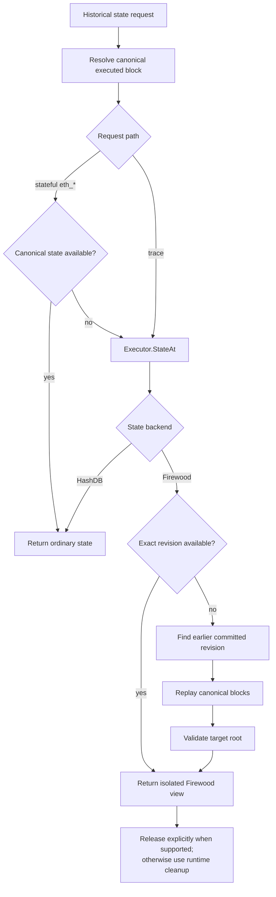

# RPC

This package serves all JSON-RPC APIs for the SAE VM. It adapts the VM to the
interfaces that libevm's `ethapi`, `tracers`, and `filters` packages require.
It registers each namespace on one `rpc.Server`. Examples include `eth`,
`debug`, `txpool`, `net`, and `web3`. See `server.go` for the full endpoint
list.

## Stateful RPCs

SAE accepts a block before it executes that block, so a stored header contains
the worst-case base fee but no post-execution state root. When an RPC needs
state, it waits for execution and uses a faked header with the executed
base fee and state root. From the client's perspective, this makes SAE behave
like a synchronous chain.

## Firewood state reconstruction

Firewood can delay state persistence, so a node can retain a block's state root
across a restart without retaining the corresponding Firewood revision. The
root identifies the state, but it does not contain the account and storage data
needed to serve a request. In this situation, the RPC backend can reconstruct
the historical state in a temporary Firewood view.

### State selection

For a stateful `eth_*` request, the RPC backend first tries to open the ordinary
state from the canonical trie database. This path avoids reconstruction. The
backend calls `Executor.StateAt` only when that state is unavailable; it returns
any other database error without trying the fallback.

Trace endpoints call `Executor.StateAt` directly. `StateAt` selects the state
source as follows:

Before `StateAt` returns a state produced by replay, it calculates the target
state root and compares it with the recorded root. It returns the state only
when the roots match.

### Replay behavior

The Firewood commit interval defines the minimum replay horizon. A trace can
increase this horizon with its `reexec` value, but it cannot decrease it. If
`StateAt` cannot find a committed seed within the horizon, the request fails.

Replay runs as part of the RPC request. It does not repair the database, write
the reconstructed state to canonical storage, or cache the result. As a result,
separate requests can replay the same blocks.

Transaction tracing can require two replay operations. `StateAt` can replay
blocks to reconstruct the parent state, after which `StateAtTransaction`
replays the preceding transactions to reconstruct the state before the target
transaction.

The `state-replay-concurrency` option limits the number of concurrent block
replays and defaults to `1`. Opening an exact Firewood view does not use a replay
slot, and the executor releases a slot before it returns the reconstructed
state.

### Resource ownership

`StateAt` returns both the state and a release function. Trace backends pass the
function to libevm, which calls it after the trace finishes. If an RPC error
occurs after the backend acquires a reconstructed state, the error path calls
the release function.

The ordinary `ethapi.Backend` interface cannot return a release function. For
this interface, Go runtime cleanup releases each Firewood view after the state
becomes unreachable.

### Limits

- Reconstruction applies only to Firewood; HashDB uses its ordinary state
  behavior.
- Firewood does not implement trie proofs, and reconstruction does not add
  proof support. Therefore, Firewood does not support `eth_getProof`.
- Cancellation can stop a request while it waits for a replay slot or between
  replayed blocks. It cannot interrupt an active EVM execution or Firewood
  call.
- A caller **MUST** use a reconstructed state from only one goroutine and
  **MUST NOT** call `StateDB.Commit` on it.
- Pre-Cancun subnet history has a known limitation: the final root can differ
  when separate replayed blocks delete and recreate the same account. Mainnet
  C-Chain history does not contain the known transition.

## Trace backends

`tracerAPI` serves the trace endpoints in the `debug` namespace. It selects a
`tracers.API` with the state behavior that each endpoint requires.

`backend` is the base adapter from the SAE `Chain` to the libevm API packages.
Three wrappers use this adapter. Each wrapper changes only the listed methods.
All other calls go to the next backend in the stack.

| Method | Behavior | Implementation |
| --- | --- | --- |
| `StateAtBlock` | Returns the post-execution state of the specified block. | `backend` |
| | Applies the canonical child's before-block changes to the specified block state. Transaction tracing on the child requires these changes. | `tracerBackend` |
| | Returns the specified block state without child changes. `debug_traceCall` runs directly after that block. | `traceCallBackend` |
| | Applies before-block changes from the caller-supplied child block. | `suppliedHashBackend` |
| `StateAtTransaction` | Applies the block's before-block changes. Then it replays transactions before the target transaction. | `backend` |
| | Replays the stored block. This prevents the faked header from reaching the hooks. | `tracerBackend` |
| `BlockByHash`, `BlockByNumber` | Returns the stored block. Its header has the worst-case base fee and no post-execution state root. | `backend` |
| | Returns the stored block with a faked header. The header has the executed base fee and post-execution state root. | `tracerBackend` |
| `BlockHash` | Does not change the hash. Each stored block hashes to its own header. | `backend` |
| | Returns the canonical hash. A faked header has a different hash. | `tracerBackend` |
| | Returns the caller-supplied hash for the block from `debug_traceBlock`. It returns canonical hashes for all other blocks. | `suppliedHashBackend` |

The diagram uses rounded boxes for endpoints and square boxes for backends. A
labeled edge applies only to the specified method. An unlabeled edge applies to
all other methods.

