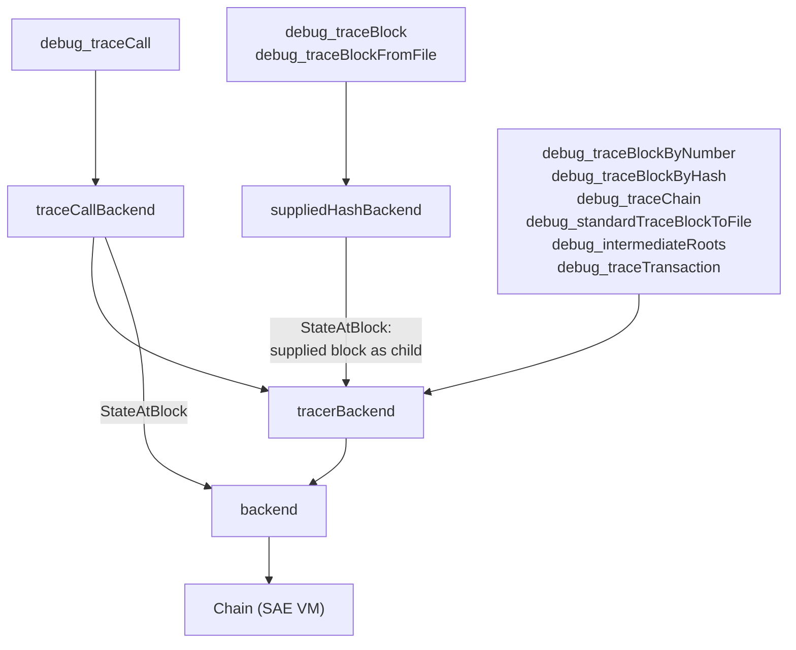

# RPC

This package serves all of the SAE VM's JSON-RPC APIs. It adapts the VM into
the backends expected by libevm's `ethapi`, `tracers`, and `filters` packages
and registers every namespace (`eth`, `debug`, `txpool`, `net`, `web3`, …) on a
single `rpc.Server`; see `server.go` for the full endpoint list.

## Stateful RPCs

Blocks are executed after acceptance, so a stored header carries the worst-case
base fee and no post-execution state root. RPCs that need state (`eth_call`,
`eth_getBalance`, `debug_trace*`, …) wait for execution and are served faked
headers carrying the executed base fee and post-execution root, mimicking a
synchronous chain.

The tracing endpoints of the `debug` namespace are served by `tracerAPI`, which
routes each call to a `tracers.API` instance over one of three wrappers around
`backend`, the adapter from the SAE `Chain` to libevm's API packages. Any method
a wrapper doesn't override falls through to the next layer, so only the methods
below vary:

| Method | Behavior | Implementation |
| --- | --- | --- |
| `StateAtBlock` | The post-execution state of the provided block. | `backend` |
| | The provided block's post-execution state with the **canonical child's** before-block changes applied, allowing transaction tracing on the child to include these operations. | `tracerBackend` |
| | The post-execution state of the provided block. `debug_traceCall` is expected to be executed as if it was the last transaction. | `traceCallBackend` |
| | The provided block's post-execution state with the **caller-supplied block** before-block changes. | `suppliedHashBackend` |
| `StateAtTransaction` | Replays the provided block's transactions up to the target index to reach the state just before it — the only method in this table that executes anything. No wrapper overrides it. | `backend` |
| `BlockByHash`, `BlockByNumber` | The stored block: worst-case base fee, no post-execution state root. | `backend` |
| | The stored block with a faked header carrying the executed base fee and post-execution state root. | `tracerBackend` |
| `BlockHash` | Not implemented; the stored blocks it serves hash to their own headers. | `backend` |
| | The provided block's canonical hash, needed because its faked header hashes to something else. | `tracerBackend` |
| | The caller-supplied hash for the single block `debug_traceBlock` re-sealed with the executed base fee, and the canonical hash for every other block. | `suppliedHashBackend` |

So two of the four apply before-block changes — `tracerBackend` from the
canonical child and `suppliedHashBackend` from the supplied block — and all
three wrappers serve faked headers, with only `backend` returning the block as
stored.

