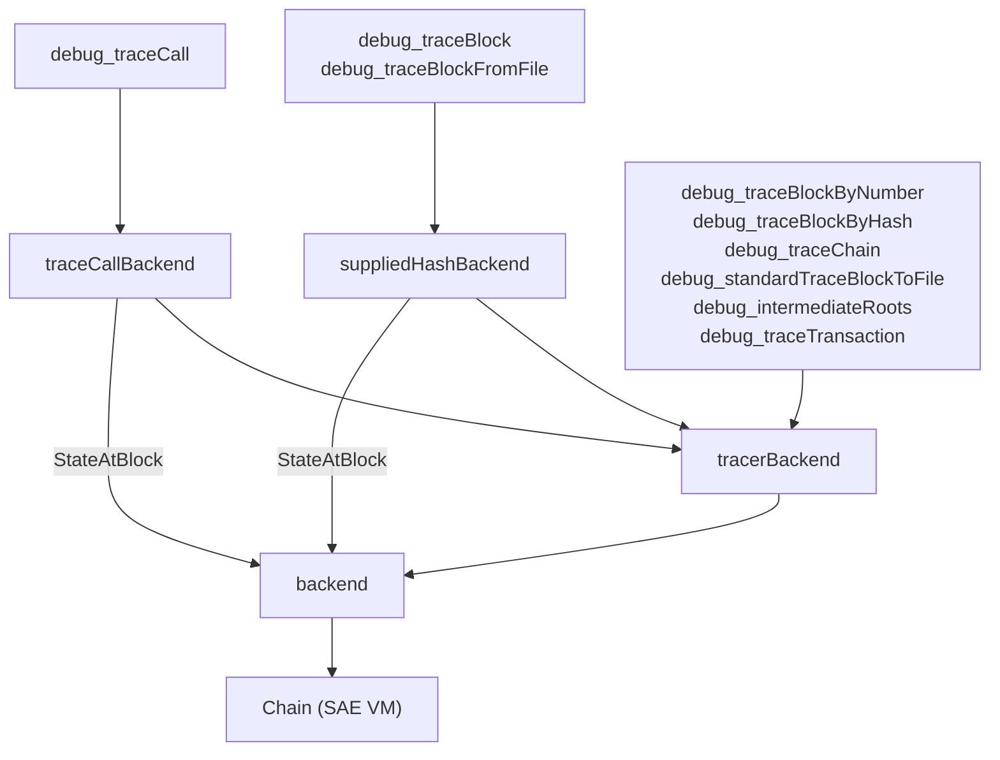

# RPC

This package serves all of the SAE VM's JSON-RPC APIs. It adapts the VM into
the backends expected by libevm's `ethapi`, `tracers`, and `filters` packages
and registers every namespace (`eth`, `debug`, `txpool`, `net`, `web3`, …) on a
single `rpc.Server`; see `server.go` for the full endpoint list.

## Stateful RPCs

SAE executes blocks asynchronously, so a stored header carries the worst-case
base fee and no post-execution state root. RPCs that need state (`eth_call`,
`eth_getBalance`, `debug_trace*`, …) wait for execution and are served faked
headers carrying the executed base fee and post-execution root, mimicking a
synchronous chain.

The tracing endpoints of the `debug` namespace are served by `tracerAPI`,
which routes each call to a `tracers.API` instance over one of three backends. All of them wrap
`backend`, and any method a wrapper doesn't override falls through to the next
layer:

- `traceCallBackend` wraps `tracerBackend` but routes `StateAtBlock` straight
  to `backend`: `debug_traceCall` wants the state as of the block itself, not
  a base state for re-executing its child.
- `suppliedHashBackend` wraps `tracerBackend` for a single `debug_traceBlock`
  call. The caller-supplied block need not be canonical, so its `StateAtBlock`
  routes straight to `backend` and applies the supplied block's own
  before-block changes instead of the canonical child's. The block is also
  re-sealed with the executed base fee, changing its hash, so `BlockHash`
  reports the hash as supplied.
- `tracerBackend` wraps `backend`. Its `StateAtBlock` returns the parent's
  post-execution state with the canonical child's before-block changes
  applied (block tracing re-executes the child), and its `BlockHash` reports
  canonical hashes for the faked headers.
- `backend` adapts the SAE `Chain` for libevm's API packages. It waits for a
  block's execution and fakes its header with the executed base fee and
  post-execution state root. Its `StateAtBlock` opens the state as of the
  block's own execution, and its `StateAtTransaction` replays the preceding
  transactions within the block.

No wrapper overrides `StateAtTransaction`, so `debug_traceTransaction` and
`debug_traceCall` with a transaction index always resolve to
`backend.StateAtTransaction`, which replays the preceding transactions within
the block.

