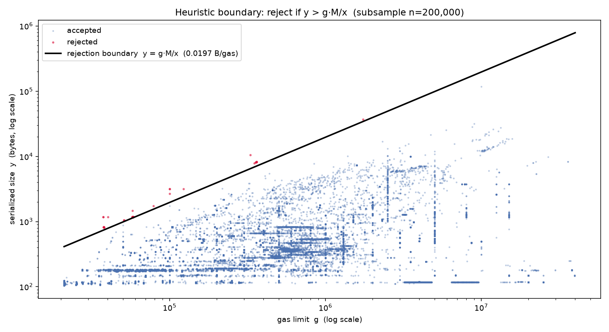

# Bounding block size to the P2P message limit

## Why this exists

A SAE block is gossiped as a single P2P message, capped at
`constants.DefaultMaxMessageSize` (2 MiB). But the block builder bounds blocks
by **gas**, not **bytes** — and the two diverge: the cheapest byte is a calldata
zero byte at `TxDataZeroGas = 4` gas/byte, so a block built to the block gas
limit `x` — `80M` at Helicon launch (ACP-176 sets the per-block limit at target
× 20, and the initial target is 4M) — could reach `80M / 4 ≈ 20 MB`, ~10× the
message limit. Such a block can't be gossiped.

This matters beyond a single wasted block. Unlike the P/X-chains, **SAE does not
remove transactions from the mempool while building**, so a node that builds an
oversized block and cannot gossip it would rebuild the *same* block from the
same pending transactions rather than making progress. Bounding block size by
bytes — not just gas — is therefore needed for liveness, not only efficiency.
(Earlier EVM block builders kept blocks gossipable by skipping over-large txs at
build time; SAE can do better because it knows each tx's gas limit up front and
gates on the gas-to-byte ratio directly.)

## The rule

A transaction is eligible only if its **byte share does not exceed its gas
share**:

$$\text{accept if } \quad \frac{y}{M} \le \frac{g}{x} \quad \iff \quad y x \le g M$$

where `M` = the block's transaction byte budget (`saeparams.MaxBlockTxBytes`,
512 KiB below the max message size), `x` = block gas limit, `g` = tx gas limit,
`y` = tx serialized size — i.e. it must carry at least `x/M ≈ 50.9` gas per byte
(at the `80M` Helicon-launch limit). [`eligible`](./txgossip.go) evaluates this
with exact 128-bit integer math.

The *ratio* form (not a flat byte cap) is what composes: if every included tx
satisfies $y_i/M \le g_i/x$, then

$$\sum_i \frac{y_i}{M} \le \sum_i \frac{g_i}{x} \le 1$$

so a block's transactions fit in `M`, and the 512 KiB margin above `M` covers
every non-transaction byte on the wire — **provided the `x` in the per-tx check
matches the `x` bounding the block**, a condition the build-time backstop below
protects.

## Why the threshold is acceptable

`50.9` gas/byte sits *above* even the 16 gas/nonzero-byte intrinsic cost, so it
rejects any calldata-dominated tx with modest execution — raising the worry that
it blocks legitimate traffic. Analysis of **all C-Chain EVM traffic for May 2026
(82,577,809 txs)** shows it does not:

- **25,489 txs (0.0309%, ~1 in 3,240) would be rejected.** The median tx sits at
  ~362 gas/byte, **~7× above the threshold**, so the rule almost never bites.
- The rejected set is **calldata-dominated** traffic — byte-heavy relative to the
  gas it buys, which is exactly what the ratio rule is meant to gate — not spam,
  and rejection is **soft**: raising the tx's gas limit makes it eligible.
- The absolute byte ceiling is never the binding constraint: the largest tx
  all month was ~123 KiB (~12× under `M`). The **gas/byte ratio**, not size, is
  what does the rejecting.

  

Blocking an absurdly small percentage of legitimate traffic to keep blocks gossipable is worth it. The issuers of said transactions can also simply pay more to continue to issue those transactions.

## Why atomic transactions are out of scope

Atomic cross-chain txs (`ImportTx`/`ExportTx`) are byte-heavy and gas-light by
construction (~36 gas/byte, below the cutoff), so this rule would reject ~100% of
them. They are gated out and handled
separately. **Any future use of `eligible` must only be reached by EVM txs.**

## How it is enforced — three layers

1. **Mempool admission** ([`txgossip.go`](./txgossip.go)) — rejects ineligible
   txs on the gossip and RPC paths against the **live** block gas limit
   (`worstcase.SafeMaxBlockSize`). This carries the bulk of the protection.
2. **Build-time backstop** ([`sae/block_builder.go`](../sae/block_builder.go)) —
   caps a block's cumulative serialized tx bytes at the same
   `saeparams.MaxBlockTxBytes`.
3. **Parse-time cap** ([`sae/blocks.go`](../sae/blocks.go)) — rejects any block
   larger than `maxBlockBytes` (256 KiB below the message size) before it
   enters consensus.

The backstop is needed because `x` is **dynamic** (ACP-176). A tx admitted
under one `x` may be built into a block under a larger `x`, breaking the
admission-time $\sum y \le M$ guarantee — so the absolute byte cap is what
actually guarantees the produced block is gossipable. The flat, somewhat
arbitrary margins below the message size (512 KiB for transaction bytes,
256 KiB for the whole block) reserve headroom for the block header,
hook-injected payloads, RLP framing, the ProposerVM header, and message
framing, without itemizing their worst-case sizes.

## Assumptions that would justify revisiting

- **`x = 80M`** is the Helicon-launch limit (live value from
  `worstcase.SafeMaxBlockSize`). A material change in the gas target shifts the
  threshold `x/M`; re-run the rejection-rate analysis before assuming the rule
  stays this benign.
- **`M = 1.5 MiB`** is `saeparams.MaxBlockTxBytes`, tracking
  `constants.DefaultMaxMessageSize`; if either the message size or the margins
  change, the threshold `x/M` moves with them.
- **Traffic composition.** The 0.0309% figure was measured on traffic with no
  access lists. The rule uses the true `types.Transaction.Size()`, so it stays
  *correct* for any composition, but a future access-list- or calldata-heavy
  workload could make it bite more often than history suggests.
