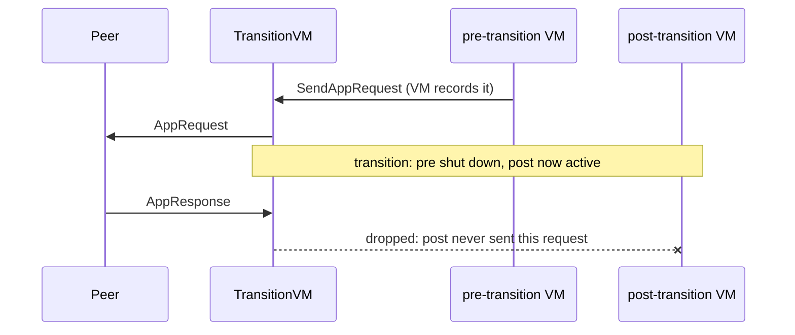

# TransitionVM

TransitionVM changes a chain's underlying VM as part of a scheduled network
upgrade. No operator action is needed at the upgrade. The operator installs one
binary ahead of time holding both VMs. At the configured `transitionTime` the
node swaps from the old VM to the new one in-process. Peers stay connected and
API endpoints keep working through the swap.

It is a [`block.ChainVM`](../../snow/engine/snowman/block/vm.go) wrapping a
*pre-transition* and a *post-transition* [`Chain`](vm.go). It forwards every call
to whichever is active. Its first use is the C-Chain's migration from **Coreth**
to **SAEVM** at the Helicon upgrade.

The two VMs are not independent. They share one database and one block history,
so they must agree on a database layout and block format. Each must also handle
the other's blocks:

- A node on the pre-transition VM may bootstrap from already-switched peers, so
  the **pre-transition VM must parse post-transition blocks**.
- A switched node still serves history to bootstrapping peers, so the
  **post-transition VM must serve all pre-transition blocks**.

Implementing the [`Chain`](vm.go) interface is necessary but not sufficient.

## Usage

Construct one from a [`Factory`](factory.go) naming the two factories and the
switch time:

```go
n.VMManager.RegisterFactory(context.TODO(), constants.EVMID, &transitionvm.Factory{
    PreFactory:     &coreth.Factory{},
    PostFactory:    &saevm.Factory{},
    TransitionTime: n.Config.UpgradeConfig.HeliconTime.Add(-10 * time.Second),
})
```

The transition is one-way and happens once. The pre-transition VM is then shut
down for good. The switch is recorded durably, so a restart resumes on the right
VM.

## How it works

### One chain, two eras

The transition is a point in the chain's history, not a wall-clock event. It is
anchored to block timestamps and `transitionTime`, so every node draws the
boundary in the same place. Blocks before it belong to the pre-transition VM;
blocks after it belong to the post-transition VM.


The pre-transition VM may never extend the chain past this boundary. A block
whose parent already lies in the post-transition era is refused until the node
switches. So the two VMs never disagree about who owns a stretch of history. A
node switches when it accepts the first block at or after `transitionTime`.
Verification and acceptance enforce the boundary:


### Swapping the VM underneath the node

The consensus engine, the network, and the API server treat a chain's VM as one
long-lived object. TransitionVM keeps that true across the swap. A bare
replacement would drop everything the old VM held, so the wrapper hands that
state to the new VM instead of letting it start cold.


Three things carry over, each a piece of state the rest of the node assumes is
stable:

- consensus state and block preference (the engine expects them to stick),
- the set of connected peers (the p2p layer won't re-announce them),
- registered HTTP routes (the node mounts these at startup).

Beyond this surface the two VMs are isolated.

### Requests across the swap

One piece of state must *not* carry over: in-flight app requests. Handing a VM a
response to a request it never sent is fatal to the consensus engine. After the
swap, the new VM knows nothing of the old VM's outstanding requests.



So TransitionVM tracks the requests each VM sends. It drops any response or
failure that doesn't match one the active VM made, including late replies to the
shut-down VM's requests.

## Concurrency

The transition replaces the active VM while other goroutines forward calls
through the wrapper. The swap must be atomic against all of them. A single
`transitionLock` provides this: forwarded calls hold it as readers, the
transition holds it as the writer. No caller sees a half-swapped VM, and the swap
waits for in-flight calls to drain.

That alone would deadlock, because one forwarded call blocks on purpose.
`WaitForEvent` parks until the VM has work, holding the read lock the whole time,
and a VM is idle most of the time. A writer asking for the lock would wait
forever behind it. The transition avoids this by cancelling the active VM's
context before taking the writer lock. The cancellation wakes `WaitForEvent`, it
returns and releases the read lock, and the swap proceeds.

`Accept` adds a wrinkle: it triggers the transition but is itself a forwarded
call. It cannot hold the read lock, or it would deadlock against the writer lock
it is about to request. Instead it relies on the wrapped block being immutable
once verified.

These tensions shape the locking. The line-level mechanics are commented at their
call sites in [`vm.go`](vm.go) and [`vm_block.go`](vm_block.go).
