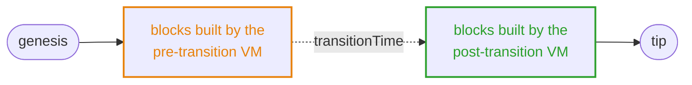
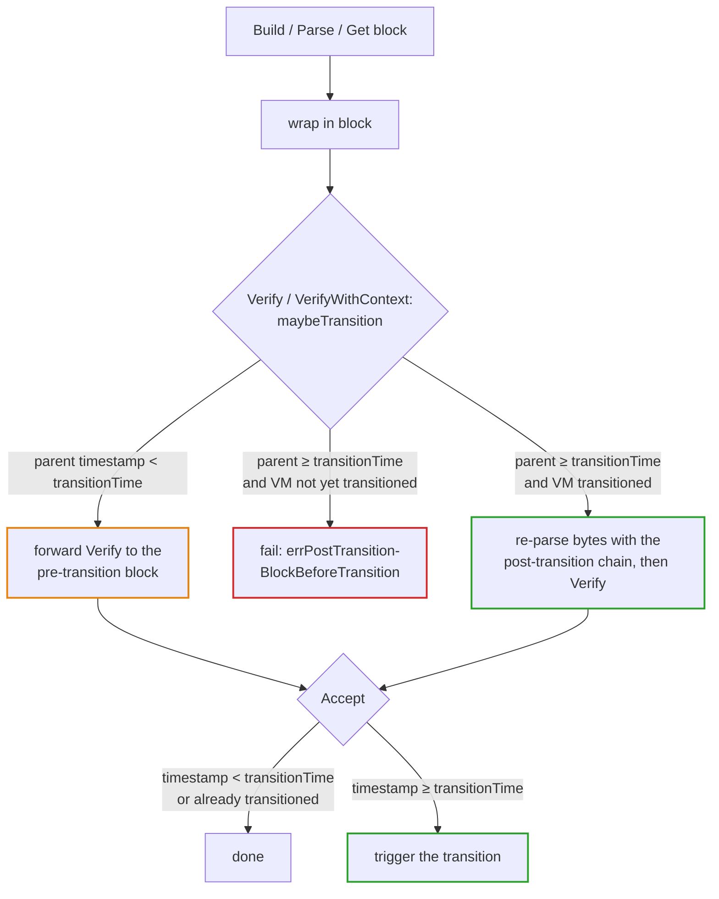
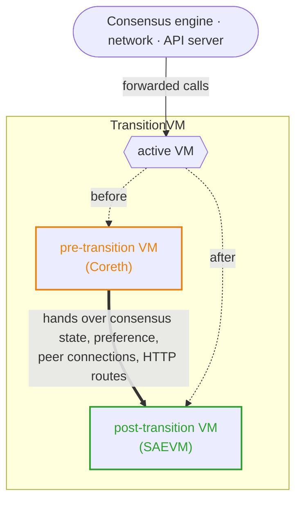
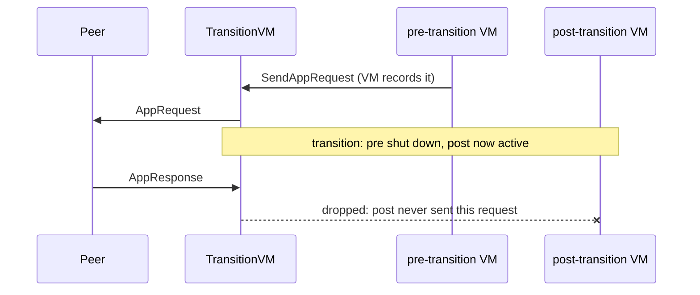
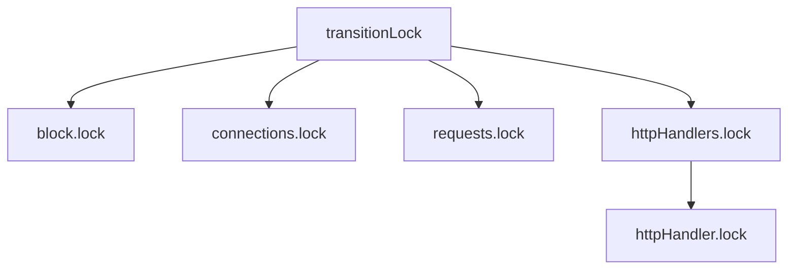

# TransitionVM

TransitionVM swaps a chain's underlying VM at a scheduled upgrade, in-process and
with no operator action. The operator installs one binary holding both VMs ahead
of time; at `transitionTime` the node switches from the old VM to the new. Peers
stay connected and APIs keep working across the swap.

It is a [`block.ChainVM`](../../snow/engine/snowman/block/vm.go) wrapping a
*pre-transition* and a *post-transition* [`Chain`](vm.go), forwarding every call
to whichever is active. Its first use is the C-Chain's Coreth-to-SAEVM migration
at Helicon.

The two VMs are not independent. They share one database and block history, so
they must agree on layout and block format, and each must handle the other's
blocks:

- The **pre-transition VM must parse post-transition blocks**: it may bootstrap
  from already-switched peers.
- The **post-transition VM must serve all pre-transition blocks**: a switched
  node still serves history to bootstrapping peers.

Implementing the [`Chain`](vm.go) interface is necessary but not sufficient.

## Usage

Construct one from a [`Factory`](factory.go) with the two factories and the switch
time:

```go
n.VMManager.RegisterFactory(context.TODO(), constants.EVMID, &transitionvm.Factory{
    PreFactory:     &coreth.Factory{},
    PostFactory:    &saevm.Factory{},
    TransitionTime: n.Config.UpgradeConfig.HeliconTime.Add(-10 * time.Second),
})
```

The transition is one-way and happens once; the pre-transition VM is then shut
down for good. The switch is recorded durably, so restarts resume on the right
VM.

## How it works

### One chain, two eras

The transition is a point in the chain's history, not a wall-clock event. It is
anchored to block timestamps and `transitionTime`, so every node draws the
boundary in the same place. The pre-transition VM executes blocks before it; the
post-transition VM executes blocks after.



The pre-transition VM may never extend the chain past the boundary: a block whose
parent lies in the post-transition era is refused until the node switches, so the
two VMs never disagree about who owns a stretch of history. A node switches when
it accepts the first block at or after `transitionTime`. Verification and
acceptance enforce this:



### Swapping the VM underneath the node

The consensus engine, network, and API server treat a chain's VM as one
long-lived object, and TransitionVM keeps that true across the swap. A bare
replacement would drop everything the old VM held, so the wrapper hands that state
to the new VM instead of starting it cold.



Three things carry over:

- consensus state and block preference (the engine expects them to stick),
- the set of connected peers (the p2p layer won't re-announce them),
- registered HTTP routes (the node mounts these at startup).

Beyond this surface the two VMs are isolated.

### Requests across the swap

One piece of state must *not* carry over: in-flight app requests. The new VM knows
nothing of the old VM's outstanding requests, and handing a VM a response to a
request it never sent is fatal to the consensus engine.



TransitionVM tracks the requests each VM sends, and drops any response or failure
that doesn't match one the active VM made, including late replies to the
shut-down VM.

### API requests across the swap

The node mounts a chain's HTTP routes once and never re-reads them, so the wrapper
owns each route and re-points it at the active VM.

A request must never reach a VM as it shuts down. A handler still reading state
when the database closes may fail.

Before shutting the pre-transition VM down, the transition stops routing and
drains in-flight requests, bounded by a timeout. New requests are *parked*, not
rejected: they wait for the post-transition routes, then run against the new VM,
or 404 if their route is gone. A request still running at the timeout is
abandoned rather than blocking the transition.

## Concurrency

The transition replaces the active VM while other goroutines forward calls through
the wrapper, so the swap must be atomic against them. A single `transitionLock`
provides this: forwarded calls are readers, the transition is the writer. No
caller sees a half-swapped VM, and the swap waits for in-flight calls to drain.

That alone would deadlock, because one forwarded call blocks on purpose.
`WaitForEvent` parks until the VM has work, holding the read lock the whole time,
and a VM is mostly idle. A writer would wait forever behind it. So the transition
cancels the active VM's context before taking the writer lock; the cancellation
wakes `WaitForEvent`, which releases the read lock, and the swap proceeds.

`Accept` adds a wrinkle: it triggers the transition but is itself a forwarded
call, so it cannot hold the read lock without deadlocking against the writer lock
it is about to request. Instead it relies on the wrapped block being immutable
once verified.

### Lock order

An arrow from lock A to lock B means B is acquired while holding A:



`transitionLock` is outermost and nothing re-enters it; the only nesting among
the rest is `httpHandlers.lock` over `httpHandler.lock`.

The line-level mechanics are commented at their call sites in [`vm.go`](vm.go),
[`vm_block.go`](vm_block.go), [`vm_network.go`](vm_network.go), and
[`vm_http.go`](vm_http.go).
