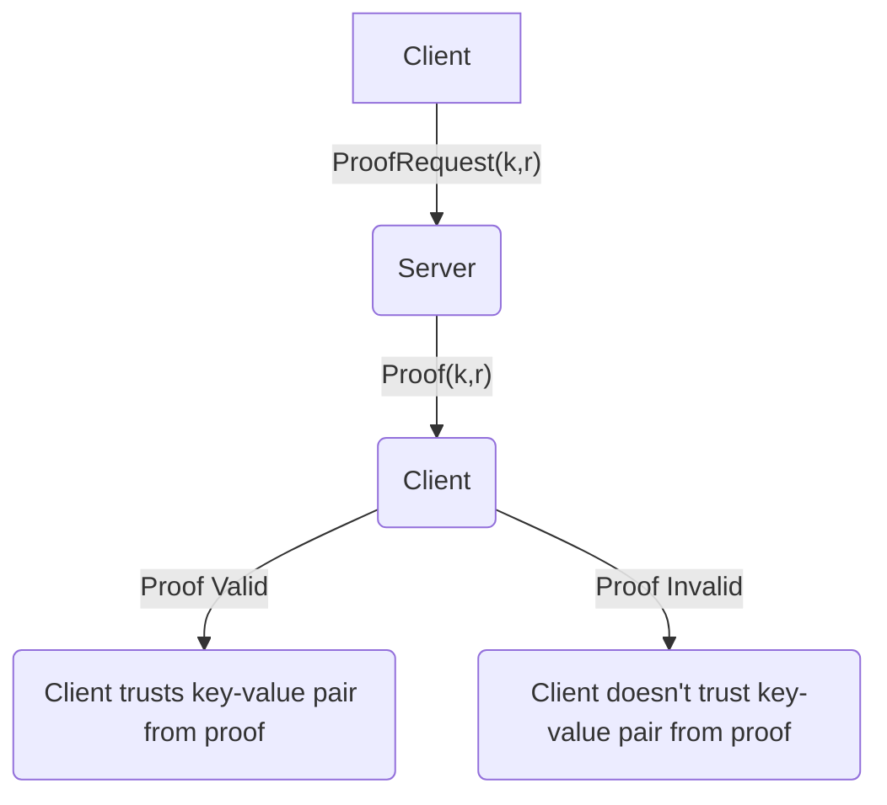
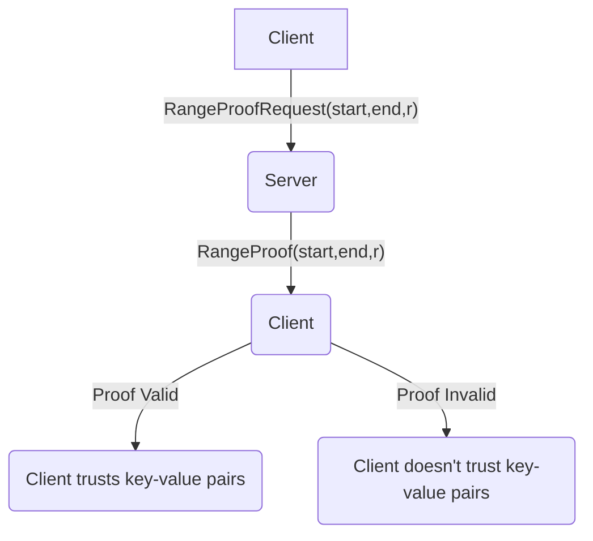
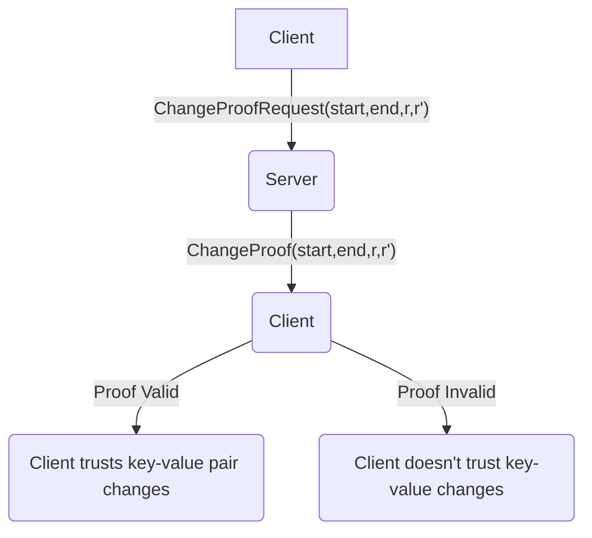

# MerkleDB

## Structure

A _Merkle radix trie_ is a data structure that is both a [Merkle tree](https://en.wikipedia.org/wiki/Merkle_tree) and a [radix trie](https://en.wikipedia.org/wiki/Radix_tree). MerkleDB is an implementation of a persisted key-value store (sometimes just called "a store") using a Merkle radix trie. We sometimes use "Merkle radix trie" and "MerkleDB instance" interchangeably below, but the two are not the same. MerkleDB maintains data in a Merkle radix trie, but not all Merkle radix tries implement a key-value store.

Like all tries, a MerkleDB instance is composed of nodes. Conceptually, a node has:
  * A unique _key_ which identifies its position in the trie. A node's key is a prefix of its childrens' keys.
  * A unique _ID_, which is the hash of the node.
  * A _children_ array, where each element is the ID of the child at that index. A child at a lower index is to the "left" of children at higher indices.
  * An optional value. If a node has a value, then the node's key maps to its value in the key-value store. Otherwise the key isn't present in the store.

and looks like this:
```
Node
+--------------------------------------------+
| ID:                              32 bytes  |
| Key:                              ? bytes  |
| Value:                 Some(value) | None  |
| Children:                                  |
|   0:                Some(child0ID) | None  |
|   1:                Some(child2ID) | None  |
|   ...                                      |
|   BranchFactor-1:  Some(child15ID) | None  |
+--------------------------------------------+
```

This conceptual picture differs slightly from the implementation of the `node` in MerkleDB but is still useful in understanding how MerkleDB works.

## Root IDs and Revisions

The ID of the root node is called the _root ID_, or sometimes just the _root_ of the trie. If any node in a MerkleDB instance changes, the root ID will change. This follows from the fact that changing a node changes its ID, which changes its parent's reference to it, which changes the parent, which changes the parent's ID, and so on until the root.

The root ID also serves as a unique identifier of a given state; instances with the same key-value mappings always have the same root ID, and instances with different key-value mappings always have different root IDs. We call a state with a given root ID a _revision_, and we sometimes say that a MerkleDB instance is "at" a given revision or root ID. The two are equivalent.

## Views

A _view_ is a proposal to modify a MerkleDB. If a view is _committed_, its changes are written to the MerkleDB. It can be queried, and when it is, it returns the state that the MerkleDB will contain if the view is committed. A view is immutable after creation. Namely, none of its key-value pairs can be modified. 

A view can be built atop the MerkleDB itself, or it can be built atop another view. Views can be chained together. For example, we might have:

```
    db
  /    \
view1  view2
  |
view3
```

where `view1` and `view2` are built atop MerkleDB instance `db` and `view3` is built atop `view1`. Equivalently, we say that `db` is the parent of `view1` and `view2`, and `view3` is a child of `view1`. `view1` and `view2` are _siblings_.

`view1` contains all the key-value pairs in `db`, except those modified by `view1`. That is, if `db` has key-value pair `(k,v)`, and `view1` doesn't modify that pair, then `view1` will return `v` when queried for the value of `k`. If `db` has `(k,v)` but `view1` modifies the pair to `(k, v')` then it will return `v'` when queried for the value of `k`. Similar for `view2`.

`view3` has all of the key-value pairs as `view1`, except those modified in `view3`. That is, it has the state after the changes in `view1` are applied to `db`, followed by those in `view3`.

A view can be committed only if its parent is the MerkleDB (and not another view). A view can only be committed once. In the above diagram, `view3` can't be committed until `view1` is committed.

When a view is created, we don't apply changes to the trie's structure or calculate the new IDs of nodes because this requires expensive hashing. Instead, we lazily apply changes and calculate node IDs (including the root ID) when necessary.

### Validity

When a view is committed, its siblings and all of their descendants are _invalidated_. An invalid view can't be read or committed. Method calls on it will return `ErrInvalid`.

In the diagram above, if `view1` were committed, `view2` would be invalidated. It `view2` were committed, `view1` and `view3` would be invalidated.

## Proofs

### Simple Proofs

MerkleDB instances can produce _merkle proofs_, sometimes just called "proofs." A merkle proof uses cryptography to prove that a given key-value pair is or isn't in the key-value store with a given root. That is, a MerkleDB instance with root ID `r` can create a proof that shows that it has a key-value pair `(k,v)`, or that `k` is not present.

Proofs can be useful as a client fetching data in a Byzantine environment. Suppose there are one or more servers, which may be Byzantine, serving a distirbuted key-value store using MerkleDB, and a client that wants to retrieve key-value pairs. Suppose also that the client can learn a "trusted" root ID, perhaps because it's posted on a blockchain. The client can request a key-value pair from a server, and use the returned proof to verify that the returned key-value pair is actually in the key-value store with (or isn't, as it were.)



`ProofRequest(k,r)` is a request for the value that `k` maps to in the MerkleDB instance with root `r` and a proof for that data's correctness.

`Proof(k,r)` is a proof that purports to show either that key-value pair `(k,v)` exists in the revision at `r`, or that `k` isn't in the revision.

#### Verification

A proof is represented as:

```go
type Proof struct {
	// Nodes in the proof path from root --> target key
	// (or node that would be where key is if it doesn't exist).
	// Always contains at least the root.
	Path []ProofNode

	// This is a proof that [key] exists/doesn't exist.
	Key Key

	// Nothing if [Key] isn't in the trie.
	// Otherwise, the value corresponding to [Key].
	Value maybe.Maybe[[]byte]
}

type ProofNode struct {
	Key Key
	// Nothing if this is an intermediate node.
	// The value in this node if its length < [HashLen].
	// The hash of the value in this node otherwise.
	ValueOrHash maybe.Maybe[[]byte]
	Children    map[byte]ids.ID
}
```

For an inclusion proof, the last node in `Path` should be the one containing `Key`.
For an exclusion proof, the last node is either:
* The node that would be the parent of `Key`, if such node has no child at the index `Key` would be at.
* The node at the same child index `Key` would be at, otherwise.

In other words, the last node of a proof says either, "the key is in the trie, and this node contains it," or, "the key isn't in the trie, and this node's existence precludes the existence of the key."

The prover can't simply trust that such a node exists, though. It has to verify this. The prover creates an empty trie and inserts the nodes in `Path`. If the root ID of this trie matches the `r`, the verifier can trust that the last node really does exist in the trie. If the last node _didn't_ really exist, the proof creator couldn't create `Path` such that its nodes both imply the existence of the ("fake") last node and also result in the correct root ID. This follows from the one-way property of hashing.

### Range Proofs

MerkleDB instances can also produce _range proofs_. A range proof proves that a contiguous set of key-value pairs is or isn't in the key-value store with a given root. This is similar to the merkle proofs described above, except for multiple key-value pairs.



`RangeProofRequest(start,end,r)` is a request for all of the key-value pairs, in order, between keys `start` and `end` at revision `r`.

`RangeProof(start,end,r)` contains a list of key-value pairs `kvs`, sorted by increasing key. It purports to show that, at revision `r`:
* Each element of `kvs` is a key-value pair in the store.
* There are no keys at/after `start` but before the first key in `kvs`.
* For adjacent key-value pairs `(k1,v1)` and `(k2,v2)` in `kvs`, there doesn't exist a key-value pair `(k3,v3)` in the store such that `k1 < k3 < k2`. In other words, `kvs` is a contiguous set of key-value pairs.

Clients can use range proofs to efficiently download many key-value pairs at a time from a MerkleDB instance, as opposed to getting a proof for each key-value pair individually.

#### Verification

Like simple proofs, range proofs can be verified without any additional context or knowledge of the contents of the key-value store.

A range proof is represented as:

```go
type RangeProof struct {
	// Invariant: At least one of [StartProof], [EndProof], [KeyValues] is non-empty.

	// A proof that the smallest key in the requested range does/doesn't exist.
	// Note that this may not be an entire proof -- nodes are omitted if
	// they are also in [EndProof].
	StartProof []ProofNode

	// If no upper range bound was given and [KeyValues] is empty, this is empty.
	//
	// If no upper range bound was given and [KeyValues] is non-empty, this is
	// a proof for the largest key in [KeyValues].
	//
	// Otherwise this is a proof for the upper range bound.
	EndProof []ProofNode

	// This proof proves that the key-value pairs in [KeyValues] are in the trie.
	// Sorted by increasing key.
	KeyValues []KeyValue
}
```

The prover creates an empty trie and adds to it all of the key-value pairs in `KeyValues`. 

Then, it inserts:
* The nodes in `StartProof`
* The nodes in `EndProof`

For each node in `StartProof`, the prover only populates `Children` entries whose key is before `start`.
For each node in `EndProof`, it populates only `Children` entries whose key is after `end`, where `end` is the largest key proven by the range proof.

Then, it calculates the root ID of this trie and compares it to the expected one.

If the proof:
* Omits any key-values in the range
* Includes additional key-values that aren't really in the range
* Provides an incorrect value for a key in the range

then the actual root ID won't match the expected root ID. 

Like simple proofs, range proof verification relies on the fact that the proof generator can't forge data such that it results in a trie with both incorrect data and the correct root ID.

### Change Proofs

Finally, MerkleDB instances can produce and verify _change proofs_. A change proof proves that a set of key-value changes were applied to a MerkleDB instance in the process of changing its root from `r` to `r'`. For example, suppose there's an instance with root `r`



`ChangeProofRequest(start,end,r,r')` is a request for all key-value pairs, in order, between keys `start` and `end`, that occurred after the root of was `r` and before the root was `r'`.

`ChangeProof(start,end,r,r')` contains a set of key-value pairs `kvs`. It purports to show that:
* Each element of `kvs` is a key-value pair in the at revision `r'` but not at revision `r`.
* There are no key-value changes between `r` and `r'` such that the key is at/after `start` but before the first key in `kvs`.
* For adjacent key-value changes `(k1,v1)` and `(k2,v2)` in `kvs`, there doesn't exist a key-value change `(k3,v3)` between `r` and `r'` such that `k1 < k3 < k2`. In other words, `kvs` is a contiguous set of key-value changes.

Change proofs are useful for applying changes between revisions. For example, suppose a client has a MerkleDB instance at revision `r`. The client learns that the state has been updated and that the new root is `r'`. The client can request a change proof from a server at revision `r'`, and apply the changes in the change proof to change its state from `r` to `r'`. Note that `r` and `r'` need not be "consecutive" revisions. For example, it's possible that the state goes from revision `r` to `r1` to `r2` to `r'`. The client apply changes to get directly from `r` to `r'`, without ever needing to be at revision `r1` or `r2`.

#### Verification

Unlike simple proofs and range proofs, change proofs require additional context to verify. Namely, the prover must have the trie at the start root `r`.

The verification algorithm is similar to range proofs, except that instead of inserting the key-value changes, start proof and end proof into an empty trie, they are added to the trie at revision `r`.

## Serialization

### Node

Nodes are persisted in an underlying database. In order to persist nodes, we must first serialize them. Serialization is done by the `encoder` interface defined in `codec.go`.

The node serialization format is:

```
+----------------------------------------------------+
| Value existence flag (1 byte)                      |
+----------------------------------------------------+
| Value length (varint) (optional)                   |
+----------------------------------------------------+
| Value (variable length bytes) (optional)           |
+----------------------------------------------------+
| Number of children (varint)                        |
+----------------------------------------------------+
| Child index (varint)                               |
+----------------------------------------------------+
| Child compressed key length (varint)              |
+----------------------------------------------------+
| Child compressed key (variable length bytes)      |
+----------------------------------------------------+
| Child ID (32 bytes)                                |
+----------------------------------------------------+
| Child has value (1 bytes)                          |
+----------------------------------------------------+
| Child index (varint)                               |
+----------------------------------------------------+
| Child compressed key length (varint)              |
+----------------------------------------------------+
| Child compressed key (variable length bytes)      |
+----------------------------------------------------+
| Child ID (32 bytes)                                |
+----------------------------------------------------+
| Child has value (1 bytes)                          |
+----------------------------------------------------+
|...                                                 |
+----------------------------------------------------+
```

Where:
* `Value existence flag` is `1` if this node has a value, otherwise `0`.
* `Value length` is the length of the value, if it exists (i.e. if `Value existence flag` is `1`.) Otherwise not serialized.
* `Value` is the value, if it exists (i.e. if `Value existence flag` is `1`.) Otherwise not serialized.
* `Number of children` is the number of children this node has.
* `Child index` is the index of a child node within the list of the node's children.
* `Child compressed key length` is the length of the child node's compressed key.
* `Child compressed key` is the child node's compressed key.
* `Child ID` is the child node's ID.
* `Child has value` indicates if that child has a value.

For each child of the node, we have an additional:

```
+----------------------------------------------------+
| Child index (varint)                               |
+----------------------------------------------------+
| Child compressed key length (varint)               |
+----------------------------------------------------+
| Child compressed key (variable length bytes)       |
+----------------------------------------------------+
| Child ID (32 bytes)                                |
+----------------------------------------------------+
| Child has value (1 bytes)                          |
+----------------------------------------------------+
```

Note that the `Child index` are not necessarily sequential. For example, if a node has 3 children, the `Child index` values could be `0`, `2`, and `15`. 
However, the `Child index` values must be strictly increasing. For example, the `Child index` values cannot be `0`, `0`, and `1`, or `1`, `0`.

Since a node can have up to 16 children, there can be up to 16 such blocks of children data.

#### Example

Let's take a look at an example node. 

Its byte representation (in hex) is: `0x01020204000210579EB3718A7E437D2DDCE931AC7CC05A0BC695A9C2084F5DF12FB96AD0FA32660E06FFF09845893C4F9D92C4E097FCF2589BC9D6882B1F18D1C2FC91D7DF1D3FCBDB4238`

The node's key is empty (its the root) and has value `0x02`.
It has two children.
The first is at child index `0`, has compressed key `0x01` and ID (in hex) `0x579eb3718a7e437d2ddce931ac7cc05a0bc695a9c2084f5df12fb96ad0fa3266`.
The second is at child index `14`, has compressed key `0x0F0F0F` and ID (in hex) `0x9845893c4f9d92c4e097fcf2589bc9d6882b1f18d1c2fc91d7df1d3fcbdb4238`.

```
+--------------------------------------------------------------------+
| Value existence flag (1 byte)                                      |
| 0x01                                                               |
+--------------------------------------------------------------------+
| Value length (varint) (optional)                                   |
| 0x02                                                               |
+--------------------------------------------------------------------+
| Value (variable length bytes) (optional)                           |
| 0x02                                                               |
+--------------------------------------------------------------------+
| Number of children (varint)                                        |
| 0x04                                                               |
+--------------------------------------------------------------------+
| Child index (varint)                                               |
| 0x00                                                               |
+--------------------------------------------------------------------+
| Child compressed key length (varint)                               |
| 0x02                                                               |
+--------------------------------------------------------------------+
| Child compressed key (variable length bytes)                       |
| 0x10                                                               |
+--------------------------------------------------------------------+
| Child ID (32 bytes)                                                |
| 0x579EB3718A7E437D2DDCE931AC7CC05A0BC695A9C2084F5DF12FB96AD0FA3266 |
+--------------------------------------------------------------------+
| Child index (varint)                                               |
| 0x0E                                                               |
+--------------------------------------------------------------------+
| Child compressed key length (varint)                               |
| 0x06                                                               |
+--------------------------------------------------------------------+
| Child compressed key (variable length bytes)                       |
| 0xFFF0                                                             |
+--------------------------------------------------------------------+
| Child ID (32 bytes)                                                |
| 0x9845893C4F9D92C4E097FCF2589BC9D6882B1F18D1C2FC91D7DF1D3FCBDB4238 |
+--------------------------------------------------------------------+
```

### Node Hashing

Each node must have a unique ID that identifies it. This ID is calculated by hashing the following values:
* The node's children
* The node's value digest
* The node's key

The node's value digest is:
* Nothing, if the node has no value
* The node's value, if it has a value < 32 bytes
* The hash of the node's value otherwise

We use the node's value digest rather than its value when hashing so that when we send proofs, each `ProofNode` doesn't need to contain the node's value, which could be very large. By using the value digest, we allow a proof verifier to calculate a node's ID while limiting the size of the data sent to the verifier.  

Specifically, we encode these values in the following way:

```
+----------------------------------------------------+
| Number of children (varint)                        |
+----------------------------------------------------+
| Child index (varint)                               |
+----------------------------------------------------+
| Child ID (32 bytes)                                |
+----------------------------------------------------+
| Child index (varint)                               |
+----------------------------------------------------+
| Child ID (32 bytes)                                |
+----------------------------------------------------+
|...                                                 |
+----------------------------------------------------+
| Value existence flag (1 byte)                      |
+----------------------------------------------------+
| Value length (varint) (optional)                   |
+----------------------------------------------------+
| Value (variable length bytes) (optional)           |
+----------------------------------------------------+
| Key bit length (varint)                            |
+----------------------------------------------------+
| Key (variable length bytes)                        |
+----------------------------------------------------+
```

Where:
* `Number of children` is the number of children this node has.
* `Child index` is the index of a child node within the list of the node's children.
* `Child ID` is the child node's ID.
* `Value existence flag` is `1` if this node has a value, otherwise `0`.
* `Value length` is the length of the value, if it exists (i.e. if `Value existence flag` is `1`.) Otherwise not serialized.
* `Value` is the value, if it exists (i.e. if `Value existence flag` is `1`.) Otherwise not serialized.
* `Key length` is the number of bits in this node's key.
* `Key` is the node's key.

Note that, as with the node serialization format, the `Child index` values aren't necessarily sequential, but they are unique and strictly increasing.
Also like the node serialization format, there can be up to 16 blocks of children data.
However, note that child compressed keys are not included in the node ID calculation.

Once this is encoded, we `sha256` hash the resulting bytes to get the node's ID.

### Encoding Varints and Bytes

Varints are encoded with `binary.PutUvarint` from the standard library's `binary/encoding` package.
Bytes are encoded by simply copying them onto the buffer.

## Design choices

### []byte copying

A node may contain a value, which is represented in Go as a `[]byte`. This slice is never edited, allowing it to be used without copying it first in many places. When a value leaves the library, for example when returned in `Get`, `GetValue`, `GetProof`, `GetRangeProof`, etc., the value is copied to prevent edits made outside the library from being reflected in the database.

### Split Node Storage

Nodes with values ("value nodes") are persisted under one database prefix, while nodes without values ("intermediate nodes") are persisted under another database prefix. This separation allows for easy iteration over all key-value pairs in the database, as this is simply iterating over the database prefix containing value nodes. 

### Single Node Type

MerkleDB uses one type to represent nodes, rather than having multiple types (e.g. branch nodes, value nodes, extension nodes) as other Merkle Trie implementations do.

Not using extension nodes results in worse storage efficiency (some nodes may have mostly empty children) but simpler code.

### Locking

`merkleDB` has a `RWMutex` named `lock`. Its read operations don't store data in a map, so a read lock suffices for read operations.
`merkleDB` has a `Mutex` named `commitLock`. It enforces that only a single view/batch is attempting to commit to the database at one time.  `lock` is insufficient because there is a period of view preparation where read access should still be allowed, followed by a period where a full write lock is needed. The `commitLock` ensures that only a single goroutine makes the transition from read => write.

A `view` is built atop another trie, which may be the underlying `merkleDB` or another `view`.
We use locking to guarantee atomicity/consistency of trie operations.

`view` has a `RWMutex` named `commitLock` which ensures that we don't create a view atop the `view` while it's being committed.
It also has a `RWMutex` named `validityTrackingLock` that is held during methods that change the view's validity, tracking of child views' validity, or of the `view` parent trie.  This lock ensures that writing/reading from `view` or any of its descendants is safe.
The `CommitToDB` method grabs the `merkleDB`'s `commitLock`. This is the only `view` method that modifies the underlying `merkleDB`.

In some of `merkleDB`'s methods, we create a `view` and call unexported methods on it without locking it.
We do so because the exported counterpart of the method read locks the `merkleDB`, which is already locked.
This pattern is safe because the `merkleDB` is locked, so no data under the view is changing, and nobody else has a reference to the view, so there can't be any concurrent access.

To prevent deadlocks, `view` and `merkleDB` never acquire the `commitLock` of descendant views.
That is, locking is always done from a view toward to the underlying `merkleDB`, never the other way around.
The `validityTrackingLock` goes the opposite way. A view can lock the `validityTrackingLock` of its children, but not its ancestors. Because of this, any function that takes the `validityTrackingLock` must not take the `commitLock` as this may cause a deadlock. Keeping `commitLock` solely in the ancestor direction and `validityTrackingLock` solely in the descendant direction prevents deadlocks from occurring.

## TODOs

- [ ] Analyze performance of using database snapshots rather than in-memory history
- [ ] Improve intermediate node regeneration after ungraceful shutdown by reusing successfully written subtrees
