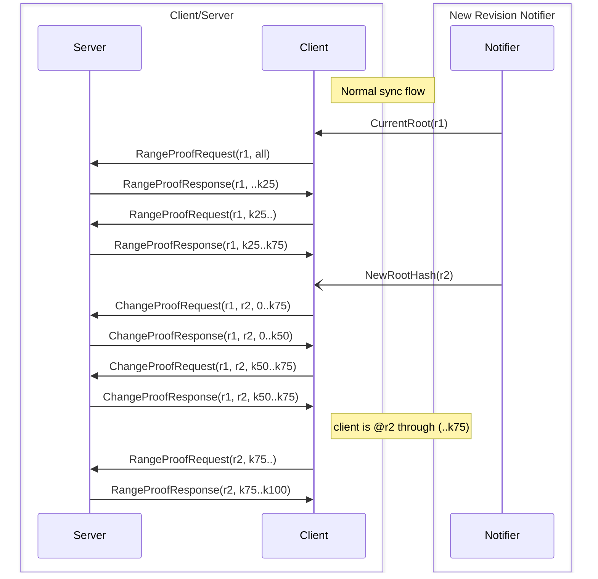

# `sync` package

## Overview

This package implements a client and server that allows for the syncing of a [MerkleDB](../merkledb/README.md).
The servers have an up-to-date version of the database, and the clients have an out of date version of the database or an empty database.

It's planned that these client and server implementations will eventually be compatible with Firewood.

## Messages

There are four message types sent between the client and server:

1. `SyncGetRangeProofRequest`
2. `RangeProof`
3. `SyncGetChangeProofRequest`
4. `SyncGetChangeProofResponse`

These message types are defined in `avalanchego/proto/sync.proto`.
For more information on range proofs and change proofs, see their definitions in `avalanchego/merkledb/proof.go`.

### `SyncGetRangeProofRequest`

This message is sent from the client to the server to request a range proof for a given key range and root hash.
That is, the client says, "Give me the key-value pairs that were in this key range when the database had this root."
This request includes a limit on the number of key-value pairs to return, and the size of the response.

### `RangeProof`

This message is sent from the server to the client in response to a `SyncGetRangeProofRequest`.
It contains the key-value pairs that were in the requested key range when the database had the requested root, 
as well as a proof that the key-value pairs are correct.
If a server can't serve the entire requested key range in one response, its response will omit keys from the
end of the range rather than the start.
For example, if a client requests a range proof for range [`requested_start`, `requested_end`] but the server
can't fit all the key-value pairs in one response, it'll send a range proof for [`requested_start`, `proof_end`] where `proof_end` < `requested_end`, 
as opposed to sending a range proof for [`proof_start`, `requested_end`] where `proof_start` > `requested_start`.

### `SyncGetChangeProofRequest`

This message is sent from the client to the server to request a change proof between the given root hashes.
That is, the client says, "Give me the key-value pairs that changed between the time the database had this root and that root." 
This request includes a limit on the number of key-value pairs to return, and the size of the response.

### `SyncGetChangeProofResponse`

This message is sent from the server to the client in response to a `SyncGetChangeProofRequest`.
If the server had sufficient history to generate a change proof, it contains a change proof that contains 
the key-value pairs that changed between the requested roots.
If the server did not have sufficient history to generate a change proof, it contains a range proof that
contains the key-value pairs that were in the database when the database had the latter root.
Like range proofs, if a client requests a change proof for range [`requested_start`, `requested_end`] but
the server can't fit all the key-value pairs in one response,
it'll send a change proof for [`requested_start`, `proof_end`] where `proof_end` < `requested_end`, 
as opposed to sending a change proof for [`proof_start`, `requested_end`] where `proof_start` > `requested_start`.

## Algorithm

For each proof it receives, the sync client tracks the root hash of the revision associated with the proof's key-value pairs.
For example, it will store information that says something like, "I have all of the key-value pairs that
are in range [`start`, `end`] for the revision with root `root_hash`" for some keys `start` and `end`.
Note that `root_hash` is the root hash of the revision that the client is trying to sync to, not the 
root hash of its own (incomplete) database.
Tracking the revision associated with each downloaded key range, as well as using data in its own 
(incomplete) database, allows the client to figure out which key ranges are not up-to-date and need to be synced.
The hash of the incomplete database on a client is never sent anywhere because it does not represent a root hash of any revision.

When the client is created, it is given the root hash of the revision to sync to.
When it starts syncing, it requests from a server a range proof for the entire database.
(To indicate that it wants no lower bound on the key range, the client doesn't provide a lower bound in the request.
To indicate that it wants no upper bound, the client doesn't provide an upper bound. 
Thus, to request the entire database, the client omits both the lower and upper bounds in its request.)
The server replies with a range proof, which the client verifies.
If it's valid, the key-value pairs in the proof are written to the database.
If it's not, the client drops the proof and requests the proof from another server. 

A range proof sent by a server must return a continuous range of the key-value pairs, but may not 
return the full range that was requested.
For example, a client might request all the key-value pairs in [`requested_start`, `requested_end`] 
but only receive those in range [`requested_start`, `proof_end`] where `proof_end` < `requested_end`.
There might be too many key-value pairs to include in one message, or the server may be too busy to provide any more in its response.
Unless the database is very small, this means that the range proof the client receives in response to
 its range proof request for the entire database will not contain all of the key-value pairs in the database.

If a client requests a range proof for range [`requested_start`, `requested_end`] but only receives 
a range proof for [`requested_start`, `proof_end`] where `proof_end` < `requested_end`
it recognizes that it must still fetch all of the keys in [`proof_end`, `requested_end`]. 
It repeatedly requests range proofs for chunks of the remaining key range until it has all of the 
key-value pairs in [`requested_start`, `requested_end`].
The client may split the remaining key range into chunks and fetch chunks of key-value pairs in parallel, possibly even from different servers.

Additional commits to the database may occur while the client is syncing.
The sync client can be notified that the root hash of the database it's trying to sync to has changed.
Detecting that the root hash to sync to has changed is done outside this package.
For example, if the database is being used to store blockchain state then the sync client would be 
notified when a new block is accepted because that implies a commit to the database.
If this occurs, the key-value pairs the client has learned about via range proofs may no longer be up-to-date.

We use change proofs as an optimization to correct the out of date key-value pairs.
When the sync client is notified that the root hash to sync to has changed, it requests a change proof 
from a server for a given key range.
For example, if a client has the key-value pairs in range [`start`, `end`] that were in the database 
when it had `root_hash`, then it will request a change proof that provides all of the key-value changes 
in range [`start`, `end`] from the database version with root hash `root_hash` to the database version with root hash `new_root_hash`.
The client verifies the change proof, and if it's valid, it applies the changes to its database.
If it's not, the client drops the proof and requests the proof from another server.

A server needs to have history in order to serve a change proof.
Namely, it needs to know all of the database changes between two roots.
If the server does not have sufficient history to generate a change proof, it will send a range proof for
the requested range at revision `new_root_hash` instead.
The client will verify and apply the range proof. (Note that change proofs are just an optimization for bandwidth and speed.
A range proof for a given key range and revision has the same information as a change proof from
`old_root_hash` to `new_root_hash` for the key range, assuming the client has the key-value pairs 
for the key range at the revision with `old_root_hash`.) 
Change proofs, like range proofs, may not contain all of the key-value pairs in the requested range. 
This is OK because as mentioned above, the client tracks the root hash associated with each range of 
key-value pairs it has, so it knows which key-value pairs are out of date. 
Similar to range proofs, if a client requests the changes in range [`requested_start`, `requested_end`],
but the server replies with all of the changes in [`requested_start`, `proof_end`] for some `proof_end` < `requested_end`, 
the client will repeatedly request change proofs until it gets remaining key-value pairs (namely in [`proof_end`, `requested_end`]). 

Eventually, by repeatedly requesting, receiving, verifying and applying range and change proofs,
the client will have all of the key-value pairs in the database.
At this point, it's synced.

## Diagram

Assuming you have `Root Hash` `r1` which has many keys, some of which are k25, k50, k75,
approximately 25%, 50%, and 75% of the way into the sorted set of keys, respectively, 
this diagram shows an example flow from client to server:

## TODOs

- [ ] Handle errors on proof requests.  Currently, any errors that occur server side are not sent back to the client.
